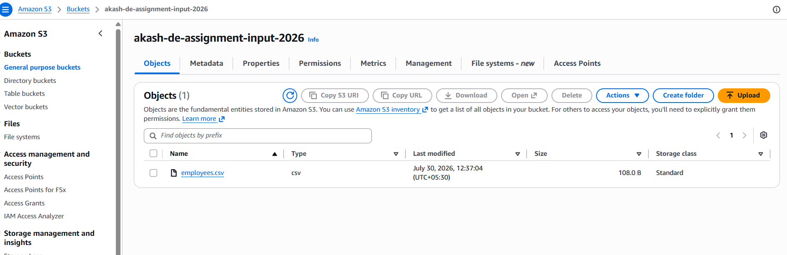
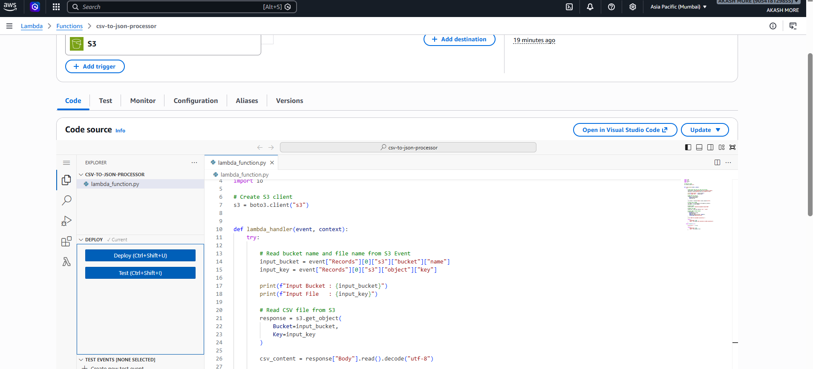
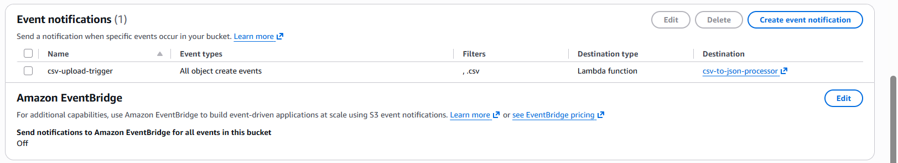
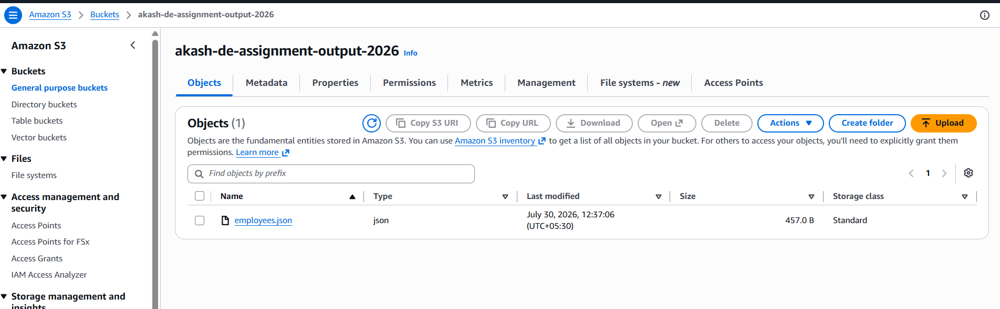
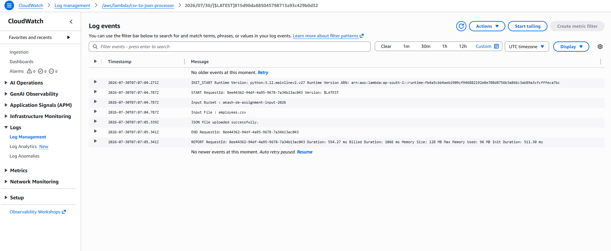
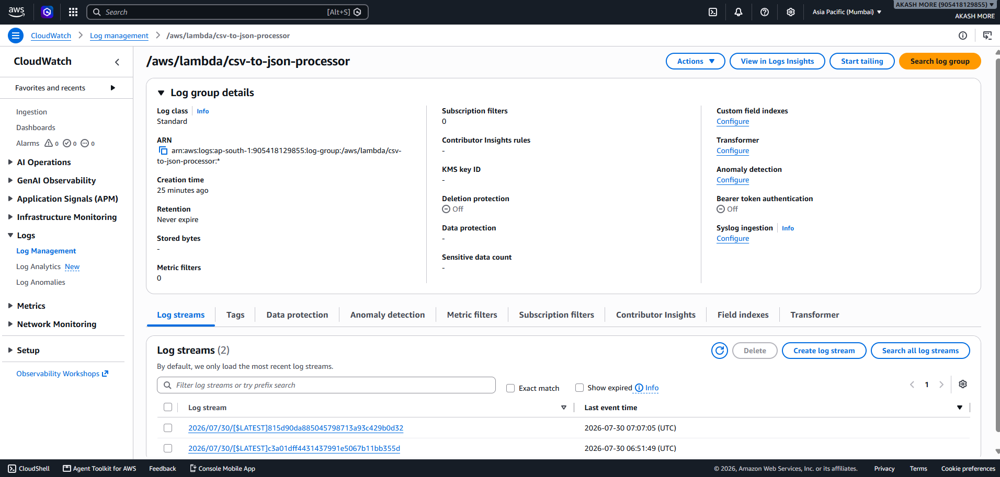

# Assignment 01 - AWS S3 Event-Driven CSV to JSON Pipeline

## Objective

This project demonstrates an event-driven serverless data pipeline using Amazon S3 and AWS Lambda.

Whenever a CSV file is uploaded to an Amazon S3 input bucket, an AWS Lambda function is automatically triggered. The Lambda function reads the uploaded CSV file, converts the records into JSON format, and stores the processed file in a separate Amazon S3 output bucket.

This project showcases a practical implementation of AWS serverless architecture for automated file processing without managing any servers.

---

# Project Overview

The project is designed to automate CSV-to-JSON conversion using AWS services.

Instead of manually processing files, Amazon S3 generates an event whenever a new CSV file is uploaded. This event invokes the Lambda function, which processes the file and saves the converted JSON output into another S3 bucket.

The execution details are recorded in Amazon CloudWatch Logs for monitoring and troubleshooting.

---

# Solution Architecture

```text
                    employees.csv
                          │
                          ▼
              Amazon S3 Input Bucket
                          │
                Object Created Event
                          │
                          ▼
                 AWS Lambda Function
               (CSV to JSON Conversion)
                          │
                          ▼
             Amazon S3 Output Bucket
                    employees.json
                          │
                          ▼
               Amazon CloudWatch Logs
```

---

# Architecture Components

## Amazon S3 Input Bucket

- Stores uploaded CSV files.
- Triggers the Lambda function whenever a new object is created.
- Acts as the source of the data pipeline.

---

## AWS Lambda

- Executes automatically after receiving an S3 event.
- Reads the uploaded CSV file.
- Converts CSV records into JSON format.
- Uploads the converted JSON file into the destination bucket.

---

## Amazon S3 Output Bucket

- Stores processed JSON files.
- Maintains converted output separately from raw input data.

---

## Amazon CloudWatch

- Stores Lambda execution logs.
- Helps monitor execution status.
- Useful for debugging and troubleshooting.

---

# AWS Services Used

| Service | Purpose |
|----------|---------|
| Amazon S3 | Store input CSV and output JSON files |
| AWS Lambda | Process uploaded CSV files automatically |
| AWS IAM | Provide secure permissions to Lambda |
| Amazon CloudWatch | Monitor Lambda execution logs |

---

# Technologies Used

## Cloud

- Amazon S3
- AWS Lambda
- AWS IAM
- Amazon CloudWatch

## Programming Language

- Python 3.12

## Python Library

- Boto3

## Tools

- Git
- GitHub
- Visual Studio Code

---

# Project Structure

```text
Assignment-01-S3-Lambda/
│
├── input/
│   └── employees.csv
│
├── output/
│   └── employees.json
│
├── screenshots/
│   ├── cloudwatch-logs.png
│   ├── cloudwatch-logs1.png
│   ├── event-notification.png
│   ├── lambda-function.png
│   ├── output-bucket.png
│   └── s3-input-bucket.png
│
├── src/
│   └── lambda_function.py
│
├── requirements.txt
└── README.md
```

---

# Project Workflow

### Step 1 - Upload CSV File

Upload **employees.csv** into the Amazon S3 input bucket.

↓

### Step 2 - S3 Event Trigger

Amazon S3 automatically generates an **Object Created Event**.

↓

### Step 3 - Lambda Execution

AWS Lambda is invoked automatically after receiving the event notification.

↓

### Step 4 - CSV Processing

The Lambda function reads the uploaded CSV file and converts every record into JSON format.

↓

### Step 5 - Store Output

The generated JSON file is uploaded into the Amazon S3 output bucket.

↓

### Step 6 - Monitoring

Execution logs are stored in Amazon CloudWatch for monitoring and debugging.

---

# Input Dataset

The input file is a CSV file containing employee information.

**File Location**

```text
input/employees.csv
```

### Sample Input

```csv
id,name,department,salary
1,Akash,IT,50000
2,Rahul,HR,45000
3,Priya,Finance,60000
4,Neha,Marketing,55000
```

### Input Description

| Column | Description |
|----------|-------------|
| id | Employee ID |
| name | Employee Name |
| department | Employee Department |
| salary | Employee Salary |

---

# Output Dataset

After processing, the Lambda function converts the CSV records into JSON format.

**File Location**

```text
output/employees.json
```

### Sample Output

```json
[
  {
    "id": "1",
    "name": "Akash",
    "department": "IT",
    "salary": "50000"
  },
  {
    "id": "2",
    "name": "Rahul",
    "department": "HR",
    "salary": "45000"
  },
  {
    "id": "3",
    "name": "Priya",
    "department": "Finance",
    "salary": "60000"
  },
  {
    "id": "4",
    "name": "Neha",
    "department": "Marketing",
    "salary": "55000"
  }
]
```

---

# Lambda Function Responsibilities

The Lambda function performs the following tasks automatically:

- Receive the Amazon S3 event notification.
- Read the uploaded CSV file.
- Parse CSV records.
- Convert CSV data into JSON format.
- Create the output JSON file.
- Upload the JSON file into the destination S3 bucket.
- Generate execution logs in Amazon CloudWatch.

---

# Source Code Overview

The Lambda function is implemented in Python using the **Boto3 SDK**.

The application performs the following operations:

1. Receive the S3 Event Object.
2. Extract Bucket Name and Object Key.
3. Download the uploaded CSV file.
4. Read CSV using Python's CSV module.
5. Convert CSV records into JSON.
6. Upload JSON file into the output bucket.
7. Write execution logs to CloudWatch.

---

# IAM Permissions

The Lambda execution role requires the following AWS permissions.

| AWS Service | Permission |
|--------------|------------|
| Amazon S3 | Read Objects |
| Amazon S3 | Write Objects |
| AWS Lambda | Execute Function |
| Amazon CloudWatch | Create Logs |
| Amazon CloudWatch | Write Logs |

---

# Deployment Steps

### Step 1

Create an Amazon S3 input bucket.

---

### Step 2

Create an Amazon S3 output bucket.

---

### Step 3

Create an AWS Lambda function.

---

### Step 4

Upload the Python source code.

---

### Step 5

Attach an IAM Role with S3 and CloudWatch permissions.

---

### Step 6

Configure Amazon S3 Event Notification.

Event Type:

```text
ObjectCreated
```

Destination:

```text
AWS Lambda Function
```

---

### Step 7

Deploy the Lambda function.

---

### Step 8

Upload a CSV file into the input bucket.

---

### Step 9

Verify the generated JSON file inside the output bucket.

---

### Step 10

Verify execution logs inside Amazon CloudWatch.

---

# Testing

The project was tested using the following workflow.

### Test Case 1

Upload a valid CSV file.

**Expected Result**

- Lambda is triggered automatically.
- JSON file is created.
- JSON file is stored in the output bucket.
- CloudWatch logs are generated.

---

### Test Case 2

Upload another CSV file.

**Expected Result**

- Lambda processes the new file.
- New JSON file is created successfully.

---

### Test Case 3

Verify CloudWatch Logs.

**Expected Result**

- Successful execution logs.
- No runtime errors.

---

## Requirements

Install the required Python package:

```bash
pip install -r requirements.txt
```

---


# Skills Demonstrated

This project demonstrates the following Data Engineering and AWS skills:

- Event-Driven Architecture
- Serverless Computing
- Amazon S3 Integration
- AWS Lambda Development
- IAM Role Configuration
- Amazon CloudWatch Monitoring
- Python Automation
- CSV File Processing
- JSON Data Transformation
- Boto3 SDK
- AWS Event Notifications
- Cloud-Based Data Processing
- Git Version Control
- GitHub Repository Management

---

# Learning Outcomes

This project helped in understanding:

- Amazon S3 Event Notifications
- AWS Lambda Trigger Mechanism
- IAM Roles and Permissions
- Python Boto3 SDK
- Serverless Data Processing
- CSV to JSON Transformation
- CloudWatch Monitoring
- Event-Driven Data Engineering
- AWS Service Integration
- Cloud Automation

---

# Future Improvements

The following enhancements can be implemented in future versions of the project:

- Process multiple CSV files simultaneously.
- Validate CSV schema before processing.
- Handle invalid or corrupted CSV files.
- Store output JSON using date-based folders.
- Compress generated JSON files.
- Add SNS Email Notifications.
- Store metadata in DynamoDB.
- Deploy infrastructure using Terraform.
- Automate deployment using GitHub Actions.
- Add Unit Testing using PyTest.
- Improve monitoring using Amazon CloudWatch Metrics.

---

# Screenshots

### 1. Amazon S3 Input Bucket

The input bucket where CSV files are uploaded.



---

### 2. AWS Lambda Function

Lambda function configuration used for CSV to JSON conversion.



---

### 3. Amazon S3 Event Notification

S3 Event Notification configured to trigger the Lambda function automatically.



---

### 4. Amazon S3 Output Bucket

Generated JSON files are stored in the output bucket.



---

### 5. Amazon CloudWatch Logs

CloudWatch execution logs after successful Lambda execution.



---

### 6. Amazon CloudWatch Logs (Execution Details)

Additional execution logs for monitoring and troubleshooting.



---

# Project Summary

This project successfully demonstrates a complete serverless data processing pipeline using AWS services.

A CSV file uploaded to Amazon S3 automatically triggers an AWS Lambda function. The function processes the file, converts it into JSON format, stores the processed output in another S3 bucket, and records execution logs in Amazon CloudWatch.

The implementation follows an event-driven architecture and provides hands-on experience with AWS serverless technologies commonly used in modern Data Engineering solutions.

---

# Author

**Akash More**

**Data Engineer**

GitHub Portfolio:

https://github.com/Akash-web750/aws-data-engineering-assignments

---

# License

This project is licensed under the MIT License.

---

# Acknowledgement

This project was created for learning, portfolio development, interview preparation, and gaining practical experience with AWS serverless technologies and modern Data Engineering concepts.


