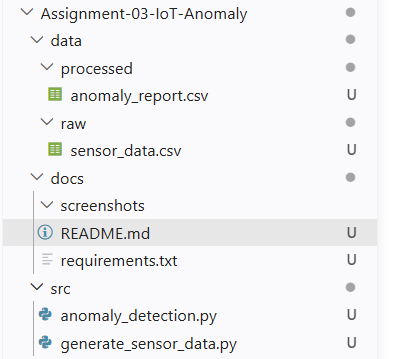
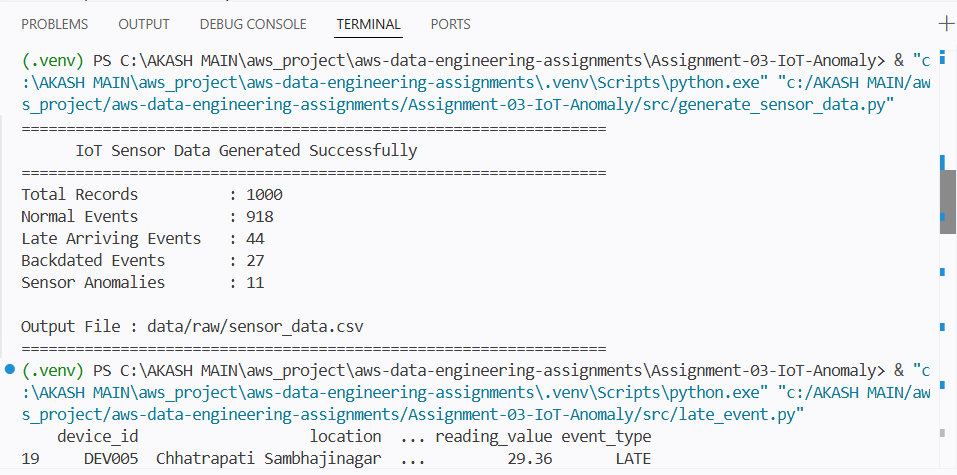
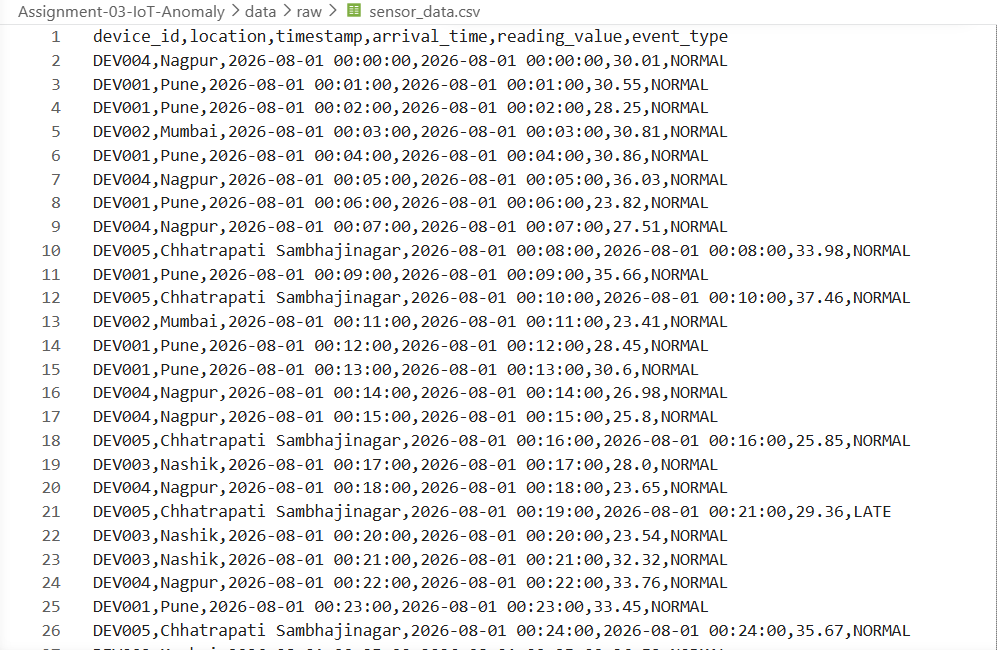
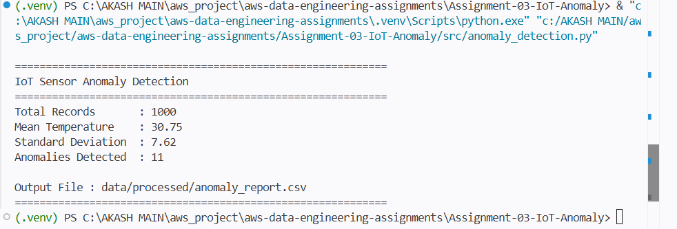
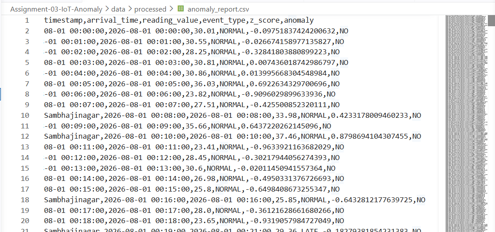
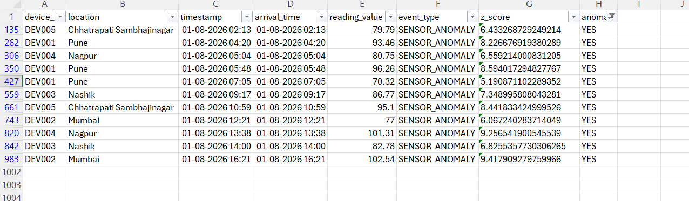

# Assignment 03 - IoT Data Engineering & Anomaly Detection

## Objective

This project demonstrates how to generate synthetic IoT sensor data, simulate real-world data challenges such as backdated and late-arriving events, and detect anomalous sensor readings using the Z-Score statistical method.

---

## Project Structure

```text
Assignment-03-IoT-Anomaly/
│
├── data/
│   ├── raw/
│   │   └── sensor_data.csv
│   │
│   └── processed/
│       └── anomaly_report.csv
│
├── src/
│   ├── generate_sensor_data.py
│   └── anomaly_detection.py
│
├── docs/
├── screenshots/
├── README.md
└── requirements.txt
```

---

## Technologies Used

- Python 3.x
- Pandas
- CSV
- Statistics (Mean, Standard Deviation, Z-Score)

---

## Dataset Columns

| Column | Description |
|---------|-------------|
| device_id | Unique IoT Device ID |
| location | Device Location |
| timestamp | Event Time |
| arrival_time | Time when data arrived |
| reading_value | Temperature Sensor Reading (°C) |
| event_type | NORMAL, LATE, BACKDATED, SENSOR_ANOMALY |

---

## Features

- Generate 1000 synthetic IoT sensor records
- Simulate multiple IoT devices
- Generate realistic temperature readings
- Simulate backdated events
- Simulate late-arriving events
- Inject sensor anomalies
- Detect anomalies using Z-Score
- Export processed anomaly report

---

## Event Types

### NORMAL

Regular sensor data.

### BACKDATED

Event timestamp is earlier than its arrival time.

### LATE

Data reaches the system after a delay.

### SENSOR_ANOMALY

Abnormal temperature generated intentionally for anomaly detection.

---

## Anomaly Detection

The project uses the Z-Score method.

### Formula

```text
Z = (Reading - Mean) / Standard Deviation
```

If

```text
|Z| > 3
```

then the record is marked as an anomaly.

---

## Input Dataset

```text
data/raw/sensor_data.csv
```

Contains generated IoT sensor data.

---

## Output Dataset

```text
data/processed/anomaly_report.csv
```

Additional columns:

- z_score
- anomaly

Example:

| reading_value | z_score | anomaly |
|--------------:|---------:|----------|
| 29.51 | -0.12 | NO |
| 96.42 | 8.65 | YES |

---

## How to Run

### Generate Sensor Data

```bash
python src/generate_sensor_data.py
```

### Detect Anomalies

```bash
python src/anomaly_detection.py
```

---

## Sample Console Output

### Sensor Data Generation

```text
============================================================
IoT Sensor Data Generated Successfully
============================================================
Total Records          : 1000
Late Arriving Events   : 44
Backdated Events       : 27
Sensor Anomalies       : 11
============================================================
```

### Anomaly Detection

```text
============================================================
IoT Sensor Anomaly Detection
============================================================
Total Records       : 1000
Mean Temperature    : 30.75
Standard Deviation  : 7.62
Anomalies Detected  : 11
============================================================
```

---

## Learning Outcomes

- Synthetic IoT Data Generation
- Time-Series Data Handling
- Backdated Event Processing
- Late Arriving Event Simulation
- Statistical Anomaly Detection
- Z-Score Implementation
- Data Processing using Pandas

---

## Future Improvements

- Real-time Streaming using Apache Kafka
- Apache Spark Streaming
- Apache Airflow Scheduling
- AWS S3 Data Storage
- Grafana Dashboard
- Machine Learning Based Anomaly Detection

---

# Screenshots

### 1. Project Structure



### 2. Sensor Data Generation



### 3. Raw Sensor Data



### 4. Anomaly Detection



### 5. Processed Anomaly Report



### 6. Detected Anomalies



---

## Author

**Akash More**

**Data Engineer**

GitHub: https://github.com/Akash-web750