# Assignment 04 - Predictive Modelling with Pandas

## Objective

This project demonstrates a complete Machine Learning workflow using the Titanic dataset from Kaggle.

The objective is to showcase practical skills in data preprocessing, exploratory data analysis (EDA), feature engineering, predictive modelling, and model evaluation using Python, Pandas, and Scikit-learn.

This assignment bridges the gap between **Data Engineering** and **Machine Learning** by transforming raw data into actionable predictions through a structured pipeline.

---

# Project Overview

The Titanic dataset contains passenger information such as age, gender, ticket class, fare, and embarkation details.

The project performs the following tasks:

- Read the raw dataset using Pandas
- Handle missing values
- Clean and preprocess the dataset
- Encode categorical variables
- Perform Exploratory Data Analysis (EDA)
- Analyze feature correlations
- Train a Logistic Regression model
- Evaluate model performance
- Predict passenger survival
- Save the trained model for future predictions

---

# Machine Learning Workflow

```text
                Titanic Dataset (train.csv)
                          │
                          ▼
                 Data Preprocessing
                          │
                          ▼
               Missing Value Handling
                          │
                          ▼
             Feature Engineering & Encoding
                          │
                          ▼
          Exploratory Data Analysis (EDA)
                          │
                          ▼
               Correlation Analysis
                          │
                          ▼
                 Train-Test Split
                          │
                          ▼
             Logistic Regression Model
                          │
                          ▼
                Model Evaluation
                          │
                          ▼
               Save Trained Model (.pkl)
                          │
                          ▼
                  Predict New Data
```

---

# Project Structure

```text
Assignment-04-Pandas-ML/
│
├── data/
│   ├── raw/
│   │   └── train.csv
│   │
│   └── processed/
│       └── titanic_cleaned.csv
│
├── models/
│   └── titanic_model.pkl
│
├── screenshots/
│
├── src/
│   ├── data_preprocessing.py
│   ├── eda.py
│   ├── train_model.py
│   └── predict.py
│
├── requirements.txt
└── README.md
```

---

# Technologies Used

## Programming Language

- Python 3.12

## Libraries

- Pandas
- NumPy
- Matplotlib
- Scikit-learn
- Joblib

## Machine Learning Algorithm

- Logistic Regression

## Development Tools

- Visual Studio Code
- Git
- GitHub

---

# Dataset Information

## Dataset

**Titanic - Machine Learning from Disaster**

Source:

Kaggle Titanic Dataset

### Dataset Size

| Item | Value |
|------|-------|
| Records | 891 |
| Features | 12 |
| Target Variable | Survived |

---

## Dataset Columns

| Column | Description |
|----------|-------------|
| PassengerId | Unique Passenger ID |
| Survived | Target Variable (0 = No, 1 = Yes) |
| Pclass | Passenger Class |
| Name | Passenger Name |
| Sex | Passenger Gender |
| Age | Passenger Age |
| SibSp | Number of Siblings/Spouses |
| Parch | Number of Parents/Children |
| Ticket | Ticket Number |
| Fare | Ticket Fare |
| Cabin | Cabin Number |
| Embarked | Port of Embarkation |

---

# Project Pipeline

### Step 1

Read the Titanic dataset using Pandas.

### Step 2

Clean the dataset by handling missing values.

### Step 3

Encode categorical variables into numerical values.

### Step 4

Perform Exploratory Data Analysis (EDA).

### Step 5

Train a Logistic Regression model.

### Step 6

Evaluate model performance using standard evaluation metrics.

### Step 7

Save the trained model using Joblib.

### Step 8

Predict passenger survival using the saved model.

---


# Data Preprocessing

The raw Titanic dataset contains missing values and categorical features that cannot be directly used for Machine Learning.

The preprocessing script performs the following operations:

- Load the dataset using Pandas
- Handle missing values
- Remove unnecessary columns
- Encode categorical variables
- Export the cleaned dataset

---

## Missing Value Handling

| Column | Action |
|----------|--------|
| Age | Filled using Median |
| Embarked | Filled using Mode |
| Cabin | Removed due to a high number of missing values |

---

## Removed Columns

The following columns were removed because they do not contribute significantly to prediction.

- PassengerId
- Name
- Ticket
- Cabin

---

## Categorical Encoding

### Gender

| Original | Encoded |
|-----------|----------|
| Male | 1 |
| Female | 0 |

---

### Embarked

| Port | Encoded |
|------|----------|
| Southampton (S) | 0 |
| Cherbourg (C) | 1 |
| Queenstown (Q) | 2 |

---

## Output Dataset

```
data/processed/titanic_cleaned.csv
```

Final dataset contains the following columns:

- Survived
- Pclass
- Sex
- Age
- SibSp
- Parch
- Fare
- Embarked

---

# Exploratory Data Analysis (EDA)

EDA was performed to better understand the dataset before model training.

The following analyses were completed:

- Dataset Summary
- Missing Value Analysis
- Summary Statistics
- Survival Distribution
- Passenger Class Distribution
- Gender Distribution
- Age Distribution
- Fare Distribution
- Correlation Analysis

---

## Correlation Analysis

The correlation matrix shows the relationship between different features.

Important observations:

- Passenger Class negatively correlates with survival.
- Female passengers have a higher survival rate.
- Higher ticket fares generally indicate better survival chances.
- Age has a relatively weak correlation with survival.

---

# Model Training

A Logistic Regression model was trained using the cleaned dataset.

---

## Features Used

- Pclass
- Sex
- Age
- SibSp
- Parch
- Fare
- Embarked

---

## Target Variable

```
Survived
```

- 0 = Did Not Survive
- 1 = Survived

---

## Train-Test Split

| Dataset | Percentage |
|----------|------------|
| Training | 80% |
| Testing | 20% |

Random State:

```
42
```

---

## Machine Learning Algorithm

```
Logistic Regression
```

The Logistic Regression model was selected because it is well-suited for binary classification problems such as survival prediction.

---

# Model Evaluation

The trained model was evaluated using standard Machine Learning metrics.

Evaluation metrics include:

- Accuracy Score
- Confusion Matrix
- Classification Report
- Precision
- Recall
- F1-Score

---

## Model Performance

| Metric | Result |
|----------|---------|
| Algorithm | Logistic Regression |
| Accuracy | **79.89%** |
| Train Records | 712 |
| Test Records | 179 |

---

## Model Output

The trained model is stored as:

```
models/titanic_model.pkl
```

The model is serialized using Joblib and reused for future predictions without retraining.

---

# Prediction

The prediction script loads the saved model and predicts passenger survival using new input data.

Example passenger:

| Feature | Value |
|----------|-------|
| Passenger Class | 1 |
| Gender | Female |
| Age | 28 |
| Fare | 85.50 |
| Embarked | Cherbourg |

Prediction Result:

```
Passenger is likely to SURVIVE
```

Probability:

```
Survival Probability     : 94.47%
Non-Survival Probability : 5.53%
```

---

# How to Run

## Step 1

Install dependencies.

```bash
pip install -r requirements.txt
```

---

## Step 2

Run data preprocessing.

```bash
python src/data_preprocessing.py
```

---

## Step 3

Perform Exploratory Data Analysis.

```bash
python src/eda.py
```

---

## Step 4

Train the Machine Learning model.

```bash
python src/train_model.py
```

---

## Step 5

Predict passenger survival.

```bash
python src/predict.py
```

---

# Requirements

```
Python 3.10+

pandas
numpy
matplotlib
scikit-learn
joblib
```

---


# Screenshots

## Project Structure

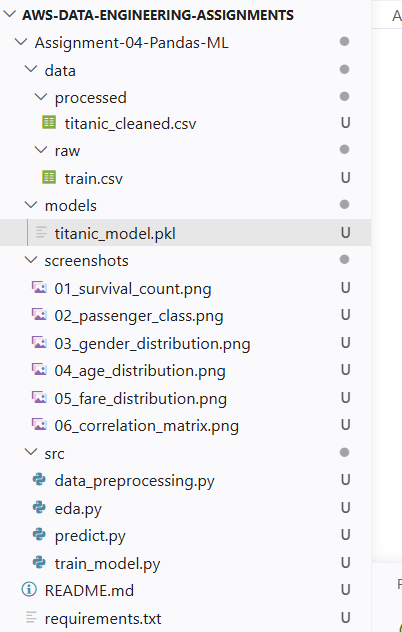

---

## Data Preprocessing

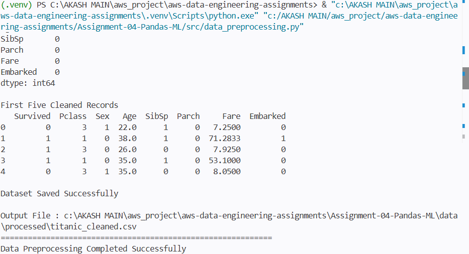

---

## Cleaned Dataset

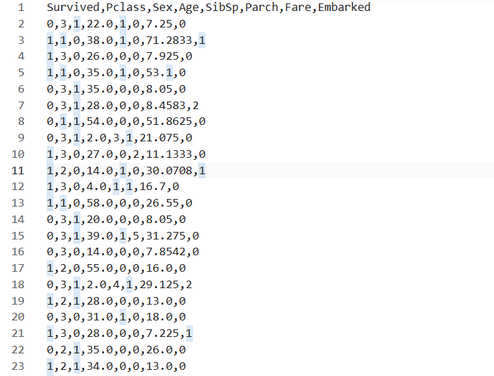

---

## Exploratory Data Analysis

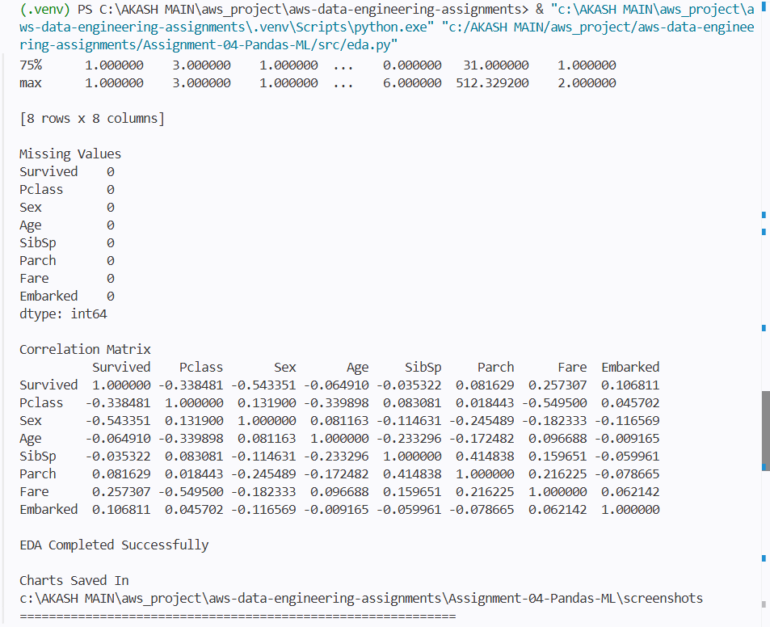

---

## Model Training

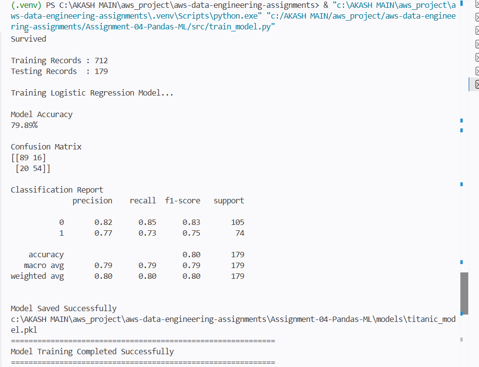

---

## Model Prediction

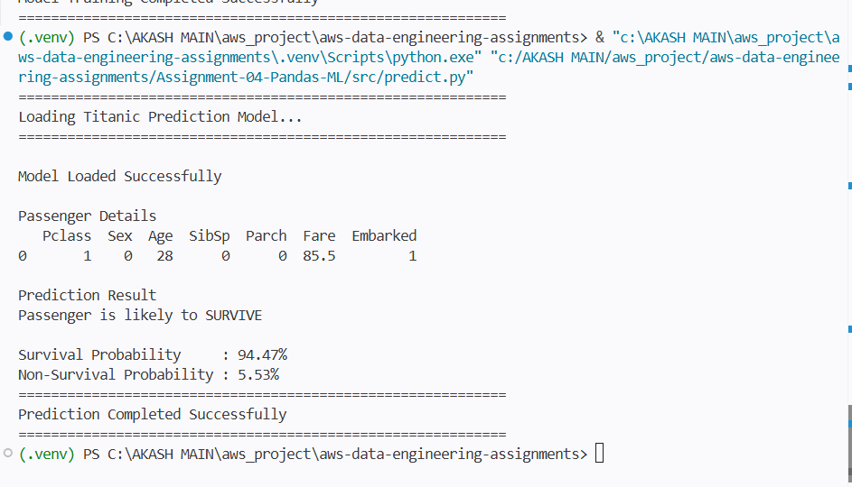

---

## Survival Count

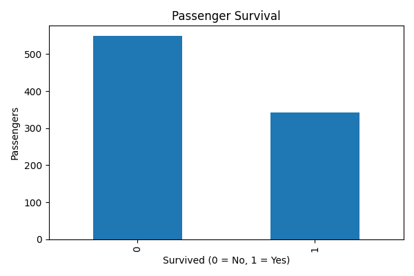

---

## Passenger Class Distribution

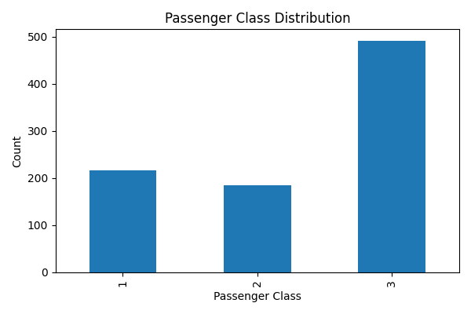

---

## Gender Distribution

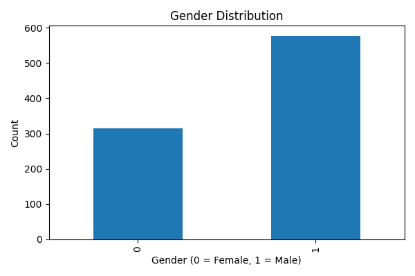

---

## Age Distribution

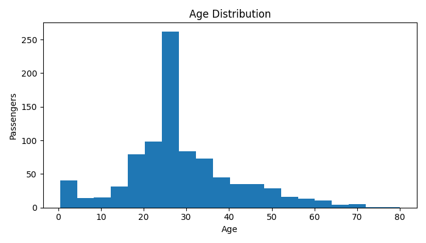

---

## Fare Distribution

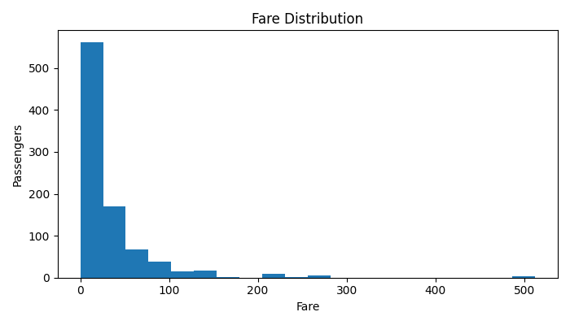

---

## Correlation Matrix

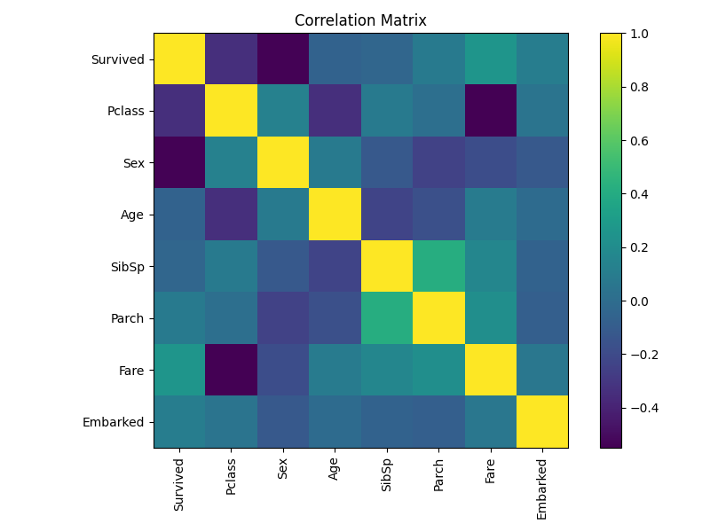

---

# Learning Outcomes

This project helped in understanding the complete Machine Learning workflow from raw data to prediction.

Key concepts learned:

- Data Ingestion using Pandas
- Data Cleaning and Preprocessing
- Missing Value Handling
- Feature Engineering
- Categorical Data Encoding
- Exploratory Data Analysis (EDA)
- Statistical Data Analysis
- Correlation Analysis
- Train-Test Split
- Logistic Regression
- Model Evaluation
- Accuracy Measurement
- Confusion Matrix
- Classification Report
- Model Serialization using Joblib
- Predictive Modelling
- Machine Learning Pipeline
- GitHub Portfolio Development

---

# Future Enhancements

This project can be further enhanced by implementing:

- Feature Scaling using StandardScaler
- Hyperparameter Tuning using GridSearchCV
- Random Forest Classifier
- Decision Tree Classifier
- XGBoost Classifier
- Cross Validation
- Feature Importance Analysis
- ROC Curve and AUC Score
- Model Comparison
- Streamlit Web Application
- Docker Containerization
- CI/CD using GitHub Actions
- Cloud Deployment on AWS

---

# Project Summary

| Component | Status |
|-----------|--------|
| Data Collection | ✅ Completed |
| Data Cleaning | ✅ Completed |
| Feature Engineering | ✅ Completed |
| Data Preprocessing | ✅ Completed |
| Exploratory Data Analysis | ✅ Completed |
| Correlation Analysis | ✅ Completed |
| Machine Learning Model | ✅ Completed |
| Model Evaluation | ✅ Completed |
| Model Serialization | ✅ Completed |
| Prediction Pipeline | ✅ Completed |

---

# Repository Highlights

This assignment demonstrates practical implementation of:

- End-to-End Machine Learning Workflow
- Data Engineering Fundamentals
- Data Preparation using Pandas
- Exploratory Data Analysis
- Binary Classification using Logistic Regression
- Model Persistence using Joblib
- Predictive Analytics
- Python Best Practices
- Professional Project Documentation

---

# Author

**Akash More**

**Data Engineer**

GitHub Portfolio Project

---

# License

This project is licensed under the **MIT License**.

---

# Acknowledgement

This project has been created for learning, portfolio development, interview preparation, and demonstrating practical knowledge of Data Engineering, Data Analysis, and Machine Learning using Python, Pandas, and Scikit-learn.

The dataset used in this project is the **Titanic - Machine Learning from Disaster** dataset provided by Kaggle.

---