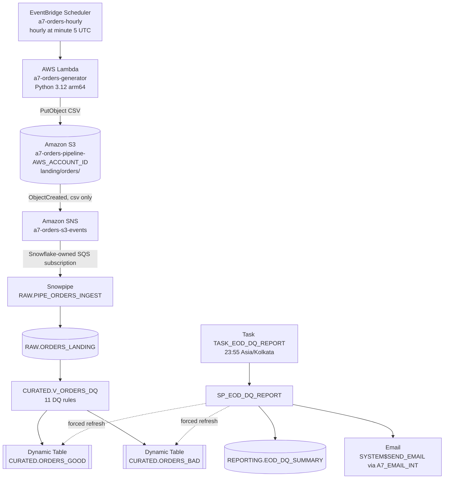

# Assignment 7 — Automated Data Pipeline
## Technical Specification

---

## 1. Document Control

| Item | Value |
|---|---|
| Project | Automated Data Pipeline (hourly orders → data quality → daily report) |
| Assignment | Assignment 7, AWS Data Engineering Assignments portfolio |
| Document version | 1.0 |
| Status | **Live**: production go-live on 2026-10-05 |
| Environment | AWS `ap-south-1` (Mumbai) + Snowflake on AWS `ap-southeast-7` (Bangkok) |
| Repository | `github.com/Akash-web750/aws-data-engineering-assignments`, folder `Assignment-7-automated-data-pipeline/` |
| Baseline commit | `dc6bed3` "feat: add Assignment 7 automated data pipeline" |
| Last updated | 2026-10-06 |
| Purpose | A complete description of the system **as built**, so an engineer can understand, operate and extend it without first reading every source file |

**Conventions.**
- `<AWS_ACCOUNT_ID>`, `<SNOWFLAKE_ACCOUNT>`, `<DEVELOPER_USER>`, `<connection>` and `YOUR_EMAIL@example.com` are placeholders for environment-specific values. This document contains no secrets, credentials, external IDs or real addresses.
- Anything not present in the code is marked **Not implemented**.

---

## 2. Executive Summary

**Problem.** Order data arrives as hourly files. It must be ingested without manual steps, checked for quality record by record, separated into usable and rejected data, and summarised once a day for an operator.

**What the pipeline does.**
1. An AWS Lambda function, triggered every hour by EventBridge Scheduler, generates a realistic e-commerce order file and writes it to S3. About 8 % of the rows are deliberately defective.
2. The S3 upload raises an event. SNS forwards it to Snowflake, and **Snowpipe** loads the file into a RAW table automatically.
3. A Snowflake view applies **11 data-quality rules** to every RAW row. Two **incremental Dynamic Tables** split the rows into GOOD and BAD; BAD rows carry every rule they failed.
4. At **23:55 IST** daily, a Snowflake task runs a stored procedure. It refreshes the curated tables, reconciles them against RAW, computes the day's metrics and trends, stores one summary row, and **emails** the report with Snowflake's built-in notification service.

**Technologies.** AWS: Lambda (Python 3.12), S3, SNS, EventBridge Scheduler, IAM, CloudWatch Logs, CloudFormation. Snowflake: storage integration, external stage, Snowpipe, Dynamic Tables, Snowflake Scripting stored procedure, task, email notification integration, resource monitor. Python 3 (pytest) for tests.

**Production-oriented qualities.**
- **Event-driven and hands-off:** no manual `COPY INTO`.
- **Idempotent:** a deterministic generator and fixed S3 keys, an idempotent `MERGE` for the report, and Snowpipe load history.
- **Least-privilege security:** IAM, encryption, TLS-only access, and Snowflake role separation.
- **Explicit cost controls:** an X-Small warehouse with 60 s auto-suspend, a 6-hour Dynamic Table lag, a resource monitor, and S3 lifecycle rules.
- **Evidence-based pipeline status** in the daily report.
- **A public repository** free of secrets.

---

## 3. Project Objectives (implemented)

| # | Objective | How it is met |
|---|---|---|
| O1 | Automated hourly ingestion | EventBridge Scheduler `cron(5 * * * ? *)` → Lambda → S3 |
| O2 | Event-driven architecture | S3 `ObjectCreated` → SNS → Snowpipe `AUTO_INGEST` |
| O3 | Reproducible test data | Generator seeded per hour: byte-identical output for a given hour |
| O4 | Record-level data quality | 11 rules in `CURATED.V_ORDERS_DQ`; `QUALITY_STATUS` + `QUALITY_REASON` on every row |
| O5 | GOOD / BAD separation | Dynamic Tables `ORDERS_GOOD` / `ORDERS_BAD` (INCREMENTAL) |
| O6 | Daily reporting | `SP_EOD_DQ_REPORT` + `TASK_EOD_DQ_REPORT` → `EOD_DQ_SUMMARY` |
| O7 | Notification | `SYSTEM$SEND_EMAIL` through `A7_EMAIL_INT` |
| O8 | Cost control | X-Small/60 s warehouse, 6 h target lag, resource monitor, S3 lifecycle, arm64 128 MB Lambda |
| O9 | Security | Least-privilege IAM, SSE-S3, public-access block, TLS-only bucket policy, role separation, secrets excluded from Git |
| O10 | Monitoring | Evidence-based `PIPELINE_STATUS` in the daily report; CloudWatch Logs for the Lambda |
| O11 | Testing | 75 offline unit tests; integration and end-to-end validation recorded in `docs/testing.md` |

---

## 4. Scope

### In scope
- Synthetic order generation (Lambda) and landing in S3.
- Automatic ingestion into Snowflake (Snowpipe through SNS, across regions).
- RAW landing table with load metadata.
- 11 data-quality rules; GOOD/BAD curated Dynamic Tables.
- Daily EOD summary table, stored procedure, scheduled task and email.
- Infrastructure as code for AWS (CloudFormation) and ordered SQL scripts for Snowflake.
- Unit tests and documented manual end-to-end validation.

### Out of scope / not implemented
- Real source systems: the data is **synthetic**.
- Downstream consumers, BI dashboards or data marts built on GOOD data.
- **CI/CD pipeline, automated integration tests:** not implemented.
- **CloudWatch alarms, paging or any alerting other than the daily email:** not implemented.
- Automated deployment of the Snowflake objects (scripts are run manually in order) and of the Snowflake IAM role (created with the AWS CLI): not implemented as IaC.
- Data retention policies inside Snowflake beyond 1-day Time Travel.
- Multi-environment (dev/test/prod) separation: a single environment.

---

## 5. High-Level Architecture



In the diagram, `AWS_ACCOUNT_ID` stands for the placeholder `<AWS_ACCOUNT_ID>`. The schedule expression is `cron(5 * * * ? *)`.

| Component | Role |
|---|---|
| EventBridge Scheduler | Fires the Lambda at minute 5 of every UTC hour |
| Lambda `a7-orders-generator` | Builds the previous complete hour's CSV and uploads it |
| S3 bucket | Encrypted, private landing zone; files expire after 30 days |
| SNS topic | Bridges S3 events to Snowflake's queue, across AWS regions |
| Snowpipe | Serverless, event-driven `COPY` into RAW |
| `RAW.ORDERS_LANDING` | Source values as text + load metadata |
| `CURATED.V_ORDERS_DQ` | Single definition of the 11 DQ rules |
| `ORDERS_GOOD` / `ORDERS_BAD` | Curated split, refreshed incrementally |
| `SP_EOD_DQ_REPORT` + task | Daily refresh, reconciliation, metrics, summary, email |
| `EOD_DQ_SUMMARY` | One row per IST business date |

**Cross-region note.** S3 can only send notifications to a queue in its own region, and the Snowflake account runs in another region. The bucket therefore publishes to an SNS topic, which Snowflake's queue subscribes to. Snowflake assumes the AWS IAM role through STS **in its own region**. Because `ap-southeast-7` is an opt-in AWS region, it had to be **enabled on the AWS account**; no resources are deployed there.

---

## 6. Complete End-to-End Data Flow

| # | Step | What happens | If it fails |
|---|---|---|---|
| 1 | Scheduler | At `HH:05` UTC, EventBridge Scheduler invokes the Lambda with `{}` | Scheduler retries up to 2 times within 1 h (RetryPolicy) |
| 2 | Lambda | Reads config from environment variables; resolves the batch hour (= previous complete UTC hour, or `run_ts` if given) | Invalid input/config raises → invocation fails → Lambda async retry (max 1) + logs |
| 3 | Data generation | Seeds an RNG from `SHA-256("a7-orders|YYYY-MM-DDTHH")`; generates 80–150 rows (IST time-of-day pattern), corrupts ≈ 8 % with known defects | Deterministic: a retry produces identical bytes |
| 4 | S3 object | `PutObject` to `landing/orders/year=YYYY/month=MM/day=DD/orders_YYYYMMDD_HH.csv` with metadata `row-count`, `defect-count`, `generator-version`; SSE-S3 by bucket default | Error raises → invocation fails → retry; nothing partial is left (single PUT) |
| 5 | S3 event | Bucket notification fires for `ObjectCreated` on `landing/orders/` + `*.csv` | No event → file sits in S3 un-ingested (see runbook: `ALTER PIPE … REFRESH`) |
| 6 | SNS | Topic `a7-orders-s3-events` delivers the event to Snowflake's SQS subscription | Same as above |
| 7 | Snowpipe | Copies the 15 CSV columns **by position** into RAW, adds `SOURCE_FILE`, `SOURCE_ROW_NUMBER`, `LOADED_AT` (UTC scan time), `LOAD_BATCH_ID`. Observed latency: about 3 s from upload | Structural parse error → whole file skipped (default `ON_ERROR = SKIP_FILE`, visible in `COPY_HISTORY`). A file already loaded by this pipe is skipped |
| 8 | RAW landing | Values are stored as text, so malformed values never block the load | — |
| 9 | DQ validation | `V_ORDERS_DQ` evaluates 11 rules per row with safe `TRY_*` parsing | No runtime failure on bad values; they become `BAD` |
| 10 | Dynamic Tables | `ORDERS_GOOD` / `ORDERS_BAD` refresh incrementally within 6 h (target lag) | Delay is by design; the EOD procedure forces a refresh |
| 11 | EOD reporting | 23:55 IST task → procedure: refresh + verify, counts, reconciliation, Snowpipe status, trends, status, `MERGE` | Runtime error → best-effort `FAILED` row + error re-raised (task history shows the failure); no email |
| 12 | Email | Subject/body built from the saved row; `SYSTEM$SEND_EMAIL` | Failure recorded as `email=FAILED (...)` in `STATUS_DETAILS`; summary and `PIPELINE_STATUS` unaffected |

---

## 7. AWS Architecture

All resources except the Snowflake read role belong to CloudFormation stack `a7-orders-pipeline` (`infra/aws/template.yaml`).

| Component | Purpose | Configuration | Security | Cost consideration |
|---|---|---|---|---|
| **S3** `a7-orders-pipeline-<AWS_ACCOUNT_ID>` | Landing zone | Notification: `ObjectCreated`, prefix `landing/orders/`, suffix `.csv` → SNS. Lifecycle: expire `landing/orders/` after 30 days; abort incomplete multipart after 1 day. No versioning | SSE-S3 (AES256); 4/4 public-access blocks; `BucketOwnerEnforced` (ACLs off); bucket policy denies non-TLS (`aws:SecureTransport=false`) | About 25 KB per file; lifecycle caps storage |
| **Lambda** `a7-orders-generator` | Generate + upload one file per hour | Python 3.12, **arm64**, 128 MB, 30 s, handler `handler.lambda_handler`; env vars `S3_BUCKET`, `S3_LANDING_PREFIX`, `ROWS_PER_FILE_MIN/MAX`, `DEFECT_RATE`; async retries 1, max event age 1 h; no reserved concurrency | Execution role below; no secrets in code or env | 24 short invocations/day; arm64 is cheaper per GB-s |
| **EventBridge Scheduler** `a7-orders-hourly` | Hourly trigger | `cron(5 * * * ? *)`, UTC, `FlexibleTimeWindow OFF`, input `{}`, retry 2 / 1 h. State is a stack parameter (`ENABLED` since go-live) | Invokes via scheduler role only | Free tier at this volume |
| **SNS** `a7-orders-s3-events` | S3 → Snowflake event bridge | Standard topic; **no encryption configured** in the template | Publish: only `s3.amazonaws.com` for this bucket ARN **and** this account. Subscribe: only Snowflake's principal (parameter `SnowflakeSnsPrincipalArn`) | ~720 publishes/month |
| **IAM** `a7-orders-generator-role` | Lambda execution | `s3:PutObject` on `<bucket>/landing/orders/*`; `logs:CreateLogStream`/`PutLogEvents` on its log group | Trust: `lambda.amazonaws.com` with `aws:SourceAccount` | — |
| **IAM** `a7-orders-generator-scheduler-role` | Scheduler → Lambda | `lambda:InvokeFunction` on the generator only | Trust: `scheduler.amazonaws.com` with `aws:SourceAccount` | — |
| **IAM** `a7-snowflake-s3-access-role` *(AWS CLI, not in stack)* | Snowflake reads S3 | Policy `infra/aws/iam/snowflake-s3-read-policy.json`: `s3:GetObject`, `s3:GetObjectVersion` on `landing/orders/*`; `s3:ListBucket` only with `s3:prefix` `landing/orders/`; `s3:GetBucketLocation` | Trust (`snowflake-trust-policy.example.json` shape): Snowflake's IAM user **and** `sts:ExternalId` must match the storage integration | — |
| **CloudWatch Logs** `/aws/lambda/a7-orders-generator` | Lambda logs (one JSON summary line per run) | Retention 14 days | Written only by the execution role | Retention caps cost |

**IAM JSON files** (no comments are possible in JSON, so they're documented here):
- `snowflake-s3-read-policy.json` is **read-only**, limited to the landing prefix. There's no `PutObject`/`DeleteObject` and no other buckets. `ListBucket` is restricted by prefix, and `GetBucketLocation` lets Snowflake resolve the bucket region.
- `snowflake-trust-policy.example.json` is the **template** for the trust policy. Its two values come from `DESC INTEGRATION A7_S3_INT`. The filled-in file `snowflake-trust-policy.json` contains the external ID and is **git-ignored**.

---

## 8. Snowflake Architecture

### 8.1 Account-level objects (created by ACCOUNTADMIN: `00_admin_bootstrap.sql`, `00b_admin_email_integration.sql`)

| Object | Purpose / configuration |
|---|---|
| `A7_PIPELINE_ROLE` | Owns everything inside `A7_ORDERS_DB`; granted to `SYSADMIN` and to the operating user. Holds `EXECUTE TASK`, USAGE on both integrations, USAGE/OPERATE/MONITOR on the warehouse. `00_admin_bootstrap.sql` also contains `GRANT MONITOR ON RESOURCE MONITOR A7_PIPELINE_RM` to this role, but the **live account does not currently have that grant** (verified read-only with `SHOW GRANTS TO ROLE A7_PIPELINE_ROLE` on 2026-10-06) |
| `A7_PIPELINE_WH` | X-Small, `AUTO_SUSPEND = 60`, `AUTO_RESUME = TRUE`, created suspended, statement/queue timeouts 600 s. **Owned by ACCOUNTADMIN**, so the project role cannot resize it or detach the monitor |
| `A7_PIPELINE_RM` | Resource monitor: 10 credits/month; notify 75 %/90 %, `SUSPEND` 100 %, `SUSPEND_IMMEDIATE` 110 %; attached only to `A7_PIPELINE_WH` |
| `A7_ORDERS_DB` | Project database, `DATA_RETENTION_TIME_IN_DAYS = 1`; auto-created `PUBLIC` schema dropped |
| `A7_S3_INT` | Storage integration (`EXTERNAL_STAGE`, S3), role ARN of `a7-snowflake-s3-access-role`, allowed location `s3://a7-orders-pipeline-<AWS_ACCOUNT_ID>/landing/orders/` |
| `A7_EMAIL_INT` | Email notification integration; `ALLOWED_RECIPIENTS` = the single verified report recipient |

### 8.2 Schemas and objects (created by `A7_PIPELINE_ROLE`: scripts `01`–`06`)

| Schema | Object | Script | Depends on |
|---|---|---|---|
| RAW | File format `FF_ORDERS_CSV` | 02 | — |
| RAW | External stage `STG_ORDERS_S3` | 02 | `A7_S3_INT`, `FF_ORDERS_CSV`, AWS read role |
| RAW | Table `ORDERS_LANDING` | 03 | — |
| RAW | Pipe `PIPE_ORDERS_INGEST` | 03b | stage, table, SNS topic + subscribe permission |
| CURATED | View `V_ORDERS_DQ` | 05 (logic from 04) | `ORDERS_LANDING` |
| CURATED | Dynamic tables `ORDERS_GOOD`, `ORDERS_BAD` | 05 | `V_ORDERS_DQ`, `A7_PIPELINE_WH`, change tracking on RAW |
| REPORTING | Table `EOD_DQ_SUMMARY` | 06 | — |
| REPORTING | Procedure `SP_EOD_DQ_REPORT(DATE)` | 06 | DTs, view, pipe, summary table, `A7_EMAIL_INT` |
| REPORTING | Task `TASK_EOD_DQ_REPORT` | 06 | procedure, `A7_PIPELINE_WH`, `EXECUTE TASK` |

**Dependency chain:**
```text
A7_S3_INT ──► (AWS role trusts its IAM user + external ID) ──► STG_ORDERS_S3 ──► PIPE_ORDERS_INGEST ──► ORDERS_LANDING
SNS topic policy (Snowflake may subscribe) ───────────────────────────────────────┘
ORDERS_LANDING ──► V_ORDERS_DQ ──► ORDERS_GOOD / ORDERS_BAD ──► SP_EOD_DQ_REPORT ──► EOD_DQ_SUMMARY + email
TASK_EOD_DQ_REPORT ──► SP_EOD_DQ_REPORT
```

---

## 9. Data Model

### 9.1 `RAW.ORDERS_LANDING`

The business columns are `VARCHAR`, so **any** value loads. Typed columns would make the whole file fail (`SKIP_FILE`), and the defect could never be reported.

| Column | Type | Source | Meaning |
|---|---|---|---|
| `ORDER_ID` | VARCHAR | `$1` | `ORD-YYYYMMDDHH-NNNNN`; unique per hour except injected duplicates |
| `ORDER_TS` | VARCHAR | `$2` | Order time, ISO-8601 UTC `YYYY-MM-DDTHH:MI:SSZ` |
| `CUSTOMER_ID` | VARCHAR | `$3` | `CUST-NNNNN` |
| `CUSTOMER_NAME` | VARCHAR | `$4` | First + last name |
| `CUSTOMER_EMAIL` | VARCHAR | `$5` | Customer email (synthetic) |
| `PRODUCT_ID` | VARCHAR | `$6` | `SKU-<category code><nnn>` from a fixed 42-product catalog |
| `PRODUCT_CATEGORY` | VARCHAR | `$7` | Electronics, Fashion, Home & Kitchen, Beauty, Books, Sports, Grocery |
| `QUANTITY` | VARCHAR | `$8` | Units (1–5 when clean) |
| `UNIT_PRICE` | VARCHAR | `$9` | INR, 2 decimals |
| `AMOUNT` | VARCHAR | `$10` | `QUANTITY × UNIT_PRICE` when clean |
| `CURRENCY` | VARCHAR | `$11` | `INR` |
| `PAYMENT_METHOD` | VARCHAR | `$12` | UPI, CARD, NET_BANKING, COD, WALLET |
| `ORDER_STATUS` | VARCHAR | `$13` | PLACED, SHIPPED, DELIVERED, CANCELLED, RETURNED |
| `CITY` | VARCHAR | `$14` | Indian city |
| `BATCH_TS` | VARCHAR | `$15` | Business hour of the file (UTC) |
| `SOURCE_FILE` | VARCHAR | `METADATA$FILENAME` | Object key, e.g. `landing/orders/year=…/orders_YYYYMMDD_HH.csv` |
| `SOURCE_ROW_NUMBER` | NUMBER | `METADATA$FILE_ROW_NUMBER` | Data row number in the file (1 = first data row) |
| `LOADED_AT` | TIMESTAMP_NTZ | `CONVERT_TIMEZONE('UTC', METADATA$START_SCAN_TIME)` | Snowpipe scan time in UTC (pipe v2; see §11 for v1 rows) |
| `LOAD_BATCH_ID` | VARCHAR | `MD5(SOURCE_FILE \| scan time)` | One identifier per file load |

`(SOURCE_FILE, SOURCE_ROW_NUMBER)` uniquely identifies a RAW row and is the reconciliation key.

### 9.2 Derived columns (`V_ORDERS_DQ`; parsed and quality columns also exposed by the Dynamic Tables)

| Column | Definition |
|---|---|
| `ORDER_TS_PARSED` | `TRY_TO_TIMESTAMP_NTZ(ORDER_TS, 'YYYY-MM-DD"T"HH24:MI:SS"Z"')` (UTC, NTZ) |
| `QUANTITY_PARSED` / `UNIT_PRICE_PARSED` / `AMOUNT_PARSED` | `TRY_TO_NUMBER(x, 18, 4)` |
| `LOADED_AT_UTC` | Ingestion time normalised to UTC (§11) |
| `ORDER_ID_OCCURRENCE` | Arrival rank of the row within its `ORDER_ID` (view only) |
| `DQ01_FAIL` … `DQ11_FAIL` | Boolean per rule (view only) |
| `QUALITY_STATUS` | `GOOD` / `BAD` |
| `QUALITY_REASON` | NULL for GOOD; otherwise every failed rule code, in rule order, joined with `;` |

---

## 10. Data Quality Specification

| Rule ID | Rule | Logic (Snowflake) | Failure behaviour |
|---|---|---|---|
| `DQ01_REQUIRED_FIELDS` | All 15 business columns present | Any business column `IS NULL` (blank fields become NULL through the file format) | Row BAD; code added |
| `DQ02_QUANTITY_NUMERIC` | Quantity is numeric | `QUANTITY` not NULL and `TRY_TO_NUMBER(QUANTITY,18,4)` NULL | Row BAD |
| `DQ03_QUANTITY_POSITIVE` | Quantity > 0 | `QUANTITY_PARSED <= 0` | Row BAD |
| `DQ04_UNIT_PRICE_NUMERIC` | Unit price is numeric | `UNIT_PRICE` not NULL and parse NULL | Row BAD |
| `DQ05_AMOUNT_NUMERIC` | Amount is numeric | `AMOUNT` not NULL and parse NULL | Row BAD |
| `DQ06_AMOUNT_POSITIVE` | Amount > 0 | `AMOUNT_PARSED <= 0` | Row BAD |
| `DQ07_AMOUNT_MATCH` | Amount = quantity × unit price | All three parsed and `ABS(AMOUNT − QUANTITY × UNIT_PRICE) > 0.01` | Row BAD |
| `DQ08_EMAIL_VALID` | Plausible email | Not `REGEXP_LIKE(email, '[A-Za-z0-9._%+-]+@[A-Za-z0-9.-]+[.][A-Za-z]{2,}')` (whole-string match) | Row BAD |
| `DQ09_ORDER_TS_NOT_FUTURE` | Valid, non-future order time | `ORDER_TS` not NULL and (unparseable **or** `ORDER_TS_PARSED > LOADED_AT_UTC`) | Row BAD (§11) |
| `DQ10_STATUS_VALID` | Known status | Not in (PLACED, SHIPPED, DELIVERED, CANCELLED, RETURNED), case-sensitive | Row BAD |
| `DQ11_DUPLICATE_ORDER_ID` | First arrival wins | `ROW_NUMBER() OVER (PARTITION BY ORDER_ID ORDER BY LOADED_AT, SOURCE_FILE, SOURCE_ROW_NUMBER) > 1` | Later arrivals BAD (§12) |

**Evaluation semantics.**
- **All rules are evaluated for every row**, and `QUALITY_REASON` lists **all** failures, e.g. `DQ06_AMOUNT_POSITIVE;DQ07_AMOUNT_MATCH`.
- **NULLs fail only DQ01.** The type and range rules (DQ02–DQ10) evaluate *present* values, so one missing field isn't counted twice. `COALESCE(…, FALSE)` turns comparisons with NULL into a pass.
- **Safe parsing:** `TRY_*` functions never abort the query. `TRY_TO_NUMBER(x, 18, 4)` is used because the one-argument form rounds to an integer (`1097.99` → `1098`), which would break DQ07.
- **Tolerance:** 0.01 INR for DQ07.
- **No sampling.** Every row is classified; there's no quarantine step other than the BAD table.

---

## 11. DQ09 Timestamp Design

| Aspect | Decision |
|---|---|
| **Parsing** | Explicit format `'YYYY-MM-DD"T"HH24:MI:SS"Z"'`. Automatic detection was rejected: it read a zone-less timestamp in the account time zone (America/Los_Angeles). Non-ISO values are unparseable and fail DQ09. |
| **Meaning of "future"** | *Later than the moment the record was ingested*: `ORDER_TS_PARSED > LOADED_AT_UTC`. The result is fixed at ingestion and never changes as time passes. |
| **Why not the current clock** | `SYSDATE()`/`CURRENT_TIMESTAMP` are non-deterministic. In a test Dynamic Table, Snowflake reported *"Query contains the function 'CURRENT_TIMESTAMP' … change tracking is not supported"* and chose **FULL** refresh. With `LOADED_AT_UTC` the same query refreshes **INCREMENTAL**. On the validation data both definitions gave identical DQ09 results. |
| **`LOADED_AT` history** | Pipe v1 stored `CURRENT_TIMESTAMP()::TIMESTAMP_NTZ`, i.e. Pacific wall-clock time, repeated across loads. Pipe v2 (recreated 2026-10-05) stores `CONVERT_TIMEZONE('UTC', METADATA$START_SCAN_TIME)`, the real scan time in UTC. RAW rows were **not** rewritten. |
| **`LOADED_AT_UTC`** | `IFF(LOADED_AT < '2026-10-05 15:53:30.544'::TIMESTAMP_NTZ, CONVERT_TIMEZONE('America/Los_Angeles','UTC', LOADED_AT), LOADED_AT)`. The constant is pipe v2's creation time in UTC. The ranges can't overlap: v1 values are Pacific times before 08:53:30, and v2 values are UTC times from 15:53:30 onwards. Without this, raw `LOADED_AT` would have wrongly failed 294 of the 295 v1 rows. |
| **Future detection** | The generator's future defect is +365 days; clean rows are inside a completed hour that is already in the past when the file is generated. |

---

## 12. DQ11 Duplicate Design

- **Rule:** among rows sharing a non-NULL `ORDER_ID`, the **first one received** passes. Every later arrival is `BAD` with `DQ11_DUPLICATE_ORDER_ID`.
- **Arrival order:** `ORDER BY LOADED_AT, SOURCE_FILE, SOURCE_ROW_NUMBER`.
  - `LOADED_AT` orders files by scan time.
  - Rows of one file share it, and the two pipe-v1 files share one value. So `SOURCE_FILE` and then `SOURCE_ROW_NUMBER` give a deterministic tie-break, following the order inside the file.
- **Why not `ORDER_TS`:** duplicates are re-sent copies, and a copy's event time can be earlier than the original's. In the validation file, 3 of the 4 injected copies had an earlier `ORDER_TS`. Event-time ordering flagged the clean originals instead, and arrival order fixed it, giving 4/4 correct.
- **NULL IDs** aren't ranked: they fail DQ01 only and are never duplicates of each other.
- **Same `ORDER_ID` in GOOD and BAD is expected.** The original is in `ORDERS_GOOD` and the later copy is in `ORDERS_BAD`. Row uniqueness across the two tables is defined by (`SOURCE_FILE`, `SOURCE_ROW_NUMBER`), not by `ORDER_ID`.

---

## 13. Curated Dynamic Tables

| Property | `CURATED.ORDERS_GOOD` | `CURATED.ORDERS_BAD` |
|---|---|---|
| Source | `V_ORDERS_DQ WHERE QUALITY_STATUS = 'GOOD'` | `V_ORDERS_DQ WHERE QUALITY_STATUS = 'BAD'` |
| Columns (26) | 15 business, `SOURCE_FILE`, `SOURCE_ROW_NUMBER`, `LOADED_AT`, `LOAD_BATCH_ID`, `LOADED_AT_UTC`, 4 parsed, `QUALITY_STATUS`, `QUALITY_REASON` | same |
| Refresh mode | `INCREMENTAL` (explicit: creation fails rather than silently using FULL) | same |
| Target lag | `6 hours` | same |
| Warehouse | `A7_PIPELINE_WH` | same |
| Initialize | `ON_CREATE` | same |

- **Single source of truth:** both tables filter the same view, so they can never disagree. Incremental refresh needs change tracking on `RAW.ORDERS_LANDING`, which Snowflake enabled automatically.
- **Why 6 hours** (observed while testing with a 1-minute lag):
  - **No-data checks are cheap:** checks that found no new rows ran in cloud services and **did not** resume the warehouse.
  - **New data is expensive:** each check that found a new file needed about 1 s of work but cost a full resume (60 s minimum, then the 60 s suspend tail).
  - **Hourly files multiply that:** with one file per hour, any lag of 1 hour or less means about 24 resumes a day, an *estimated* 13–20 credits a month, which is over the 10-credit cap.
  - **A 6-hour lag batches files:** several hourly files go into each refresh, an *estimated* 3–7 credits a month.
- **Freshness:** GOOD/BAD may trail RAW by up to 6 hours during the day. The EOD procedure **forces** a refresh of both tables before reporting, so the report always covers every loaded row. A demo can temporarily set `TARGET_LAG = '1 minute'`.

---

## 14. EOD Reporting: `REPORTING.EOD_DQ_SUMMARY`

One row per **IST business date** (`REPORT_DATE`, logical key; uniqueness is enforced by `MERGE`; the declared primary key is informational).

| Column | Meaning |
|---|---|
| `REPORT_DATE`, `REPORT_TIMEZONE` | IST date; `Asia/Kolkata` |
| `WINDOW_START_UTC`, `WINDOW_END_UTC` | IST midnight → next IST midnight, expressed in UTC |
| `TOTAL_RECORDS`, `GOOD_RECORDS`, `BAD_RECORDS` | Curated rows whose `LOADED_AT_UTC` falls in the window |
| `GOOD_PERCENTAGE`, `BAD_PERCENTAGE` | 2 decimals; NULL when total = 0 |
| `FILES_PROCESSED` | Distinct `SOURCE_FILE` in the window |
| `BAD_REASON_SUMMARY` | Failures per rule code, most frequent first (`DQ07_AMOUNT_MATCH=6; …`) |
| `PREVIOUS_DAY_TOTAL` | `TOTAL_RECORDS` of the previous date's row; NULL if no such row (no fabricated zero) |
| `VOLUME_CHANGE`, `VOLUME_CHANGE_PERCENTAGE` | Versus previous day; % NULL when previous = 0 or missing |
| `SEVEN_DAY_AVG_TOTAL` | Average over the available days in `date−6 … date` (today included) |
| `SEVEN_DAY_AVG_BAD_PERCENTAGE` | Mean of the available daily BAD % (0-record days skipped) |
| `SEVEN_DAY_DAYS_AVAILABLE`, `SEVEN_DAY_TREND` | Days actually used; `MM-DD:total` list |
| `PIPELINE_STATUS` | `HEALTHY` / `WARNING` / `FAILED` (§15) |
| `STATUS_DETAILS` | Evidence: `refresh_verified`, `curated_as_of_utc`, `raw_rows`, `curated_rows`, `classification_mismatch`, `raw_not_curated`, `curated_not_in_raw`, `duplicate_row_keys`, `snowpipe`, then `email=…` |
| `OBSERVATIONS` | Deterministic text (thresholds in §15) |
| `CURATED_AS_OF_UTC` | Earliest data timestamp of the two refreshed DTs |
| `CREATED_AT`, `UPDATED_AT`, `RUN_COUNT` | First run, latest run (UTC) and number of runs for the date |

---

## 15. EOD Stored Procedure: `REPORTING.SP_EOD_DQ_REPORT(P_REPORT_DATE DATE DEFAULT NULL)`

Snowflake Scripting (SQL), `EXECUTE AS OWNER` (`A7_PIPELINE_ROLE`), returns a status string.

| # | Step | Detail |
|---|---|---|
| 1 | Resolve report date | `v_today_ist = CONVERT_TIMEZONE('UTC','Asia/Kolkata', SYSDATE())::DATE`; date = parameter or today; **future dates rejected** (`-20001`) |
| 2 | IST day window | IST midnight of the date |
| 3 | Convert to UTC | `CONVERT_TIMEZONE('Asia/Kolkata','UTC', date)` → `[start, start + 1 day)`, which never depends on the session time zone |
| 4 | Refresh Dynamic Tables | `ALTER DYNAMIC TABLE … REFRESH` on `ORDERS_GOOD`, then `ORDERS_BAD` |
| 5 | Verify refresh | `data_timestamp` from each refresh (via `RESULT_SCAN`) must be ≥ procedure start, otherwise `refresh_verified=N` → FAILED |
| 6 | DQ metrics | GOOD/BAD counts, distinct files, failures per rule (`SPLIT_TO_TABLE` on `QUALITY_REASON`) for the window |
| 7 | Reconciliation | Full outer join of `V_ORDERS_DQ` (re-evaluated on RAW) with GOOD ∪ BAD on (`SOURCE_FILE`, `SOURCE_ROW_NUMBER`): classification mismatches, RAW rows not yet curated, curated rows missing in RAW, rows present more than once |
| 8 | Snowpipe status | `SYSTEM$PIPE_STATUS(...)` → `executionState` |
| 9 | Trends | Previous day and 7-day window from `EOD_DQ_SUMMARY` (other dates only, rows with totals) |
| 10 | Status | **FAILED:** refresh not verified, classification mismatch, curated-not-in-RAW, or duplicate row keys. **WARNING:** Snowpipe ≠ `RUNNING`, 0 records, BAD ≥ 10 %, or RAW rows not curated. **HEALTHY:** otherwise. Observations: BAD vs 10 %, volume change vs ±25 %, no previous day / previous = 0, most frequent failure, files, days used |
| 11 | `MERGE` | Upsert on `REPORT_DATE`; re-runs update the row (`RUN_COUNT + 1`, `CREATED_AT` kept); **idempotent** |
| 12 | Email | Subject/body read back from the saved row; `SYSTEM$SEND_EMAIL`; result checked; outcome appended to `STATUS_DETAILS` |
| 13 | Error handling | Inner email block: failure → `email=FAILED (…)`, nothing else changes. Outer handler: best-effort `FAILED` row with `SQLCODE`/`SQLSTATE`/`SQLERRM` in `STATUS_DETAILS`, then `RAISE` so the task records the failure. No email is sent in that case. |

Every call (scheduled or manual) sends **one email**.

---

## 16. EOD Task: `REPORTING.TASK_EOD_DQ_REPORT`

| Property | Value |
|---|---|
| Schedule | `USING CRON 55 23 * * * Asia/Kolkata` (23:55 IST daily, explicit time zone) |
| Warehouse | `A7_PIPELINE_WH` (same warehouse as the DT refreshes, so a single resume per run) |
| Body | `CALL A7_ORDERS_DB.REPORTING.SP_EOD_DQ_REPORT()` |
| Overlap | Not allowed: Snowflake default `ALLOW_OVERLAPPING_EXECUTION = FALSE` (not set explicitly) |
| Timeout | `USER_TASK_TIMEOUT_MS = 600000` (10 minutes) |
| State | **Started** (resumed at go-live). It was created suspended. Re-running `CREATE OR REPLACE TASK` recreates it **suspended**. |
| Purpose | Close each IST business day with a verified summary and notification. The last hourly file of an IST day lands at about 23:35 IST (`HH:05` UTC), before the run. |

---

## 17. Email Notification

- **Mechanism:** Snowflake-native `SYSTEM$SEND_EMAIL('A7_EMAIL_INT', '<recipient>', subject, body)`. There's no AWS SES, Lambda or third-party service.
- **Integration:** `A7_EMAIL_INT` (`TYPE = EMAIL`, enabled, outbound). `ALLOWED_RECIPIENTS` contains only the verified report recipient, and the project role has USAGE.
- **Recipient prerequisite:** Snowflake delivers only to an address that is **verified on a user of the account** (Snowsight → Profile → verify).
- **Subject:** `Assignment 7 EOD DQ Report - YYYY-MM-DD - <HEALTHY|WARNING|FAILED>`.
- **Body:** report date, status, totals with GOOD/BAD and %, files, previous day, volume change, 7-day average/BAD %/days/trend, failures by rule, status details, observations, curated as-of time and window (UTC), run number.
- **Production vs public repository:**
  - The **deployed** procedure contains the real verified recipient.
  - The **repository** contains the placeholder `YOUR_EMAIL@example.com`, in `06_eod_reporting.sql`, `00b_admin_email_integration.sql` (`<VERIFIED_EMAIL>`) and `config/pipeline.example.env`.
  - Deploying the repository version unchanged makes every send fail (`email=FAILED`) **without** affecting the DQ results.
- **Delivery validated** on 2026-10-05: one test email, then one production-format email, both accepted (`true`) and received.

---

## 18. Security Design

| Area | Control |
|---|---|
| Least-privilege IAM | Generator: `PutObject` on the landing prefix and its own logs only. Scheduler: invoke one function. Snowflake role: read-only on the landing prefix. All trust policies are scoped (`aws:SourceAccount`, external ID). |
| S3 encryption | SSE-S3 (AES256) default encryption |
| Public access | All four S3 public-access blocks enabled |
| Object ownership | `BucketOwnerEnforced`: ACLs disabled |
| Secure transport | Bucket policy denies any request with `aws:SecureTransport = false` |
| SNS | Publish restricted to this bucket and account; subscribe restricted to Snowflake's principal |
| Snowflake role separation | Account-level objects created once by ACCOUNTADMIN. The project role owns only database objects, uses but cannot resize the warehouse, and can't detach the monitor. The procedure runs with owner's rights. |
| Storage integration | Snowflake reads S3 by assuming an IAM role. **No access keys** exist anywhere. |
| External ID | Snowflake generates a per-integration external ID, and the role's trust policy requires it, which prevents another Snowflake customer from using the role. Its value is stored only in the git-ignored trust policy file. **Never recreate the integration**: a new one gets a new external ID. |
| Email | `ALLOWED_RECIPIENTS` limits delivery to one verified address |
| Secrets & Git | `.gitignore` excludes `.env*`, credentials, keys/certificates (`*.pem/.key/.crt/.p8/.p12/.pfx`), Snowflake CLI configs, `*.csv`, build artifacts and the filled trust policy. AWS uses the CLI profile; Snowflake uses the CLI connection. |
| Public repository | Account IDs, ARNs, the external ID, the real email and developer user names are replaced by placeholders. Git history was scanned before publishing. |

---

## 19. Cost Optimization

### 19.1 Design intent
- **X-Small warehouse:** `AUTO_SUSPEND = 60`, auto-resume; it runs only while working.
- **6-hour Dynamic Table lag:** fewer warehouse resumes for hourly data (§13).
- **One resume per EOD run:** both refreshes, the reconciliation and the email share one session.
- **Resource monitor `A7_PIPELINE_RM`:** caps the warehouse at 10 credits/month (suspends at 100 %).
- **Serverless Snowpipe:** no warehouse involved.
- **S3 lifecycle:** landing files expire after 30 days; incomplete uploads after 1 day.
- **Lambda:** arm64, 128 MB, a few seconds 24×/day. CloudWatch Logs retention is 14 days.
- **No always-on compute:** no EC2, RDS or containers.

### 19.2 Actual observed behaviour (validation, 2026-10-05)
- **No-data checks:** scheduled checks that found nothing new did **not** resume the warehouse.
- **Initial refresh:** a data refresh at creation took about 0.2–0.4 s of execution for 295 rows.
- **EOD run:** a manual EOD session resumed the warehouse once and auto-suspended after about 80–90 s.
- **Monitor usage:** the ACCOUNTADMIN check at go-live showed **0.37 of 10 credits** used (all earlier development and testing).

### 19.3 Not yet measured
The steady-state monthly cost with the hourly schedule enabled. The ~3–7 credits/month figure is an **estimate**, to be confirmed from warehouse metering and the Dynamic Table refresh history after several days of operation.

---

## 20. Testing Specification

### 20.1 Unit tests (offline, `pytest`): **75 / 75 passed**

| File | Cases | Focus |
|---|---|---|
| `tests/unit/test_naming.py` | 16 | S3 key format/padding/prefix, `run_ts` parsing (Z, naive, offsets, invalid), previous-hour default |
| `tests/unit/test_generator.py` | 49 | Byte-identical determinism, CSV header/quoting/LF, volume bounds and daily pattern, realistic clean rows, ≈ 8 % defects, all 9 defect types, each defect fails its intended check, duplicate donors, config validation |
| `tests/unit/test_handler.py` | 10 | Upload key/body/metadata via a stub S3 client, dry run, scheduled event, missing bucket, invalid `run_ts`, custom prefix |
| `tests/unit/dq_reference.py` | — | Simplified Python version of the rules, used by the generator tests (not the production rules) |

`tests/sql/` and `snowflake/validation/` are empty placeholders. **Automated SQL tests are not implemented**; the SQL rules were validated as below.

### 20.2 Integration and end-to-end validation (performed manually, 2026-10-05)

| Area | Evidence | Result |
|---|---|---|
| Lambda | Dry run + one real invoke | Output byte-identical to local generation; Python 3.12 arm64 = local 3.10 |
| Storage integration | `SYSTEM$VALIDATE_STORAGE_INTEGRATION` list + read | SUCCESS (after enabling the opt-in region) |
| Snowpipe | Existing file via `REFRESH`; new file fully automatic via SNS | 145 + 150 rows, 0 errors; automatic ingest about 3 s after upload |
| Column mapping | Every loaded cell vs generator output | 4,425 / 4,425 match |
| DQ rules | Every row vs the generator's record of the defects it injected | 24 / 24 detected, 0 false positives |
| Dynamic Tables | Row-level comparison vs validated DQ query | 0 mismatches, INCREMENTAL |
| EOD | Re-runs, 0-record day, previous = 0, 7-day over 2 days, future date | Correct; 1 row per date; future date rejected |
| Email | Test + production-format email | Accepted and delivered |
| Idempotency | Re-running the same EOD date; same-hour regeneration | One row per date (`RUN_COUNT` increments); identical bytes per hour |

**Validation evidence** (initial tested run, not ongoing production history):

| Records | GOOD | BAD | GOOD % | BAD % | Files | Status |
|---|---|---|---|---|---|---|
| 295 | 271 | 24 | 91.86 % | 8.14 % | 2 | HEALTHY |

---

## 21. Failure and Recovery

| Failure | Behaviour as implemented | Recovery |
|---|---|---|
| Lambda error (config, bad `run_ts`, S3 error) | Invocation fails; Scheduler retry policy (2 attempts, 1 h) + Lambda async retry (1); logged in CloudWatch | Fix the cause; re-invoke with `{"run_ts":"<hour>"}`. The output is identical and the key is the same |
| S3 `PutObject` failure | Exception → invocation fails (single PUT, no partial file) | As above |
| S3 → SNS → Snowpipe notification lost | File remains in S3, not loaded | `ALTER PIPE A7_ORDERS_DB.RAW.PIPE_ORDERS_INGEST REFRESH` loads stage files from the last 7 days that **this** pipe hasn't loaded |
| Snowpipe delay | RAW rows appear later. The EOD report includes only rows loaded before it runs; a pipe not `RUNNING` gives WARNING | Re-run `CALL SP_EOD_DQ_REPORT('<date>')` for the affected date (sends an email) |
| Malformed CSV structure | Snowpipe default `SKIP_FILE`: the file is not loaded; visible in `COPY_HISTORY` | Fix the source and re-deliver under a new key |
| Malformed values | Loaded as text, classified BAD with reasons | None needed; that's the design |
| High defect rate | BAD ≥ 10 % → `WARNING` + observation | Investigate the source |
| Dynamic Table delay | Up to 6 h by design | EOD forces a refresh; manual `ALTER DYNAMIC TABLE … REFRESH` |
| Resource monitor reached | `A7_PIPELINE_WH` suspended: DT refresh and the EOD task fail until the monthly reset; Snowpipe continues | Raise the quota (ACCOUNTADMIN) or wait for the reset; re-run EOD for missed dates |
| EOD runtime error | Best-effort `FAILED` row + error re-raised; task history shows the failure; no email | Fix, then `CALL SP_EOD_DQ_REPORT('<date>')` |
| Email failure | Summary saved; `STATUS_DETAILS` gets `email=FAILED (…)`; `PIPELINE_STATUS` unchanged | Check the recipient verification and `ALLOWED_RECIPIENTS` |

---

## 22. Deployment Specification

```text
AWS prerequisites (CLI signed in as an IAM admin, not root; $env:AWS_ACCOUNT_ID set)
  ↓  enable the Snowflake account's AWS region on the AWS account if it is opt-in
S3 / Lambda / EventBridge (DISABLED) / SNS            infra/aws/deploy.ps1  (CloudFormation)
  ↓
Snowflake role / warehouse / monitor / database        00_admin_bootstrap.sql  (ACCOUNTADMIN)
  + storage integration A7_S3_INT                       → note IAM user ARN + external ID
  ↓
IAM: Snowflake read role (trust = those two values)    AWS CLI, infra/aws/iam/
  ↓
Schemas → file format + stage → landing table          01, 02, 03   (A7_PIPELINE_ROLE)
  ↓  LIST @stage proves the trust
SNS subscribe permission for Snowflake                 deploy.ps1 -SnowflakeSnsPrincipalArn
  ↓
Snowpipe                                               03b
  ↓
DQ (validation) → view + Dynamic Tables                04, 05
  ↓
Email integration (verified recipient)                 00b (ACCOUNTADMIN)
  ↓
EOD table, procedure, task (task created SUSPENDED)    06  (recipient placeholder substituted)
  ↓
End-to-end test → go-live: deploy.ps1 -ScheduleState ENABLED ; ALTER TASK … RESUME
```

**Production safety requirements.**
- **Preview AWS changes** with a CloudFormation change set first.
- **Never recreate** `A7_S3_INT`; the external ID would change.
- **Never recreate the pipe**: it would lose its load history.
- **Re-running `06` resets the live objects.** It suspends the task and replaces the procedure.
- **Repository files hold placeholders.** Substitute them before deploying from the public repository.

**Deployment note: comment-only Lambda changes.** `deploy.ps1` uploads the Lambda code whenever the zip's `CodeSha256` differs from the deployed one, and any byte change in `lambda/order_generator/*.py` changes it, comments and docstrings included. The current source changes are documentation only, so the next normal `deploy.ps1` run will re-package and re-upload the function, with unchanged runtime behaviour. No production change is needed now.

---

## 23. Project File-by-File Reference

| File | Type | Purpose | Depends on | Used by |
|---|---|---|---|---|
| `README.md` | Markdown | Public project overview | — | GitHub visitors |
| `SPEC.md` | Markdown | This technical specification | All sources | Engineers / reviewers |
| `.gitignore` | Config | Keeps secrets, data and build artifacts out of Git | — | Git |
| `requirements.txt` | Config | Optional local tooling (boto3, Snowflake connector, dotenv); not needed for the tests or the packaging script. `handler.py` imports boto3 lazily, and the Lambda runtime supplies it | — | Developers |
| `requirements-dev.txt` | Config | `pytest` (tests); `moto` listed but currently unused | — | Test runs |
| `config/pipeline.example.env` | Config | Placeholder list of environment-specific values | — | Developers (copy → `pipeline.env`, git-ignored) |
| `docs/architecture.md` | Markdown | Component and design reference | — | Engineers |
| `docs/setup.md` | Markdown | Deployment order, placeholders, go-live, teardown | — | Operators |
| `docs/testing.md` | Markdown | Test levels and validation evidence | — | Reviewers |
| `docs/troubleshooting.md` | Markdown | Issues met during the build, with diagnoses | — | Operators |
| `infra/aws/template.yaml` | CloudFormation | S3, bucket policy, SNS + policy, log group, IAM roles, Lambda, async config, schedule | Parameters (bucket name, Snowflake SNS principal) | `deploy.ps1` |
| `infra/aws/deploy.ps1` | PowerShell | Account guard → validate → deploy stack → package + upload Lambda if changed | template, `package_lambda.py`, AWS CLI, `$env:AWS_ACCOUNT_ID` | Operator |
| `infra/aws/teardown.ps1` | PowerShell | Empties the project bucket, deletes the stack and the Snowflake read role | Stack outputs, AWS CLI | Operator (decommission only) |
| `infra/aws/iam/snowflake-s3-read-policy.json` | IAM policy | Read-only S3 access to the landing prefix for Snowflake | Bucket name (`<AWS_ACCOUNT_ID>`) | AWS CLI `put-role-policy` |
| `infra/aws/iam/snowflake-trust-policy.example.json` | IAM policy template | Trust: Snowflake IAM user + external ID | `DESC INTEGRATION A7_S3_INT` values | AWS CLI `create-role` (filled copy is git-ignored) |
| `lambda/order_generator/handler.py` | Python | Lambda entry point: event → generate → `PutObject` → summary | config, generator, naming, boto3 (runtime) | AWS Lambda |
| `lambda/order_generator/generator.py` | Python | Deterministic realistic rows, defect injection, CSV | config, naming | handler, tests |
| `lambda/order_generator/naming.py` | Python | `run_ts` parsing, batch-hour resolution, S3 key | — | handler, generator, tests |
| `lambda/order_generator/config.py` | Python | Environment-driven settings with validation | — | handler, generator, tests |
| `scripts/package_lambda.py` | Python | Deterministic zip + Lambda-style `CodeSha256` | Lambda sources | `deploy.ps1` |
| `snowflake/00_admin_bootstrap.sql` | SQL | Role, monitor, warehouse, database, storage integration, grants | AWS bucket name / role name | ACCOUNTADMIN (once) |
| `snowflake/00b_admin_email_integration.sql` | SQL | Email integration + grant | Verified email | ACCOUNTADMIN (once) |
| `snowflake/01_database_warehouse.sql` | SQL | Time Travel setting, RAW/CURATED/REPORTING schemas | 00 | Project role |
| `snowflake/02_stage_file_format.sql` | SQL | CSV file format, external stage | 00, 01, AWS read role | Project role |
| `snowflake/03_landing_table.sql` | SQL | `RAW.ORDERS_LANDING` | 01 | Project role |
| `snowflake/03b_snowpipe.sql` | SQL | Pipe with `AUTO_INGEST` via SNS (v2 definition) | 02, 03, SNS permission | Project role |
| `snowflake/04_data_quality_validation.sql` | SQL | The 11 DQ rules as a read-only validation query + summaries | 03 | Project role; source of the view logic |
| `snowflake/05_curated_dynamic_tables.sql` | SQL | `V_ORDERS_DQ` + `ORDERS_GOOD` / `ORDERS_BAD` | 04 logic, warehouse | Project role |
| `snowflake/06_eod_reporting.sql` | SQL | `EOD_DQ_SUMMARY`, `SP_EOD_DQ_REPORT`, `TASK_EOD_DQ_REPORT` | 05, 00b | Project role |
| `snowflake/validation/.gitkeep` | Placeholder | Keeps the empty folder (no validation scripts yet) | — | — |
| `tests/unit/conftest.py` | Python | Puts the flat Lambda package on `sys.path` | — | pytest |
| `tests/unit/dq_reference.py` | Python | Simplified rule reference for generator tests | generator | test_generator |
| `tests/unit/test_naming.py` | Python | Naming tests (16) | naming | pytest |
| `tests/unit/test_generator.py` | Python | Generator tests (49) | generator, config, dq_reference | pytest |
| `tests/unit/test_handler.py` | Python | Handler tests (10), stubbed S3 | handler | pytest |
| `tests/sql/.gitkeep` | Placeholder | Empty; SQL tests not implemented | — | — |
| `screenshots/.gitkeep` | Placeholder | Empty; no screenshots are published | — | — |

---

## 24. Configuration Reference

| Setting | Value / placeholder | Where |
|---|---|---|
| `AWS_ACCOUNT_ID` | `<AWS_ACCOUNT_ID>` (required) | Environment variable for `deploy.ps1` / `teardown.ps1` |
| `AWS_REGION` | `ap-south-1` | `deploy.ps1 -Region` default |
| Bucket | `a7-orders-pipeline-<AWS_ACCOUNT_ID>` | Derived by `deploy.ps1` (override `-BucketName`) |
| Landing prefix | `landing/orders/` | Template parameter `LandingPrefix` / Lambda `S3_LANDING_PREFIX` |
| Rows per file | 80–150 | `RowsPerFileMin/Max` → `ROWS_PER_FILE_MIN/MAX` |
| Defect rate | 0.08 | `DefectRate` → `DEFECT_RATE` (validated 0–0.5) |
| Seed salt | `a7-orders` | `SEED_SALT` env var (default; not set by the stack) |
| Schedule | `cron(5 * * * ? *)` UTC; state parameter `ScheduleState` | template / `deploy.ps1 -ScheduleState` |
| Landing retention | 30 days | `LandingRetentionDays` |
| Log retention | 14 days | `LogRetentionDays` |
| Snowflake account | `<SNOWFLAKE_ACCOUNT>` | Snowflake CLI connection (`<connection>`) |
| Warehouse | `A7_PIPELINE_WH`, X-Small, auto-suspend 60 s | `00_admin_bootstrap.sql` |
| Resource monitor | `A7_PIPELINE_RM`, 10 credits/month | `00_admin_bootstrap.sql` |
| Target lag | `6 hours` | `05_curated_dynamic_tables.sql` |
| EOD schedule | `USING CRON 55 23 * * * Asia/Kolkata` | `06_eod_reporting.sql` |
| BAD threshold / volume threshold | 10 % / ±25 % | Procedure variables `v_bad_threshold` / `v_volume_threshold` |
| EOD recipient | `YOUR_EMAIL@example.com` (placeholder) | `06_eod_reporting.sql`; `A7_EMAIL_INT ALLOWED_RECIPIENTS` |

---

## 25. Operational Runbook

**Daily health check:**
```sql
SELECT REPORT_DATE, PIPELINE_STATUS, TOTAL_RECORDS, BAD_PERCENTAGE, FILES_PROCESSED, STATUS_DETAILS
FROM A7_ORDERS_DB.REPORTING.EOD_DQ_SUMMARY ORDER BY REPORT_DATE DESC LIMIT 7;
SELECT SYSTEM$PIPE_STATUS('A7_ORDERS_DB.RAW.PIPE_ORDERS_INGEST');            -- expect RUNNING, 0 pending
SHOW DYNAMIC TABLES IN SCHEMA A7_ORDERS_DB.CURATED;                         -- ACTIVE, INCREMENTAL, 6 hours
SHOW TASKS LIKE 'TASK_EOD_DQ_REPORT' IN SCHEMA A7_ORDERS_DB.REPORTING;     -- started
```
A full day should show `FILES_PROCESSED = 24` once the hourly schedule has run all day.

**Ingestion stopped (no new files in S3):**
1. Check that `aws scheduler get-schedule --name a7-orders-hourly` shows `ENABLED`.
2. Read `/aws/lambda/a7-orders-generator` in CloudWatch Logs; each run logs one JSON summary line.
3. Check the Lambda environment variables.
4. Check the account guard and AWS sign-in if you're redeploying.

**Snowpipe delayed (file in S3, not in RAW):**
1. Check `SYSTEM$PIPE_STATUS`: `executionState`, outstanding messages, last ingested file.
2. Check `COPY_HISTORY` for the file's status and error.
3. Confirm with `aws sns list-subscriptions-by-topic` that exactly one Snowflake `sqs` subscription exists.
4. Confirm the S3 bucket notification configuration.
5. A never-loaded recent file can be loaded with `ALTER PIPE … REFRESH`.

**DQ counts look wrong:**
1. Run `04_data_quality_validation.sql`, which is read-only.
2. Compare its summary with `ORDERS_GOOD` + `ORDERS_BAD`.
3. Check the reconciliation fields in `STATUS_DETAILS`.
4. Remember that the same `ORDER_ID` can legitimately appear in both tables (DQ11).
5. The tables can trail RAW by up to 6 h until refreshed.

**EOD email not received:**
1. Check `STATUS_DETAILS`: it ends with `email=SENT` or `email=FAILED (…)`.
2. Check `TASK_HISTORY` for the run.
3. Check that the recipient is verified and listed in `DESC NOTIFICATION INTEGRATION A7_EMAIL_INT`.
4. Check the spam folder.

**What NOT to do:**
- **Don't recreate `PIPE_ORDERS_INGEST`.** A new pipe has **empty load history**; a `REFRESH` or a rewritten file would load data twice.
- **Don't regenerate already-loaded hours** with `run_ts`. In particular, never regenerate the two **2026-10-05 13:00 and 14:00 UTC** validation hours: they were loaded by an earlier pipe version, so the current pipe would load them again.
- **Don't recreate `A7_S3_INT`.** Its external ID would change and break the AWS trust.
- **Don't re-run `06_eod_reporting.sql` against production.** It replaces the procedure (placeholder recipient) and recreates the task **suspended**.
- **Don't redeploy from the public repository without substituting placeholders,** and preview stack changes with a change set first.
- **Don't run `teardown.ps1`** unless you're decommissioning.
- **Remember that manual `CALL SP_EOD_DQ_REPORT()` runs send an email.**

---

## 26. Current Production State (non-secret)

| Item | State |
|---|---|
| Pipeline | **LIVE** since 2026-10-05 (go-live about 18:10 UTC) |
| EventBridge `a7-orders-hourly` | ENABLED, `cron(5 * * * ? *)` UTC |
| Snowpipe `PIPE_ORDERS_INGEST` | RUNNING, auto-ingest via SNS |
| Dynamic Tables | `ORDERS_GOOD` / `ORDERS_BAD`: ACTIVE, INCREMENTAL, 6-hour lag |
| EOD task | Started; 23:55 IST daily |
| Email | `A7_EMAIL_INT` enabled; delivery verified |
| Repository | Public on GitHub (commit `dc6bed3`); pre-publication security audit passed |
| Unit tests | 75 / 75 passed |

---

## 27. Known Limitations

1. **Business date = ingestion date (IST)**, not order date. A file delayed past 23:55 IST belongs to that date's window but misses that day's report until the date is re-run manually.
2. **The `LOADED_AT_UTC` cutover is a hard-coded constant** (`2026-10-05 15:53:30.544` UTC) to normalise the pipe-v1 rows.
3. **DQ11's window function ranks across the whole RAW table on every refresh.** That's fine at this volume, but cost grows with history.
4. **Monitoring is the daily report plus Lambda logs.** There are no CloudWatch alarms and no real-time alerting.
5. **Snowpipe skips structurally broken files** (`SKIP_FILE`). They show only in `COPY_HISTORY`, not in the BAD table.
6. **Snowflake objects are deployed by manually ordered SQL scripts,** and the Snowflake IAM role with the AWS CLI. Neither is fully declarative IaC.
7. **Some scripts aren't safely re-runnable against production:**
   - `05` doesn't update an existing view (`IF NOT EXISTS`).
   - `06` replaces the procedure and resets the task (`CREATE OR REPLACE`).
   - Recreating the pipe loses its load history.
8. **Every procedure call sends an email,** including manual re-runs.
9. **Single recipient**, which must be a verified Snowflake user email. The repository holds a placeholder.
10. **In the live account the resource monitor is not visible to the project role.** The bootstrap script contains a `MONITOR` grant on `A7_PIPELINE_RM` for `A7_PIPELINE_ROLE`, but that grant is not present in production, so quota usage can be checked only with administrative access (ACCOUNTADMIN). A fresh deployment from the script would include the grant.
11. **Cross-region data transfer.** Snowflake reads from another AWS region; the transfer cost is small at this volume.
12. **Lambda `dry_run` uses truthiness,** so the string `"false"` also triggers a dry run.
13. **Automated SQL/integration tests are not implemented.** End-to-end validation was manual and is recorded in `docs/testing.md`.
14. **The data is synthetic.**
15. **A NULL `LOADED_AT` passes DQ09 silently** (low severity). DQ09 fails a row when `ORDER_TS_PARSED > LOADED_AT_UTC`. With a NULL `LOADED_AT` that comparison is NULL, and `COALESCE(…, FALSE)` turns it into a pass, so a future-dated order would not be flagged (an unparseable `ORDER_TS` still fails). Snowpipe always supplies `LOADED_AT`, so this affects only rows inserted manually, e.g. test data. Not fixed in this documentation-only change.

---

## 28. Future Improvements (NOT currently implemented)

- **CI:** run the unit tests, lint the CloudFormation template and SQL, and run a secret scan on every push.
- **Automated end-to-end tests:** invoke the Lambda with a test `run_ts` into a separate prefix or environment, then assert on `COPY_HISTORY`, the DQ counts and the EOD row.
- **Alerting:** CloudWatch alarms on Lambda errors, a Snowflake alert on pipe or task failures, and notification on `WARNING`/`FAILED` beyond the daily email.
- **Snowflake as IaC:** manage the Snowflake objects (and the Snowflake IAM role) declaratively, so they get change previews.
- **Templated deployment** that substitutes placeholders, e.g. the recipient and account ID, at deploy time.
- **Order-date reporting** alongside ingestion-date reporting, and late-arrival handling for files after 23:55 IST.
- **Cost dashboard** from warehouse metering and Dynamic Table refresh history.
- **Separate dev/test/prod environments.**

---

## 29. Glossary

| Term | Meaning |
|---|---|
| RAW | Landing layer: data exactly as received (text) plus load metadata |
| CURATED | Layer containing the DQ view and the GOOD/BAD Dynamic Tables |
| REPORTING | Layer containing the EOD summary, procedure and task |
| DQ | Data quality: the 11 rules applied to every record |
| GOOD / BAD | `QUALITY_STATUS`: passes all rules / fails at least one |
| `QUALITY_REASON` | All failed rule codes of a BAD row, `;`-separated |
| Snowpipe | Snowflake's serverless, event-driven continuous loading (`AUTO_INGEST`) |
| Dynamic Table | Snowflake table defined by a query and kept up to date automatically within a target lag |
| Target lag | Maximum allowed staleness of a Dynamic Table relative to its sources (here 6 hours) |
| Incremental refresh | Refresh that processes only changed source rows (needs change tracking and deterministic SQL) |
| Change tracking | Table property recording row changes, required for incremental Dynamic Tables |
| EOD | End of day: the 23:55 IST report |
| IST | India Standard Time (`Asia/Kolkata`, UTC+05:30) |
| Storage integration | Snowflake object that accesses cloud storage by assuming an IAM role |
| External ID | Secret-like token required in the IAM trust policy so only this Snowflake integration can assume the role |
| S3 | Amazon Simple Storage Service (object storage) |
| SNS | Amazon Simple Notification Service (pub/sub topic) |
| SQS | Amazon Simple Queue Service; Snowflake's Snowpipe queue subscribes to the SNS topic |
| EventBridge Scheduler | AWS service that invokes targets on a schedule |
| IAM | AWS Identity and Access Management |
| Resource monitor | Snowflake credit quota with notify/suspend triggers |
| Idempotent | Re-running gives the same result without duplicates |
| CDC | Change data capture: **not used** in this project (Dynamic Tables rely on Snowflake change tracking internally) |

---

## 30. Final Architecture Summary

Every hour, EventBridge Scheduler invokes a small arm64 Lambda that deterministically generates the previous hour's order file. The Lambda writes it to an encrypted, private, TLS-only S3 bucket under a predictable key.

The upload raises an S3 event, which travels through a tightly scoped SNS topic to Snowflake. There, Snowpipe loads the file serverlessly into a text-typed RAW table with UTC load metadata.

A single view applies 11 data-quality rules with safe parsing, an ingestion-relative timestamp rule and arrival-ordered duplicate detection. Two incremental Dynamic Tables on a 6-hour lag separate GOOD from BAD records. Each BAD record carries every reason it failed.

At 23:55 IST a task runs an owner's-rights stored procedure. It forces and verifies a refresh, reconciles curated data against RAW, checks Snowpipe health, computes day-over-day and 7-day trends, and stores one idempotent summary row per IST date. It then emails the report through Snowflake's native email integration, isolated so that an email failure never affects the data.

Least-privilege IAM, Snowflake role separation, an X-Small auto-suspending warehouse capped by a resource monitor, and S3 lifecycle rules keep the system secure and inexpensive. The pipeline has been live since 2026-10-05; its first validation classified 295 records into 271 GOOD and 24 BAD, with 0 mismatches.
