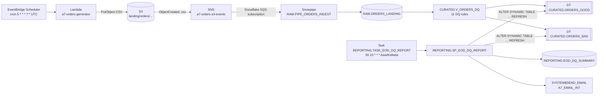

# Architecture

## 1. Overview



### Regions

| Platform | Region | Notes |
|----------|--------|-------|
| AWS resources | `ap-south-1` (Mumbai) | Bucket, Lambda, SNS topic, schedule, IAM roles |
| Snowflake account | `AWS_AP_SOUTHEAST_7` (Bangkok) | Snowpipe's notification queue is managed by Snowflake |

Two consequences of the regions being different:

1. **S3 → SNS → Snowflake.** S3 can only notify a queue in its own region, so the bucket publishes to an **SNS topic in `ap-south-1`**. The pipe is created with `AWS_SNS_TOPIC`, and Snowflake subscribes its queue to the topic.
2. **STS in Snowflake's region.** Snowflake assumes the IAM role through AWS STS in its own region. `ap-southeast-7` is an *opt-in* AWS region, so it must be **enabled on the AWS account**. No resources are created there.

---

## 2. Components

### 2.1 AWS (stack `a7-orders-pipeline`)

| Resource | Name | Configuration |
|----------|------|---------------|
| S3 bucket | `a7-orders-pipeline-<AWS_ACCOUNT_ID>` | SSE-S3, 4/4 public-access blocks, `BucketOwnerEnforced`, HTTPS-only policy, lifecycle 30 days on `landing/orders/` |
| Lambda | `a7-orders-generator` | Python 3.12, arm64, 128 MB, 30 s, async retries 1 / max age 1 h |
| Execution role | `a7-orders-generator-role` | `s3:PutObject` on `landing/orders/*` + its own log group |
| Schedule | `a7-orders-hourly` | `cron(5 * * * ? *)` UTC |
| Scheduler role | `a7-orders-generator-scheduler-role` | `lambda:InvokeFunction` on the generator only |
| SNS topic | `a7-orders-s3-events` | Publish: this bucket only (`aws:SourceArn` + `aws:SourceAccount`). Subscribe: Snowflake's principal only |
| Log group | `/aws/lambda/a7-orders-generator` | 14-day retention |
| Snowflake access role (**CLI, not in stack**) | `a7-snowflake-s3-access-role` | Trust: Snowflake's IAM user + external ID. Permissions: `GetObject`/`GetObjectVersion` on `landing/orders/*`, `ListBucket` limited to that prefix, `GetBucketLocation` |

### 2.2 Snowflake (database `A7_ORDERS_DB`)

| Object | Name | Notes |
|--------|------|-------|
| Role | `A7_PIPELINE_ROLE` | Owns all objects in `A7_ORDERS_DB` |
| Warehouse | `A7_PIPELINE_WH` | X-Small, `AUTO_SUSPEND = 60`, owned by ACCOUNTADMIN; the project role has USAGE/OPERATE/MONITOR |
| Resource monitor | `A7_PIPELINE_RM` | 10 credits/month: notify at 75 %/90 %, suspend at 100 %, suspend immediately at 110 % |
| Storage integration | `A7_S3_INT` | Role ARN of the access role; allowed location `s3://<bucket>/landing/orders/` |
| Email integration | `A7_EMAIL_INT` | `TYPE = EMAIL`, `ALLOWED_RECIPIENTS` = the verified report recipient |
| File format | `RAW.FF_ORDERS_CSV` | CSV, `SKIP_HEADER = 1`, `FIELD_OPTIONALLY_ENCLOSED_BY = '"'`, `TRIM_SPACE = TRUE`, `EMPTY_FIELD_AS_NULL`, `NULL_IF = ('', 'NULL', 'null')` |
| External stage | `RAW.STG_ORDERS_S3` | `s3://<bucket>/landing/orders/` via `A7_S3_INT` |
| Landing table | `RAW.ORDERS_LANDING` | 15 business columns as `VARCHAR` + 4 metadata columns |
| Pipe | `RAW.PIPE_ORDERS_INGEST` | `AUTO_INGEST = TRUE`, `AWS_SNS_TOPIC`, fully qualified names |
| DQ view | `CURATED.V_ORDERS_DQ` | Single definition of all 11 rules; one row per RAW record |
| Dynamic tables | `CURATED.ORDERS_GOOD`, `CURATED.ORDERS_BAD` | `INCREMENTAL`, `TARGET_LAG = '6 hours'`, `A7_PIPELINE_WH` |
| Summary table | `REPORTING.EOD_DQ_SUMMARY` | One row per IST date |
| Procedure | `REPORTING.SP_EOD_DQ_REPORT(P_REPORT_DATE DATE DEFAULT NULL)` | `EXECUTE AS OWNER` |
| Task | `REPORTING.TASK_EOD_DQ_REPORT` | `USING CRON 55 23 * * * Asia/Kolkata`, `NO_OVERLAP`, 10-minute timeout |

Account-level objects are created once by ACCOUNTADMIN: the role, warehouse, resource monitor, database and both integrations (`00_admin_bootstrap.sql`, `00b_admin_email_integration.sql`). Everything else is created by `A7_PIPELINE_ROLE` (`01` … `06`).

---

## 3. File Naming

```text
s3://<bucket>/landing/orders/year=YYYY/month=MM/day=DD/orders_YYYYMMDD_HH.csv
```

- **One file per business hour (UTC).** By default the scheduled run generates the *previous completed* hour, so no order timestamp is ever in the future at upload time.
- **Deterministic.** The random generator is seeded from the hour, so re-generating an hour produces byte-identical content. A pipe's load history then skips a file it already loaded.
- **Backfill.** The Lambda accepts `{"run_ts": "<ISO timestamp>"}` for a specific hour, and `{"dry_run": true}` to build without uploading.

---

## 4. Data Model

### 4.1 Generated CSV (15 columns, header row)

`order_id, order_ts, customer_id, customer_name, customer_email, product_id, product_category, quantity, unit_price, amount, currency, payment_method, order_status, city, batch_ts`

- **Volume:** 80–150 rows per file, following an Indian time-of-day pattern with a weekend bump. Currency is INR.
- **Defects:** about 8 % of rows are deliberately corrupted: missing field, non-numeric value, quantity ≤ 0, amount ≤ 0, amount mismatch, invalid email, invalid or future timestamp, invalid status, or duplicate order ID.

### 4.2 Landing table

| Columns | Type | Source |
|---|---|---|
| `ORDER_ID` … `BATCH_TS` (15) | `VARCHAR` | CSV positions `$1` … `$15`. The **positional** mapping must follow the header order |
| `SOURCE_FILE` | `VARCHAR` | `METADATA$FILENAME` |
| `SOURCE_ROW_NUMBER` | `NUMBER` | `METADATA$FILE_ROW_NUMBER` |
| `LOADED_AT` | `TIMESTAMP_NTZ` | `CONVERT_TIMEZONE('UTC', METADATA$START_SCAN_TIME)`, i.e. the real scan time in UTC |
| `LOAD_BATCH_ID` | `VARCHAR` | `MD5(file name \| scan time)` |

Business values stay text, so malformed values still load and are flagged by DQ rather than failing the load.

> **Historical note.** The first version of the pipe stored `LOADED_AT` as `CURRENT_TIMESTAMP()`, which gave Pacific wall-clock time and repeated one value across loads. The two validation files of 2026-10-05 were loaded that way. The DQ view derives `LOADED_AT_UTC`, converting rows stored before the pipe was replaced (at `2026-10-05 15:53:30.544` UTC) from `America/Los_Angeles` to UTC. RAW rows are never rewritten.

---

## 5. Data Quality (`CURATED.V_ORDERS_DQ`)

| Rule | Fails when |
|------|-----------|
| `DQ01_REQUIRED_FIELDS` | Any of the 15 business columns is NULL |
| `DQ02_QUANTITY_NUMERIC` | `QUANTITY` is present but `TRY_TO_NUMBER(QUANTITY, 18, 4)` is NULL |
| `DQ03_QUANTITY_POSITIVE` | Parsed quantity ≤ 0 |
| `DQ04_UNIT_PRICE_NUMERIC` | `UNIT_PRICE` present but not numeric |
| `DQ05_AMOUNT_NUMERIC` | `AMOUNT` present but not numeric |
| `DQ06_AMOUNT_POSITIVE` | Parsed amount ≤ 0 |
| `DQ07_AMOUNT_MATCH` | All three numeric and `ABS(amount − quantity × unit_price) > 0.01` |
| `DQ08_EMAIL_VALID` | Email doesn't match `[A-Za-z0-9._%+-]+@[A-Za-z0-9.-]+[.][A-Za-z]{2,}` |
| `DQ09_ORDER_TS_NOT_FUTURE` | `ORDER_TS` present but doesn't parse as `YYYY-MM-DD"T"HH24:MI:SS"Z"`, **or** is later than `LOADED_AT_UTC` |
| `DQ10_STATUS_VALID` | Status not in `PLACED, SHIPPED, DELIVERED, CANCELLED, RETURNED` (case-sensitive) |
| `DQ11_DUPLICATE_ORDER_ID` | `ROW_NUMBER() OVER (PARTITION BY ORDER_ID ORDER BY LOADED_AT, SOURCE_FILE, SOURCE_ROW_NUMBER) > 1` (NULL IDs are excluded) |

Decisions:

- **Safe conversions.** `TRY_TO_NUMBER(x, 18, 4)` is used because the 1-argument form rounds to an integer. `ORDER_TS` is parsed with an explicit ISO-UTC format, so it's never guessed in the session time zone.
- **NULLs fail DQ01 only.** The other rules evaluate present values.
- **DQ09 is ingestion-relative.** Comparing with the current clock would put a non-deterministic function in the Dynamic Tables and force FULL refresh. Snowflake reported exactly that: *"Query contains the function 'CURRENT_TIMESTAMP' … change tracking is not supported"*.
- **DQ11 uses arrival order.** Duplicates are re-sends, and their order time can be earlier than the original's.
- **Output.** `QUALITY_STATUS` is `GOOD`/`BAD`. `QUALITY_REASON` is NULL for GOOD, otherwise every failed code in rule order, separated by `;`. The view also exposes `ORDER_TS_PARSED`, `QUANTITY_PARSED`, `UNIT_PRICE_PARSED`, `AMOUNT_PARSED` and `LOADED_AT_UTC`.

---

## 6. Dynamic Tables

- `ORDERS_GOOD` and `ORDERS_BAD` each select from `V_ORDERS_DQ` with one filter on `QUALITY_STATUS`, so they can never disagree.
- **Refresh:** `REFRESH_MODE = INCREMENTAL` (set explicitly, so Snowflake would reject a FULL-only definition), `TARGET_LAG = '6 hours'`, `WAREHOUSE = A7_PIPELINE_WH`. Change tracking on `RAW.ORDERS_LANDING` is ON, as incremental refresh requires.
- **Why 6 hours:** with a 1-minute lag, scheduled checks that find no new data ran in cloud services and never resumed the warehouse. But each check that *did* find a file cost a full warehouse resume (60-second minimum plus the 60-second suspend tail). One file an hour would mean about 24 resumes a day, roughly 13–20 credits a month, which is over the 10-credit cap. A 6-hour lag batches files; the estimate is about 3–7 credits a month including the EOD run.
- **EOD report:** the procedure forces `ALTER DYNAMIC TABLE … REFRESH` on both tables, so the report always sees every RAW row regardless of the lag.

---

## 7. EOD Reporting

`SP_EOD_DQ_REPORT(P_REPORT_DATE DEFAULT NULL)`:

1. **Business date.**
   - Today in IST: `CONVERT_TIMEZONE('UTC', 'Asia/Kolkata', SYSDATE())::DATE`.
   - The date's UTC window runs from IST midnight to IST midnight.
   - Future dates are rejected.
2. **Refresh.** Refresh both Dynamic Tables and **check** that each returned data timestamp is at or after the run start.
3. **Counts.** GOOD/BAD counts for the window (by `LOADED_AT_UTC`), distinct files, and failures per rule code.
4. **Evidence.**
   - Reconcile `V_ORDERS_DQ` against GOOD ∪ BAD: classification mismatches, RAW rows not yet curated, curated rows missing from RAW, rows present in both tables.
   - Snowpipe `executionState`.
5. **Trend.**
   - Previous day and the 7-day window (date − 6 … date) come from `EOD_DQ_SUMMARY`.
   - Missing days are **not** filled in as zero; the number of days actually used is stored.
   - The average BAD % skips days with 0 records.
6. **Status.**
   - **FAILED:** refresh not verified, classification mismatch, curated rows missing from RAW, or duplicated rows.
   - **WARNING:** Snowpipe not `RUNNING`, 0 records, BAD ≥ 10 %, or RAW rows not yet curated.
   - **HEALTHY:** otherwise.
7. **Observations.** Fixed rules: BAD rate vs 10 %, volume change vs ±25 %, no previous day, most frequent failure, files processed, days used for the 7-day figures.
8. **Save.** `MERGE` on `REPORT_DATE`. A re-run updates the row (`RUN_COUNT + 1`, `CREATED_AT` kept).
9. **Email**, after the MERGE only, in its own exception block.
   - The subject and body are read back from the saved row.
   - The outcome is appended to `STATUS_DETAILS` (`email=SENT` / `email=FAILED (...)`).
   - Email delivery never changes `PIPELINE_STATUS`.

Any runtime error before the MERGE writes a `FAILED` row (best effort) and re-raises, so the task history shows the failure.

---

## 8. Cost Model

| Component | Billing | Expected |
|---|---|---|
| Lambda, S3, SNS, EventBridge, CloudWatch | AWS pay-per-use | Free tier / fractions of a cent per month |
| Snowpipe | Serverless | Small files, 24 per day |
| Dynamic table refreshes | `A7_PIPELINE_WH`, about 4–8 resumes per day | ~2–6 credits/month (estimate) |
| EOD task | 1 resume per day | ~0.6 credits/month |
| Cap | Resource monitor `A7_PIPELINE_RM` | 10 credits/month |
