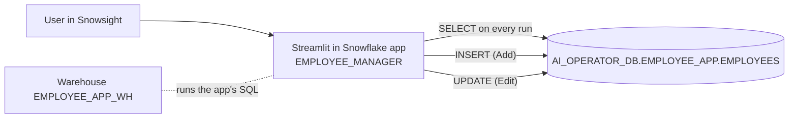
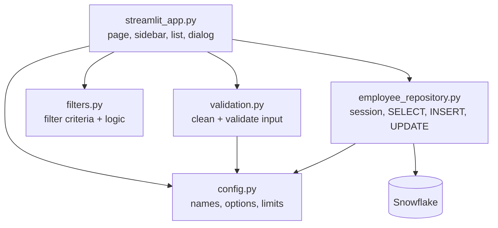
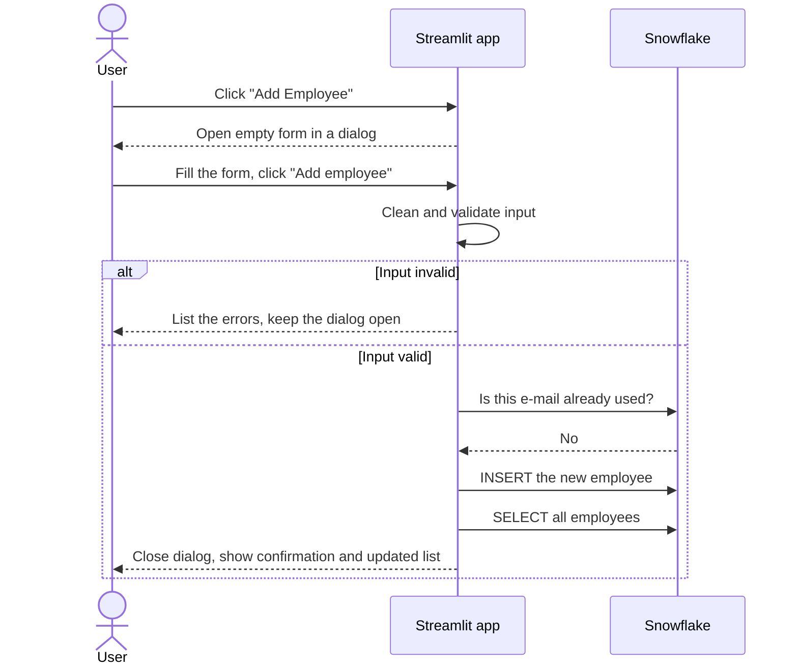

# Assignment 8 — Snowflake Streamlit Employee Application

A Streamlit in Snowflake application for viewing, filtering, adding and editing employee records stored in a Snowflake table.

```
Employees Table  <->  Snowflake Streamlit App  ->  Add / Edit / Filter Employees
```

The full design is in [spec.md](spec.md).

## Contents

1. [Objective](#objective)
2. [Key features](#key-features)
3. [Architecture and data flow](#architecture-and-data-flow)
4. [Technology stack](#technology-stack)
5. [Project structure](#project-structure)
6. [Snowflake objects](#snowflake-objects)
7. [Employee table](#employee-table)
8. [User interface](#user-interface)
9. [Add Employee flow](#add-employee-flow)
10. [Edit Employee flow](#edit-employee-flow)
11. [Filters](#filters)
12. [Validation rules](#validation-rules)
13. [Warehouse configuration](#warehouse-configuration)
14. [Local setup](#local-setup)
15. [Snowflake setup](#snowflake-setup)
16. [Run the application](#run-the-application)
17. [Unit tests](#unit-tests)
18. [Live tests](#live-tests)
19. [Deployment](#deployment)
20. [Screenshots](#screenshots)
21. [Testing results](#testing-results)
22. [Assignment requirements mapping](#assignment-requirements-mapping)
23. [Known limitations](#known-limitations)
24. [Future enhancements](#future-enhancements)

---

## Objective

Build a Streamlit application in Snowflake to view and manage employee data:

- show the current employees from an `EMPLOYEES` table,
- give every record an **Edit** button,
- provide a filter panel on the left,
- provide an **Add Employee** button at the top,
- use form widgets that match each column's data type,
- insert new records and update edited records in the table,
- always show the latest data after a change.

No table or dataset existed beforehand. This project creates the schema, the table and 60 sample employees.

## Key features

- **Paged employee list** with an Edit button on every row and four summary metrics.
- **12 sidebar filters** covering text, category, skill, status, salary, experience and hire date, with a one-click reset.
- **One shared Add/Edit form** in a modal dialog, using all eight widget types the assignment lists.
- **13 validation rules**, reported together inside the form before anything is written.
- **Parameterised SQL only**: user input is always bound, never concatenated into a statement.
- **Always-current data**: the employee table is re-read on every run and after every save.
- **Tested at three levels**: offline unit tests, scripted UI tests, and live end-to-end tests against Snowflake.

## Architecture and data flow



The code is split so that only one module talks to Snowflake:



`validation.py` and `filters.py` import neither Streamlit nor Snowflake, which is what makes them testable offline.

## Technology stack

| Layer | Technology |
|---|---|
| Data platform | Snowflake (standard table, X-Small warehouse) |
| Application | Streamlit in Snowflake, container runtime, Python 3.11 |
| Data access | Snowpark for Python (`session.sql` with bind variables) |
| Data handling | pandas |
| Deployment | Snowflake CLI (`snow`) with `snowflake.yml` |
| Testing | pytest, Streamlit `AppTest` |

Versions used during development and verification: Python 3.10, Streamlit 1.52.2, Snowpark 1.53.0, pandas 2.3.3, pytest 9.1.1, Snowflake CLI 3.28.0. The app needs Streamlit 1.37 or later (`st.dialog`).

## Project structure

```
Assignment-8-streamlit-employee-app/
├── streamlit_app.py            # User interface: header, filters, list, Add/Edit dialog
├── employee_repository.py      # All Snowflake access: session, SELECT, INSERT, UPDATE
├── validation.py               # Cleaning and validation of form input
├── filters.py                  # Filter criteria and filtering logic
├── config.py                   # Object names, dropdown options, limits
├── snowflake.yml               # Snowflake CLI deployment definition
├── requirements-dev.txt        # Packages for local runs and tests
├── sql/
│   ├── 01_create_objects.sql   # Schema and table
│   ├── 02_seed_sample_data.sql # 60 sample employees
│   └── 03_validate.sql         # Read-only data checks
├── tests/
│   ├── conftest.py             # Shared test setup and sample rows
│   ├── test_validation.py      # Unit tests: validation rules
│   ├── test_filters.py         # Unit tests: filters
│   ├── test_app.py             # Scripted UI tests, Snowflake mocked
│   └── test_live.py            # End-to-end tests against Snowflake
├── screenshots/                # Screenshot checklist (images to be added)
├── spec.md                     # Technical specification
└── README.md
```

## Snowflake objects

| Object | Name | Notes |
|---|---|---|
| Database | `AI_OPERATOR_DB` | Existing database; this project adds a schema to it |
| Schema | `EMPLOYEE_APP` | Created by `sql/01_create_objects.sql` |
| Table | `EMPLOYEES` | One row per employee |
| Streamlit app | `EMPLOYEE_MANAGER` | Container runtime `SYSTEM$ST_CONTAINER_RUNTIME_PY3_11` |
| Query warehouse | `EMPLOYEE_APP_WH` | Runs the app's SQL |
| Compute pool | `SYSTEM_COMPUTE_POOL_CPU` | Runs the app's Python process |

The app runs with owner's rights: its queries run as the role that owns the app, whichever user opens it.

## Employee table

`AI_OPERATOR_DB.EMPLOYEE_APP.EMPLOYEES`

| Column | Type | Null | Form widget | Notes |
|---|---|---|---|---|
| `EMPLOYEE_ID` | `NUMBER(10,0)` | No | — | Primary key, `AUTOINCREMENT` from 1001 |
| `FIRST_NAME` | `VARCHAR(50)` | No | Text input | |
| `LAST_NAME` | `VARCHAR(50)` | No | Text input | |
| `EMAIL` | `VARCHAR(120)` | No | Text input | Stored in lower case; unique |
| `PHONE` | `VARCHAR(20)` | Yes | Text input | |
| `GENDER` | `VARCHAR(20)` | No | Radio buttons | 4 values |
| `DATE_OF_BIRTH` | `DATE` | No | Date input | |
| `DEPARTMENT` | `VARCHAR(50)` | No | Select box | 8 values |
| `JOB_TITLE` | `VARCHAR(80)` | No | Text input | |
| `EMPLOYMENT_TYPE` | `VARCHAR(20)` | No | Radio buttons | Full-time, Part-time, Contract, Intern |
| `WORK_LOCATION` | `VARCHAR(50)` | No | Select box | 6 cities |
| `HIRE_DATE` | `DATE` | No | Date input | |
| `SALARY` | `NUMBER(12,2)` | No | Number input | Annual, INR |
| `EXPERIENCE_YEARS` | `NUMBER(4,1)` | No | Number input | |
| `SKILLS` | `ARRAY` | No | Multi-select | May be empty |
| `IS_ACTIVE` | `BOOLEAN` | No | Checkbox | `TRUE` = currently employed |
| `IS_REMOTE` | `BOOLEAN` | No | Checkbox | |
| `NOTES` | `VARCHAR(1000)` | Yes | Text area | |
| `CREATED_AT` | `TIMESTAMP_LTZ` | No | — | Set on insert |
| `UPDATED_AT` | `TIMESTAMP_LTZ` | No | — | Set on insert and on every update |

**Sample data.** `sql/02_seed_sample_data.sql` inserts 60 employees (IDs 1001–1060) across all 8 departments and 6 locations. Values are derived from the row number with `HASH`, so every run produces the same rows, and the script inserts only into an empty table.

## User interface

The page is a dashboard in Streamlit's wide layout: filters on the left, actions and summary at the top, records below.

```
+------------------+-----------------------------------------------------------+
| FILTERS          |  Employee Manager            [Refresh]  [+ Add Employee]  |
|  Search          |  Employees | Matching | Active | Average salary           |
|  Department      |-----------------------------------------------------------|
|  Employment type |  Showing 1-10 of 60        Rows per page [10]  Page [1]   |
|  Work location   |  ID | Employee | Department | Job title | ... | Action    |
|  Gender          |  1001 | Aarav Sharma ...                      | [Edit]    |
|  Skills          |  1002 | Ananya Singh ...                      | [Edit]    |
|  Status          |  ...                                                      |
|  Remote only     |  > All columns for the matching employees                 |
|  Salary, dates   |                                                           |
|  [Reset filters] |                                                           |
+------------------+-----------------------------------------------------------+
```

| Area | Design |
|---|---|
| **Layout** | Dashboard style. The sidebar holds every filter, so the main area is left for data and actions. |
| **Header** | Title and caption on the left; **Refresh** and the primary-coloured **➕ Add Employee** button on the right, always at the top of the page. |
| **Summary metrics** | Four numbers: employees in the table, employees matching the filters, active employees among them, and their average salary. |
| **Employee list** | One bordered row per employee: ID, name with e-mail beneath, department, job title, employment type, location (marked "Remote" where it applies), hire date, salary and a colour-coded status. |
| **Edit action** | An **Edit** button at the end of every row opens that employee in the form. |
| **Paging** | 10, 25 or 50 rows per page with a page selector and a "Showing 1–10 of 60" line, so the page stays short and every visible row keeps its own button. |
| **All-columns view** | An expander under the list shows every column, including skills, phone and notes, for the matching employees. |
| **Form** | A wide modal dialog, split into *Personal details* and *Job details*, two columns per row, required fields marked with `*`, **Save** and **Cancel** at the bottom. |
| **Validation messages** | All problems are listed together in one red box inside the dialog, in plain language; the dialog stays open and keeps what was typed. |
| **Feedback** | A green confirmation with the employee's ID and name appears above the header after each save. An information message replaces the list when no employee matches the filters. |
| **Readability** | Salaries are formatted with the rupee sign and thousands separators, dates as `31 Aug 2023`, and status as green *Active* or grey *Inactive*. |
| **Responsiveness** | The layout uses Streamlit's column grid, which resizes with the browser and collapses the sidebar on narrow screens. The list has ten columns and was checked at a 1600 px wide window; it is designed for desktop use. |

## Add Employee flow



1. **➕ Add Employee** opens the form with defaults: employment type *Full-time*, hire date *today*, *Active* ticked.
2. On **Add employee**, the input is trimmed, the e-mail is lower-cased, and all rules are checked.
3. If the e-mail belongs to another employee, the save is refused.
4. Otherwise one row is inserted. Snowflake generates `EMPLOYEE_ID`, `CREATED_AT` and `UPDATED_AT`.
5. The dialog closes, the list reloads, and the confirmation shows the new ID.

## Edit Employee flow

1. **Edit** on a row opens the same form, pre-filled with that employee's current values. The dialog shows the employee ID.
2. On **Save changes**, the same cleaning and validation run. The e-mail check ignores the employee being edited, so keeping their own address is allowed.
3. One `UPDATE` rewrites the editable columns for that `EMPLOYEE_ID` and sets `UPDATED_AT` to the current time. `EMPLOYEE_ID` and `CREATED_AT` never change.
4. The dialog closes, the list reloads, and the confirmation names the employee.
5. **Cancel** closes the dialog without writing anything.

There is no delete. An employee who has left is edited to untick **Active employee**.

## Filters

| Filter | Widget | Behaviour |
|---|---|---|
| Search | Text input | Case-insensitive match on name, e-mail or job title |
| Department | Multi-select | Any of the chosen values |
| Employment type | Multi-select | Any of the chosen values |
| Work location | Multi-select | Any of the chosen values |
| Gender | Multi-select | Any of the chosen values |
| Skills | Multi-select | Employee has at least one chosen skill |
| Status | Radio | All / Active / Inactive |
| Remote only | Checkbox | Only remote employees |
| Minimum salary | Number input | Empty = no lower limit |
| Maximum salary | Number input | Empty = no upper limit |
| Minimum experience | Number input | Empty = no lower limit |
| Hired from / to | Date inputs | Empty = no limit |

- Filters combine with **AND**; an empty filter is ignored.
- **Reset filters** clears them all.
- The default view shows every employee, active and inactive.
- Filtering runs in pandas on the rows already loaded.

## Validation rules

| Rule | Message |
|---|---|
| First name, last name and job title are required | "… is required." |
| Names use only letters, spaces, `.`, `'`, `-`; at most 50 characters | "… may contain only letters, spaces, dots, apostrophes and hyphens." |
| E-mail is required and well formed | "Enter a valid email address." |
| E-mail is not used by another employee | "Another employee already uses this email." |
| Phone, when given, has 7–15 digits (`+`, spaces, `-` allowed) | "Enter a valid phone number…" |
| Gender, department, employment type and location are chosen | "Select a …" |
| Date of birth and hire date are given | "… is required." |
| Employee is at least 18 on the hire date | "Employee must be at least 18 years old on the hire date." |
| Hire date is at most 90 days in the future | "Hire date cannot be more than 90 days in the future." |
| Salary is above 0 and at most 100,000,000 | "Salary must be greater than 0 and at most 100,000,000." |
| Experience is between 0 and 50 years | "Experience must be between 0 and 50 years." |
| At most 10 skills | "Select at most 10 skills." |
| Notes are at most 1000 characters | "Notes must be 1000 characters or fewer." |

Nothing is written until every rule passes.

## Warehouse configuration

| Setting | Value |
|---|---|
| Name | `EMPLOYEE_APP_WH` |
| Size | X-Small |
| `AUTO_SUSPEND` | 60 seconds |
| `AUTO_RESUME` | `TRUE` |
| Required privilege | `USAGE` for the role that owns the app |
| Where it is set | `query_warehouse` in [snowflake.yml](snowflake.yml) |

An administrator can create it with:

```sql
CREATE WAREHOUSE IF NOT EXISTS EMPLOYEE_APP_WH
    WAREHOUSE_SIZE = 'XSMALL'
    AUTO_SUSPEND = 60
    AUTO_RESUME = TRUE
    INITIALLY_SUSPENDED = TRUE;
GRANT USAGE ON WAREHOUSE EMPLOYEE_APP_WH TO ROLE <role>;
```

## Local setup

Requirements: Python 3.10 or later and, for anything that touches Snowflake, the [Snowflake CLI](https://docs.snowflake.com/en/developer-guide/snowflake-cli/index) with a configured connection.

```powershell
cd Assignment-8-streamlit-employee-app
python -m venv .venv
.venv\Scripts\Activate.ps1
pip install -r requirements-dev.txt
```

Credentials live only in the Snowflake CLI's own `config.toml`, outside this repository. The project contains no passwords, keys or account identifiers.

## Snowflake setup

Run from the project folder. `<connection>` is your Snowflake CLI connection; its role must be able to create a schema in `AI_OPERATOR_DB` and use `EMPLOYEE_APP_WH`.

```powershell
# 1. Create the schema and table
snow sql -c <connection> -f sql/01_create_objects.sql

# 2. Load the 60 sample employees (inserts only into an empty table)
snow sql -c <connection> --warehouse EMPLOYEE_APP_WH -f sql/02_seed_sample_data.sql

# 3. Check the data (every ISSUES value should be 0)
snow sql -c <connection> --warehouse EMPLOYEE_APP_WH -f sql/03_validate.sql
```

To use a different database, change `DATABASE` in [config.py](config.py), the object names in the three SQL scripts, and `identifier.database` in [snowflake.yml](snowflake.yml).

## Run the application

**In Snowflake.** After [deployment](#deployment), open **Projects → Streamlit → Employee Manager** in Snowsight.

**Locally.** The same script runs outside Snowflake and connects through a Snowflake CLI connection:

```powershell
$env:EMP_APP_CONNECTION = "<connection>"     # connection name in config.toml
$env:EMP_APP_ROLE = "<role>"                 # optional: override the connection's role
$env:EMP_APP_WAREHOUSE = "EMPLOYEE_APP_WH"   # optional: override the connection's warehouse
streamlit run streamlit_app.py
```

## Unit tests

These need no Snowflake connection.

```powershell
python -m pytest tests -q
```

| Test file | Tests | Covers |
|---|---|---|
| `tests/test_validation.py` | 38 | Input cleaning and every validation rule |
| `tests/test_filters.py` | 26 | Every filter, alone and combined |
| `tests/test_app.py` | 12 | The real app script driven by Streamlit `AppTest`, with Snowflake replaced by an in-memory table: list, Edit buttons, paging, filters, Add, Edit, validation errors, Cancel |

## Live tests

These run the real app script against the real `EMPLOYEES` table and check every write with a direct query. They are skipped unless `EMP_APP_LIVE=1`.

```powershell
$env:EMP_APP_LIVE = "1"
$env:EMP_APP_CONNECTION = "<connection>"
$env:EMP_APP_ROLE = "<role>"                 # optional
$env:EMP_APP_WAREHOUSE = "EMPLOYEE_APP_WH"
python -m pytest tests/test_live.py -v
```

| Area | What the 25 live tests check |
|---|---|
| Connection | The session runs on `EMPLOYEE_APP_WH` |
| SELECT | Row count, order, Python types, and that the `SKILLS` array survives the round trip |
| Filters | Every sidebar filter returns the same number of rows as the equivalent SQL; combined filters; reset |
| Add | The inserted row matches the form in every column; the count rises by one; the list shows it |
| Edit | One widget of each type is changed; the same row is updated; `CREATED_AT` is kept and `UPDATED_AT` moves forward |
| Validation | Empty form, duplicate e-mail, invalid phone, zero salary and under-18 hire are rejected and write nothing |
| Safety | A hash of all other rows is identical before and after each write |

The live tests create one employee, `live.test@example.com`, and edit it. Each run first deletes the row left by the previous run, so the table holds at most one such employee.

## Deployment

```powershell
snow streamlit deploy employee_manager --replace -c <connection>
```

This uploads the five Python files listed in [snowflake.yml](snowflake.yml) and creates or replaces the `EMPLOYEE_MANAGER` app with `EMPLOYEE_APP_WH` as its query warehouse. Confirm the setting with:

```sql
DESCRIBE STREAMLIT AI_OPERATOR_DB.EMPLOYEE_APP.EMPLOYEE_MANAGER;   -- see query_warehouse
```

Do not add `--prune`: it would delete the runtime's default `pyproject.toml` from the app's stage.

### Manual check after deployment

1. **List.** The page lists employees and the "Employees in table" metric matches the table's row count.
2. **Filter.** Choose Department = Sales: only Sales employees remain. Click **Reset filters**: all return.
3. **Add.** Click **➕ Add Employee**, fill the form, click **Add employee**. A green confirmation shows the new ID and the metric rises by one.
4. **Validation.** Open the Add form and submit it empty: the errors are listed and no row is added.
5. **Edit.** Click **Edit** on a row, change the department and salary, click **Save changes**. The row shows the new values.
6. **Table.** Run section 4 of `sql/03_validate.sql`: the added and edited employees are at the top, with a fresh `UPDATED_AT`.

## Screenshots

**No screenshots have been captured yet.** The files below are the planned set; the capture instructions are in [screenshots/README.md](screenshots/README.md).

| # | Planned file | Shows | Status |
|---|---|---|---|
| 1 | `screenshots/01_dashboard.png` | Main employee dashboard | Not captured |
| 2 | `screenshots/02_filter_panel.png` | Filter panel in use | Not captured |
| 3 | `screenshots/03_add_employee_form.png` | Add Employee form | Not captured |
| 4 | `screenshots/04_edit_employee_form.png` | Edit Employee form | Not captured |
| 5 | `screenshots/05_employee_created.png` | Successful employee creation | Not captured |
| 6 | `screenshots/06_employee_updated.png` | Successful employee update | Not captured |
| 7 | `screenshots/07_snowflake_table.png` | `EMPLOYEES` table in Snowsight | Not captured |
| 8 | `screenshots/08_deployed_app.png` | Deployed app in Snowsight | Not captured |

## Testing results

Results from the verification run on 2026-10-06.

| Level | Result |
|---|---|
| Offline suite (`python -m pytest tests -q`) | 76 passed, 25 skipped (the live tests) |
| Full suite with `EMP_APP_LIVE=1` | 101 passed |
| `sql/03_validate.sql` | All 7 data checks returned 0 issues |
| Seed script | Inserted 60 rows (IDs 1001–1060) |
| Browser check | The app, run locally against the live table, was driven in headless Chrome: list, filter, reset, in-dialog validation errors, Add and Edit all worked, and both writes were confirmed in Snowflake |
| Deployed app | Deployed successfully with `query_warehouse = EMPLOYEE_APP_WH`. Clicking through it inside Snowsight is the manual check above and has not been recorded here. |

## Assignment requirements mapping

| # | Requirement | Implementation | Code |
|---|---|---|---|
| 1 | Streamlit application in Snowflake | Streamlit in Snowflake app `EMPLOYEE_MANAGER` | `snowflake.yml`, `streamlit_app.py` |
| 2 | Display the current employees | Table read on every run, shown as a paged list | `fetch_employees`, `render_employee_list` |
| 3 | Edit button on each record | One button per row | `render_employee_list` |
| 4 | Filter panel on the left | 12 filters in the sidebar | `render_filter_panel`, `filters.py` |
| 5 | Add Employee button at the top | Primary button in the header | `render_header` |
| 6 | Text input | Names, e-mail, phone, job title | `employee_form` |
| 7 | Number input | Salary, experience | `employee_form` |
| 8 | Select box / dropdown | Department, work location | `employee_form` |
| 9 | Multi-select | Skills | `employee_form` |
| 10 | Checkbox | Active employee, works remotely | `employee_form` |
| 11 | Date input | Date of birth, hire date | `employee_form` |
| 12 | Radio buttons | Gender, employment type | `employee_form` |
| 13 | Text area | Notes | `employee_form` |
| 14 | New records are inserted | Parameterised `INSERT` | `insert_employee` |
| 15 | Edited records are updated | Parameterised `UPDATE` by `EMPLOYEE_ID` | `update_employee` |
| 16 | App reflects the latest data | No caching of employee data; full rerun after each save | `main`, `employee_form` |

## Known limitations

- **No delete.** The assignment does not ask for it; employees are marked inactive instead.
- **Uniqueness is checked by the app.** Snowflake does not enforce `PRIMARY KEY` or `UNIQUE` on standard tables, so two people saving the same new e-mail at the same instant could both succeed.
- **Last save wins.** There is no locking: if two users edit the same employee, the later save overwrites the earlier one.
- **No change history.** Only `CREATED_AT` and `UPDATED_AT` are kept, not who changed what.
- **No per-user permissions.** The app runs with owner's rights, so everyone who can open it can add and edit.
- **Filtering is in memory.** All rows are loaded and filtered in pandas, which suits hundreds or a few thousand employees, not millions.
- **Dropdown options are in code.** Departments, locations and skills are lists in `config.py`; changing them needs a redeploy.
- **Desktop layout.** The ten-column list is designed for a wide screen.

## Future enhancements

- Soft-delete and restore actions with a confirmation step.
- An audit table recording who changed which field and when.
- Optimistic locking using `UPDATED_AT`, so a stale edit is detected instead of overwriting.
- Reference tables for departments, locations and skills, editable from the app.
- Server-side filtering and paging for large tables.
- CSV export of the filtered list and bulk upload of new employees.
- Role-based access: read-only viewers and editors.
- A hybrid table, so the primary key and unique e-mail are enforced by Snowflake.
