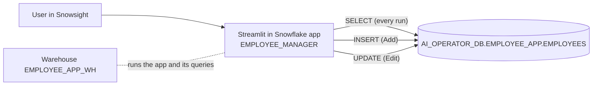

# Assignment 8 — Snowflake Streamlit Employee Application
## Technical Specification

---

## 1. Document Control

| Item | Value |
|---|---|
| Project | Employee Manager: a Streamlit in Snowflake app to view, filter, add and edit employees |
| Assignment | Assignment 8, AWS Data Engineering Assignments portfolio |
| Document version | 1.0 |
| Last updated | 2026-10-06 |
| Environment | Snowflake on AWS (single environment) |
| Repository folder | `Assignment-8-streamlit-employee-app/` |

**Conventions.** `<connection>` stands for the local Snowflake CLI connection name. This document contains no credentials.

---

## 2. Summary

**Requirement.** Build a Streamlit application in Snowflake to view and manage employee data.

**Flow.**

```
Employees Table  <->  Snowflake Streamlit App  ->  Add / Edit / Filter Employees
```

**What the app does.**
1. Reads every row of the `EMPLOYEES` table and shows it as a paged list.
2. Shows an **Edit** button on every employee row.
3. Offers a **filter panel in the left sidebar** built from the employee attributes.
4. Offers an **Add Employee** button at the top of the page.
5. Opens one shared Add/Edit form whose widgets match each column's data type.
6. **Inserts** new employees and **updates** edited employees in the `EMPLOYEES` table.
7. Re-reads the table after every save, so the list always shows the latest data.

There was no existing table or dataset. The schema, the table and 60 sample employees are created by the SQL scripts in this project.

---

## 3. Requirements Traceability

| # | Requirement | How it is met | Where |
|---|---|---|---|
| R1 | Streamlit application in Snowflake | Streamlit in Snowflake app `EMPLOYEE_MANAGER`, deployed with the Snowflake CLI | `snowflake.yml`, `streamlit_app.py` |
| R2 | Display the current employees | The table is queried on every script run and rendered as a paged list | `employee_repository.fetch_employees`, `render_employee_list` |
| R3 | Each record has an Edit button | One `st.button("Edit")` per rendered row | `render_employee_list` |
| R4 | Filter panel on the left | 12 filters in `st.sidebar` | `render_filter_panel`, `filters.py` |
| R5 | Add Employee button at the top | Primary button in the page header | `render_header` |
| R6 | Form components match the data type | All eight listed widget types are used (section 7) | `employee_form` |
| R7 | New records are inserted | Parameterised `INSERT` | `employee_repository.insert_employee` |
| R8 | Edited records are updated | Parameterised `UPDATE` by `EMPLOYEE_ID` | `employee_repository.update_employee` |
| R9 | App reflects the latest data | No caching of employee data; `st.rerun()` after each save; a Refresh button | `streamlit_app.py` |

---

## 4. Scope

### In scope
- Schema, table and sample data creation.
- Viewing, filtering, adding and editing employees.
- Input validation before any write.
- Offline unit tests and a scripted UI test.

### Out of scope / not implemented
- **Delete.** Not requested. An employee who leaves is edited to *inactive* (`IS_ACTIVE = FALSE`).
- Authentication and per-user permissions inside the app. Access is controlled by Snowflake grants on the app.
- Audit history of changes. Only `CREATED_AT` and `UPDATED_AT` are kept.
- Optimistic locking. If two users edit the same employee, the last save wins.
- Bulk upload or bulk edit.

---

## 5. Architecture



| Component | Value |
|---|---|
| Database | `AI_OPERATOR_DB` (existing; the working role cannot create databases) |
| Schema | `EMPLOYEE_APP` (created by this project) |
| Table | `EMPLOYEES` |
| Streamlit app | `EMPLOYEE_MANAGER`, container runtime `SYSTEM$ST_CONTAINER_RUNTIME_PY3_11` (the account default) |
| Compute pool | `SYSTEM_COMPUTE_POOL_CPU` (runs the app's Python process) |
| Query warehouse | `EMPLOYEE_APP_WH` (X-Small, 60 s auto-suspend; runs the app's SQL) |
| Owner role | `CLAUDE_AI_ROLE` |

The app runs with owner's rights: every query runs as `CLAUDE_AI_ROLE`, whichever user opens the app.

The app uses the Streamlit, Snowpark and pandas versions pre-installed in the container runtime, so the project has no package file. It needs Streamlit 1.37 or later (`st.dialog`).

### Code layout

| File | Responsibility |
|---|---|
| `streamlit_app.py` | The user interface: header, filter panel, employee list, Add/Edit dialog |
| `employee_repository.py` | All Snowflake access: session, `SELECT`, `INSERT`, `UPDATE` |
| `validation.py` | Cleaning and validating form input (no Streamlit or Snowflake imports) |
| `filters.py` | Filter criteria and filtering logic (pure pandas) |
| `config.py` | Object names, dropdown options and limits |
| `sql/01_create_objects.sql` | Schema and table |
| `sql/02_seed_sample_data.sql` | 60 sample employees |
| `sql/03_validate.sql` | Read-only data checks |
| `tests/` | Unit tests and a scripted UI test |
| `snowflake.yml` | Deployment definition for the Snowflake CLI |
| `requirements-dev.txt` | Packages for local runs and tests (not used by the deployed app) |
| `screenshots/` | Screenshot capture checklist |

---

## 6. Data Model

Table `AI_OPERATOR_DB.EMPLOYEE_APP.EMPLOYEES`

| Column | Type | Null | Notes |
|---|---|---|---|
| `EMPLOYEE_ID` | `NUMBER(10,0)` | No | Primary key. `AUTOINCREMENT`, starts at 1001. Never edited. |
| `FIRST_NAME` | `VARCHAR(50)` | No | |
| `LAST_NAME` | `VARCHAR(50)` | No | |
| `EMAIL` | `VARCHAR(120)` | No | Stored in lower case. Unique (checked by the app). |
| `PHONE` | `VARCHAR(20)` | Yes | |
| `GENDER` | `VARCHAR(20)` | No | Female, Male, Non-binary, Prefer not to say |
| `DATE_OF_BIRTH` | `DATE` | No | |
| `DEPARTMENT` | `VARCHAR(50)` | No | One of 8 departments |
| `JOB_TITLE` | `VARCHAR(80)` | No | |
| `EMPLOYMENT_TYPE` | `VARCHAR(20)` | No | Full-time, Part-time, Contract, Intern |
| `WORK_LOCATION` | `VARCHAR(50)` | No | One of 6 cities |
| `HIRE_DATE` | `DATE` | No | |
| `SALARY` | `NUMBER(12,2)` | No | Annual salary in INR |
| `EXPERIENCE_YEARS` | `NUMBER(4,1)` | No | Total professional experience |
| `SKILLS` | `ARRAY` | No | Array of skill names; may be empty |
| `IS_ACTIVE` | `BOOLEAN` | No | `TRUE` = currently employed |
| `IS_REMOTE` | `BOOLEAN` | No | `TRUE` = works remotely |
| `NOTES` | `VARCHAR(1000)` | Yes | Free text |
| `CREATED_AT` | `TIMESTAMP_LTZ` | No | Set on insert |
| `UPDATED_AT` | `TIMESTAMP_LTZ` | No | Set on insert and on every update |

**Constraints.** Snowflake stores `PRIMARY KEY` and `UNIQUE` on standard tables but does not enforce them. `NOT NULL` is enforced. The app therefore checks e-mail uniqueness itself before each write.

**Sample data.** `sql/02_seed_sample_data.sql` inserts 60 employees. The values are derived from the row number with `HASH`, so every run produces the same rows. The script inserts only when the table is empty, so it is safe to run again.

---

## 7. Add / Edit Form

One form serves both actions. For Add it opens with defaults; for Edit it opens with the employee's current values.

| Field | Column | Data type | Streamlit component |
|---|---|---|---|
| First name | `FIRST_NAME` | `VARCHAR` | **Text input** |
| Last name | `LAST_NAME` | `VARCHAR` | **Text input** |
| Email | `EMAIL` | `VARCHAR` | **Text input** |
| Phone | `PHONE` | `VARCHAR` | **Text input** |
| Gender | `GENDER` | `VARCHAR` (4 values) | **Radio buttons** |
| Date of birth | `DATE_OF_BIRTH` | `DATE` | **Date input** |
| Department | `DEPARTMENT` | `VARCHAR` (8 values) | **Select box** |
| Job title | `JOB_TITLE` | `VARCHAR` | **Text input** |
| Employment type | `EMPLOYMENT_TYPE` | `VARCHAR` (4 values) | **Radio buttons** |
| Work location | `WORK_LOCATION` | `VARCHAR` (6 values) | **Select box** |
| Hire date | `HIRE_DATE` | `DATE` | **Date input** |
| Annual salary | `SALARY` | `NUMBER(12,2)` | **Number input** |
| Experience (years) | `EXPERIENCE_YEARS` | `NUMBER(4,1)` | **Number input** |
| Skills | `SKILLS` | `ARRAY` | **Multi-select** |
| Active employee | `IS_ACTIVE` | `BOOLEAN` | **Checkbox** |
| Works remotely | `IS_REMOTE` | `BOOLEAN` | **Checkbox** |
| Notes | `NOTES` | `VARCHAR(1000)` | **Text area** |

`EMPLOYEE_ID`, `CREATED_AT` and `UPDATED_AT` are set by the database and are not editable.

### Validation rules

| Rule | Message shown when broken |
|---|---|
| First name, last name, job title are required | "… is required." |
| Names contain only letters, spaces, `.`, `'`, `-`; at most 50 characters | "… may contain only letters…" |
| Email is required and well formed | "Enter a valid email address." |
| Email is not used by another employee | "Another employee already uses this email." |
| Phone, when given, has 7–15 digits; `+`, spaces and `-` are allowed | "Enter a valid phone number…" |
| Gender, department, employment type and location are chosen | "Select a …" |
| Date of birth and hire date are given | "… is required." |
| Employee is at least 18 years old on the hire date | "Employee must be at least 18 years old on the hire date." |
| Hire date is at most 90 days in the future | "Hire date cannot be more than 90 days in the future." |
| Salary is above 0 and at most 100,000,000 | "Salary must be greater than 0…" |
| Experience is between 0 and 50 years | "Experience must be between 0 and 50 years." |
| At most 10 skills | "Select at most 10 skills." |
| Notes are at most 1000 characters | "Notes must be 1000 characters or fewer." |

All errors are shown together inside the form. Nothing is written until every rule passes.

---

## 8. Filter Panel (left sidebar)

| Filter | Component | Behaviour |
|---|---|---|
| Search | Text input | Case-insensitive match on name, email or job title |
| Department | Multi-select | Any of the chosen values |
| Employment type | Multi-select | Any of the chosen values |
| Work location | Multi-select | Any of the chosen values |
| Gender | Multi-select | Any of the chosen values |
| Skills | Multi-select | Employee has at least one chosen skill |
| Status | Radio | All / Active / Inactive |
| Remote only | Checkbox | Only employees with `IS_REMOTE = TRUE` |
| Minimum salary | Number input | Empty = no lower limit |
| Maximum salary | Number input | Empty = no upper limit |
| Minimum experience | Number input | Empty = no lower limit |
| Hired from / Hired to | Date inputs | Empty = no limit |

- Filters combine with **AND**. An empty filter is ignored.
- A **Reset filters** button clears every filter.
- The default shows **all** employees, active and inactive. The Status column and the Status filter separate them.
- Filtering is done in pandas on the rows already loaded. The table is small, and this keeps the filter logic testable without Snowflake.

---

## 9. User Interface

```
+------------------+-----------------------------------------------------------+
| FILTERS          |  Employee Manager            [Refresh]  [+ Add Employee]  |
|  Search          |  Total | Active | Departments | Average salary            |
|  Department      |-----------------------------------------------------------|
|  Employment type |  ID | Name / email | Department | Job title | Type | ...  |
|  Work location   |  1001 | ...                                   | [Edit]    |
|  Gender          |  1002 | ...                                   | [Edit]    |
|  Skills          |  ...                                                      |
|  Status          |  Rows per page [10]   Page [1] of 6                       |
|  Remote only     |  > All columns for the filtered employees                 |
|  Salary, dates   |                                                           |
|  [Reset filters] |                                                           |
+------------------+-----------------------------------------------------------+
```

- **Add Employee** and **Edit** open the form in a modal dialog.
- After a successful save the dialog closes, the list reloads from Snowflake, and a confirmation message is shown.
- The list is paged (10, 25 or 50 rows per page) so that every visible row can carry its own Edit button.
- An expander below the list shows every column for the filtered employees.

---

## 10. Data Access

- Every statement uses bind variables (`?`). No user input is concatenated into SQL.
- `SKILLS` is sent as a JSON string and stored with `PARSE_JSON(?)::ARRAY`.
- `fetch_employees` casts `SALARY` and `EXPERIENCE_YEARS` to `FLOAT` and returns `SKILLS` as a Python list.
- `update_employee` sets `UPDATED_AT = CURRENT_TIMESTAMP()`.
- Employee data is **not cached**, so each script run shows the current table contents. Only the Snowflake session is cached.

---

## 11. Deployment

Prerequisites: Snowflake CLI, a connection whose role owns the target schema, and a usable warehouse.

```powershell
# 1. Create the schema and table
snow sql -c <connection> -f sql/01_create_objects.sql
# 2. Load the sample employees (inserts only if the table is empty)
snow sql -c <connection> --warehouse EMPLOYEE_APP_WH -f sql/02_seed_sample_data.sql
# 3. Check the data
snow sql -c <connection> --warehouse EMPLOYEE_APP_WH -f sql/03_validate.sql
# 4. Deploy the Streamlit app
snow streamlit deploy employee_manager --replace -c <connection>
```

Open the app in Snowsight under **Projects → Streamlit → Employee Manager**.

---

## 12. Testing

| Level | What | How |
|---|---|---|
| Unit | Validation rules, input cleaning | `pytest tests/test_validation.py` |
| Unit | Each filter and their combination | `pytest tests/test_filters.py` |
| UI (scripted) | List, Edit buttons, paging, filters, Add and Edit flows, validation errors | `pytest tests/test_app.py` using Streamlit `AppTest` with Snowflake access replaced by an in-memory table. It does not exercise the SQL in `employee_repository.py`; the live checks cover that. |
| Live | Objects exist, 60 seed rows, data checks | `sql/03_validate.sql` |
| Live (scripted) | The app script against the real table: list, every filter compared with SQL, Add, Edit, validation; each write checked in Snowflake | `pytest tests/test_live.py` with `EMP_APP_LIVE=1` (skipped otherwise). Creates and edits one employee, `live.test@example.com`. |
| Live | Add, edit and filter in the deployed app | Manual checklist in `README.md` |

---

## 13. Acceptance Criteria

1. Opening the app lists the employees in `EMPLOYEES`.
2. Every listed employee has an Edit button.
3. The left sidebar filters narrow the list, and Reset restores it.
4. An Add Employee button is at the top of the page.
5. The form uses text input, number input, select box, multi-select, checkbox, date input, radio buttons and text area.
6. Saving the Add form creates one new row in `EMPLOYEES`.
7. Saving the Edit form updates that employee's row and its `UPDATED_AT`.
8. After either save, the list shows the new values without a manual reload.
9. Invalid input is rejected with a clear message and nothing is written.
