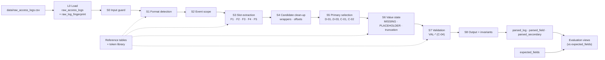

# Step 3A — Regex Parser Design

**Status:** design **confirmed for implementation** (review of 11/09/2026, decisions C-01…C-09 in §0).
No parser code had been written at the time of this design (it was implemented in Steps 3B-3 … 3C). The database
foundation existed (Step 3B-1) and the IP rule was verified (Step 3B-2).

| Version | Change |
|---|---|
| v1 | Draft design with provisional assumptions and open design questions |
| v2 | Review decisions C-01…C-09 confirmed; assumptions and open questions resolved; database `postgresql_regex_task`, schema `log_regex` |

**Inputs**

- Step 1 dataset: `data/raw_access_logs.csv` (5,000 rows, SHA-256 `a94fc3cc…e661e`) and the answer key
  `data/expected_fields.csv`.
- Step 2 requirements: [Step2_Requirements_and_Variants.md](Step2_Requirements_and_Variants.md) (requirement IDs
  such as `EML-03`, `AMB-05` refer to it) and the measurements in [Step2_Raw_Log_Profile.md](Step2_Raw_Log_Profile.md).

**Target platform:** PostgreSQL 17.9 (local Windows service `postgresql-x64-17`), PostgreSQL Advanced Regular
Expressions (ARE). Database `postgresql_regex_task`, schema `log_regex`.

---

## 0. Confirmed decisions

### 0.1 Step 3A review decisions

| ID | Decision | Resolves | Design effect |
|---|---|---|---|
| C-01 | **First status token wins.** Later status tokens in the same event are secondary. | Step 2 Q-01 | §7.3, §8.2 — EC-128 `"status":401` primary, `"result":"FAILED"` secondary |
| C-02 | **The event's own action field / first relevant action wins.** Retry fields and text outside the event are not primary. | Step 2 Q-02 | §5, §7.1, §8.2 — EC-117 `action=` over `retry_action=`; EC-143 first line over the stack trace |
| C-03 | **`POINT(...)` and GeoJSON are longitude-first; every other unlabelled coordinate pair is latitude-first.** Labels always decide when present; values are never swapped. | Step 2 Q-03 | §7.3, §7.4, §8, M-06 |
| C-04 | **Validity checks run in PostgreSQL**, using **2026** as the year for year-less syslog dates. | Step 2 Q-04 | §10.2 validators; `assumed_year = 2026` run parameter |
| C-05 | **Acceptance target: 100% value and validity match across all 5,000 rows** (all 10 fields). | Step 2 Q-05 | §12 T-07, T-10 |
| C-06 | **EC-134 truncation rule:** a pipe-format (F1) log with neither an action nor a status is flagged as truncated. | DQ-02 | §10.3 |
| C-07 | **Results are stored one row per field, with a wide view on top. MISSING is SQL NULL.** | DQ-03 | §10.1, §11 |
| C-08 | **New database `postgresql_regex_task`, schema `log_regex`.** | DQ-04 | §3.1, §11.1, §13 |
| C-09 | **F3 extraction is regex-only.** JSON/JSONB is handled in a later part of the project. | DQ-05 | §7.3 |

### 0.2 Decisions carried over from Step 2

- **D-01** acting person's email · **D-02** event timestamp, not ingestion time · **D-03** original client IP
  (first X-Forwarded-For entry) · **D-04** other candidates kept as secondary values.
- Values are exact substrings of `raw_log`; validity is one of VALID, INVALID, PLACEHOLDER, MISSING.

### 0.3 Design choices within the confirmed scope

These follow from the decisions above and need no separate confirmation:

- The parser also emits `format_family` and `record_validity` (used by checks T-04 and T-10).
- `outcome_class` is not computed in Step 3; it is not part of the C-05 acceptance target.
- Loading the answer key with PostgreSQL CSV semantics turns its unquoted empty MISSING values into SQL NULL (the file
  contains no quoted empty fields), so parser output and answer key both use NULL for MISSING.

---

## 1. Design principles

| ID | Principle | Why |
|---|---|---|
| P-01 | **Raw logs are read-only.** Output references `log_id`; `raw_log` is never updated or copied into results. | G-03 |
| P-02 | **Format first, then slots.** Each log is assigned one format; values are taken from format-specific slots (keys, clauses, columns). Shape patterns classify a slot's content; they are never used as a "first match anywhere in the line" search. | Step 2 probes: first-match picks the wrong value in 91 IPv4 rows, 951 latitude rows, 75 date rows, 196 URL rows |
| P-03 | **Extract, then judge.** A slot's text is captured whole, malformed or not; validity is decided afterwards. | EML-03, IP-06 |
| P-04 | **Candidates, then selection.** Extractors emit every candidate for a field with a role; one selection step applies D-01…D-03, C-01 and C-02; the rest become secondary values. | G-05, D-04 |
| P-05 | **Offsets everywhere.** Every value carries its 1-based character position in `raw_log`; `substr(raw_log, start_pos, length(value)) = value` must hold. | G-02, exact-substring proof |
| P-06 | **Vocabularies are data.** Key aliases, placeholder tokens, entity types, status words, HTTP reasons, schemes, sentinel phrases and log levels live in reference tables, not inside patterns. | Reviewable, versioned |
| P-07 | **Deterministic and set-based.** Same input and parser version ⇒ identical output, independent of row order, time or session state. | G-09 |
| P-08 | **The answer key is never a parser input.** It is used only by the evaluation layer. | Honest accuracy |

---

## 2. Architecture overview



| Layer | Contents | Written by |
|---|---|---|
| L0 Storage | `raw_access_logs`, `raw_log_fingerprint` | load step only |
| L1 Reference | vocabulary tables, token library | reference-data scripts |
| L2 Parser | stage functions S0–S8, run procedure | parser run |
| L3 Output | `parser_run`, `parsed_log`, `parsed_field`, `parsed_secondary`, wide view | parser run |
| L4 Evaluation | answer key table, accuracy and mismatch views | evaluation only |

All objects live in database `postgresql_regex_task`, schema `log_regex` (C-08).

---

## 3. Input structure and preservation of the raw log and `log_id`

### 3.1 Parser input

| Input | Structure |
|---|---|
| `log_regex.raw_access_logs` | `log_id` integer, primary key, not null · `raw_log` text, nullable. Exactly the two CSV columns, loaded once with PostgreSQL CSV semantics: unquoted empty ⇒ SQL NULL, `""` ⇒ empty string, quoted CR/LF/TAB preserved. No trimming and no re-encoding. The new database `postgresql_regex_task` is created with UTF-8 encoding (confirmed in Step 3B-1: UTF8, builtin locale C.UTF-8). |
| Run parameters | `parser_version`, `reference_data_version`, `assumed_year = 2026` (C-04). |

Nothing else is read by the parser; in particular not `expected_fields`.

### 3.2 Preservation guarantees

| Guarantee | Mechanism |
|---|---|
| Raw text never changes | Parser writes only to L3 tables. After load, the raw table is read-only for the parser (SELECT-only privilege; UPDATE/DELETE rejected). |
| Load fidelity | 5,000 rows; `log_id` 1–5,000 contiguous; exactly 1 NULL and 1 empty-string `raw_log`. Re-exporting the table as CSV with `raw_log` always quoted must reproduce the Step 1 SHA-256 (`a94fc3cc…`). Server-side COPY line endings on Windows are verified in 3B; per-row fingerprints are the fallback proof. |
| Per-row fingerprint | At load: `raw_log_fingerprint(log_id, is_null, char_length, sha256 of the UTF-8 bytes)`. Every run recomputes and compares before and after parsing; any difference fails the run. |
| `log_id` identity | `log_id` is the only row identity carried into output (foreign key to `raw_access_logs`). No renumbering, filtering or de-duplication — the duplicates EC-141 and EC-142 keep their own `log_id`s. Exactly one `parsed_log` row per raw row, checked by anti-joins in both directions. |
| No copies of raw text in results | Output stores values and offsets. The wide result view joins `raw_log` from the source table. |
| Exact substring | For every non-MISSING value: `substr(raw_log, start_pos, char_length(value)) = value`. |
| Offsets survive scoping | Extraction reads a **prefix** of `raw_log` (§5), so positions found in the prefix are positions in `raw_log`. |

---

## 4. Format detection (S1)

### 4.1 Evidence

Each strong signature occurs in 100% of its format and 0% of the other formats (Profile §2):

| Signature | Rows with it in its own format | In other formats |
|---|---:|---:|
| Quoted HTTP request line | F4 986 / 986 | 0 |
| JSON object `{"` | F3 985 / 985 | 0 |
| 2+ `key=` labels separated by `\|` or TAB | F1 1,528 / 1,528 | 0 (header EC-137 has pipes but no labels) |
| Exactly 9 semicolons | F5 500 / 500 | 0 (header EC-138 has 9 but no data) |

### 4.2 Ordered decision rules

Evaluated on the event line, ignoring leading whitespace. The first matching rule wins.

| Order | Rule | Condition | Result | Rows |
|---:|---|---|---|---:|
| 0 | DET-00 | `raw_log` is NULL, empty, or whitespace only | NONE | 4 (EC-129, EC-131–133) |
| 1 | DET-F4 | A `[…]` bracket after the first token, followed by a double-quoted request field that is `METHOD target HTTP/n.n` or `-` | F4 | 986 |
| 2 | DET-F3 | A JSON object opening: `{` followed (across optional whitespace or newlines) by `"` | F3 | 985 |
| 3 | DET-F1 | At least two `key=` segments separated by `\|` (optional spaces/NBSP) or TAB | F1 | 1,528 |
| 4 | DET-F5 | Exactly 9 semicolons **and** column 1 has a timestamp shape | F5 | 500 |
| 5 | DET-F2 | At least two sentence cues: (a) leading timestamp shape — `[Apache CLF]`, ISO, `MM/DD/YYYY hh:mm:ss AM`, epoch; (b) an actor token — `@`-containing token, `[at]` obfuscation, or `anonymous`; (c) an IP clause — `from`/`client` followed by an IP-like token | F2 | 992 |
| 6 | DET-NONE | None of the above | NONE | 5 (EC-130, EC-137–140) |

**Why this order.** F4 lines also contain `key=` extras (93.8%) and `;` inside user agents, and F3 JSON strings can
contain `key=` inside query strings, so the unique F4 and F3 structures are tested before the generic label rule. F2 is
last because it is defined by the absence of the other structures plus sentence cues. Every F2 row has cues (a) and (b):
its timestamp is never missing, and a missing email is always written as `anonymous`.

### 4.3 Outliers the rules must cover

| Case | Trap | Outcome |
|---|---|---|
| EC-134 | Truncated F1 with only two labels | DET-F1 (threshold is 2, not 3) |
| EC-146 / EC-150 | TAB delimiters / `\|` without spaces | DET-F1 |
| EC-047 | Sentence that starts with an epoch and contains `status=200` (one label only) | not F1; cues a, b, c ⇒ DET-F2 |
| EC-135 / EC-136 | Truncated JSON / truncated user agent | DET-F3 / DET-F4 (the opening structure is intact) |
| EC-137 / EC-138 | Header rows with pipes / 9 semicolons | fail DET-F1 / DET-F5, no F2 cues ⇒ NONE |
| EC-130, EC-139, EC-140 | `NULL` text, `#####`, ANSI escapes + mojibake | no cues ⇒ NONE |
| 3 F4 rows | Malformed leading IP (`192.168.222`, `203.0.113.167.65`) | DET-F4 does not validate the IP |
| EC-149 | Leading spaces | ignored for detection only |

### 4.4 Sub-format detection (diagnostics and extractor branching)

| Format | Sub-format | Rule | Rows |
|---|---|---|---:|
| F2 | template C | contains ` connecting from ` | 188 |
| F2 | template A/B | otherwise (B recorded when `, result ` or ` using ` appears) | 804 |
| F3 | RFC 5424 | starts with `<digits>1 ` | 358 |
| F3 | RFC 3164 | otherwise | 627 |
| F4 | IP field form | IPv4 · IPv4`:port` · bare IPv6 · `[IPv6]:port` | 986 |

### 4.5 Conflict handling

All DET-F* predicates are evaluated and the matching rule list is stored. A row matching more than one of DET-F1…F5 gets
the diagnostic `format_conflict` (expected 0; acceptance check T-04). The priority order above still decides.

---

## 5. Event scope (S2)

| Format | Event scope | Reason |
|---|---|---|
| F1, F2, F4, F5 | From the start of `raw_log` to just before the first LF; a CR immediately before that LF is excluded | EC-143 trace lines repeat `Permission denied` and a path (C-02); EC-133/EC-148 CR LF |
| F3 | From the start to the closing brace of the JSON object, or to the end of the text if it never closes | EC-144 pretty-printed JSON spans 10 lines; EC-135 truncated |
| NONE | none | — |

The scope is always a prefix, so offsets are unchanged. Whitespace around values inside the scope is handled by slot
trimming (EC-149, EC-147 NBSP).

---

## 6. Token library and PostgreSQL regex considerations

### 6.1 Named tokens

Implemented once and reused by detection, extractors and validators. Tokens describe **shape only**; the slot decides
the meaning. "Lenient" tokens deliberately accept malformed values so they can be captured whole and judged later.

| Token | Matches | Used by |
|---|---|---|
| TK-TS-* | The 19 timestamp shapes of Step 2 §5.4 (ISO with `T`/`t`, `Z`/`z`, ms/µs, offset or zone abbreviation; Apache CLF; syslog with space-padded day; US 12-hour long/short; `DD-MM-YYYY`; `YYYY/MM/DD`; compact) | timestamp slots, DET-F2/F5 cues, component capture for validation |
| TK-EPOCH | Exactly 10 or 13 digits, not adjacent to another digit | timestamp slots, DET-F2 cue |
| TK-EMAIL-LIKE (lenient) | A whitespace-free run containing `@` | actor/email slots, DET-F2 cue |
| TK-EMAIL-OBFUSCATED | `local [at] host [dot] tld` | F2 actor (EC-015), F1/F3/F5 values |
| TK-IPV4-LIKE (lenient) | 3–5 dot-separated groups of 1–3 digits, not touching another digit or dot — captures `1.2.3.4.5` and `192.168.222` whole | IP slots, F2 `from`/`client` clause |
| TK-IPV6-LIKE (lenient) | A run of letters, digits, colons and dots with at least two colons, optional `%zone`; bracketed form with optional `:port`. Applied **only inside an IP slot** (a clock time also has two colons) | IP slots |
| TK-PORT | `:` + 1–5 digits after an IPv4 or after `]` | IP slots (port ⇒ secondary) |
| TK-RESOURCE | Starts with `/`, `\\`, a drive `X:\`, or a scheme-like prefix (letter, then letters/digits/`+.-` — so `s3` qualifies — then `:` and one or two `/`, or `name//`); runs to the slot terminator | resource slots |
| TK-COORD | Signed decimal · decimal + space + hemisphere · hemisphere + decimal · DMS with `° ' "` or `° ′ ″` and optional spaces · `NaN` · decimal comma | coordinate slots |
| TK-HTTP-CODE (lenient) | 3 characters of digits/letters bounded by spaces — captures `20O`, `4O3` | status slots |
| TK-STATUS-WORD | Letters and underscores, or `✓` | status slots |
| TK-PRODUCT | `name/version`, `name_version`, or `name` + space + dotted version (`Ansible 2.16.4`) | F2 tool clauses |
| TK-PLACEHOLDER | Exact token from `ref_placeholder_token` | value-state stage |

### 6.2 PostgreSQL 17 ARE constraints the implementation must respect

| Topic | Consequence for the design |
|---|---|
| Word boundary is `\y` (also `\m`, `\M`); `\b` means backspace | Never use `\b` for word boundaries |
| Lookahead and lookbehind constraints are supported | Used for token boundaries (e.g. TK-IPV4-LIKE) |
| No named capture groups | Groups are addressed by number; each pattern documents its group map |
| The greediness of a whole RE is set by its first quantifier | Do not mix greedy and non-greedy quantifiers in one pattern; bound values with negated classes and explicit terminators |
| Flags are function arguments (`i`, `g`, `n`) | Case-insensitive matching only for keyword/phrase recognition, never for value capture |
| `regexp_instr` / `regexp_substr` accept a sub-expression argument (PG 15+) | Source of `start_pos` for captured values |
| `.` and `[^…]` match newlines unless newline-sensitive mode is used | Event scope (§5) is applied before matching instead of relying on flags |
| `\s` / `[[:space:]]` and NBSP depend on the database locale | NBSP is matched explicitly (`\u00A0`); verify in 3B |
| Positions are characters in a UTF-8 database | Offsets are character offsets, not byte offsets (294 non-ASCII rows) |
| `pg_input_is_valid` (PG 16+) | Optional error-free cross-check for casts; validators must not raise errors |

---

## 7. Extraction strategy by format (S3)

### 7.1 F1 — quote-aware key/value segmentation

1. Split the event line into segments at delimiters (`␠|␠`, `|`, TAB, NBSP-padded `|`) that are **outside double
   quotes** (EC-150 `action="Access denied | escalated to SOC"`).
2. Segment 1 that is not in `key=` form is the timestamp slot (1,527 rows). If segment 1 is a `key=` segment the
   timestamp is MISSING (EC-057).
3. Map each `key=value` segment to a field through `ref_key_alias` (F1):

   | Field | Keys |
   |---|---|
   | entity_type | `entity`, `entity_type`, `type` |
   | email_address | `email`, `user`, `principal` |
   | action_phrase | `action`, `event` |
   | resource_url | `resource`, `url`, `path` |
   | tool | `tool`, `client`, `agent` |
   | ip_address | `ip`, `src_ip`, `client_ip` |
   | latitude / longitude | `lat`, `latitude` / `lon`, `lng`, `longitude`; `geo` = pair `lat,lon` (C-03) |
   | status | `status`, `result`, `outcome` |

4. Keys outside the alias map produce secondary candidates for a related field: `ingested_at` ⇒ timestamp (EC-056),
   `retry_action` ⇒ action (EC-117, C-02).
5. Value = text after `=`, trimmed of spaces/NBSP; enclosing double quotes removed; for email, `<…>` and `mailto:`
   removed; for status, a trailing ` (…)` reason is split off as secondary `status_reason` (EC-127); `geo=a,b` is split
   at the comma.
6. Key with empty value (`status=`) ⇒ MISSING (empty). Key absent ⇒ MISSING (absent).

Segmentation is used instead of per-field searches because F1 values contain spaces (`C:\Share\Finance\Budget 2026.xlsx`,
`Ansible 2.16.4`, `18° 31′ 13.4″ N`, `2026-03-22 14:30:00 IST`) and fields appear in 193 different orders.

### 7.2 F2 — left-to-right clause grammar

Each step consumes text; later steps search only the unconsumed remainder. A word inside a consumed span therefore
cannot start another clause (the `from` in `was blocked from accessing`, 45 rows).

| Step | Clause | Recognition | Fields |
|---:|---|---|---|
| 1 | Prefix | Optional leading whitespace; timestamp as `[Apache CLF]`, ISO, `MM/DD/YYYY hh:mm:ss AM` followed by ` -`, or epoch; then an optional log level from `ref_log_level` (EC-047 `WARN`) | event_timestamp |
| 2 | Template-C status | Only when ` connecting from ` is present: a `[word]` right after the prefix | status |
| 3 | Actor | First actor token after the prefix: `@`-containing token (bare, `<…>`, or `"First Last" <…>`), `[at]`/`[dot]` obfuscated address, or `anonymous`. Entity = the text between the prefix (or template-C status) and the actor token — a `[UPPER]` bracket or one or more words (`Service Account`). A following `(on behalf of <email>)` is a secondary candidate | entity_type, email_address |
| 4 | Template-C clauses | `connecting from <ip>`, `with <tool>`, `located <coords>` | ip_address, tool, latitude, longitude |
| 5 | Resource | First TK-RESOURCE token, or the sentinel `an unspecified resource`, after the actor (A/B) or after the last template-C clause (C); an opening `(` and a closing `),` are not part of it | resource_url |
| 6 | Action phrase | The text between the actor (A/B) or the last template-C clause (C) and the resource | action_phrase |
| 7 | Trailing clauses (A/B, any order) | Tool: `via <tool>`, `using <tool>`, `tool: <tool>;`. IP: `from <ip>[:port]`, `client <ip>`. Proxy: `via <ip-like>` ⇒ secondary. Coordinates (latitude-first, C-03): `(lat, lon)`, `(loc: lat, lon)`, `at lat … lon …`, `at <DMS> <DMS>`, `[N… E…]`, `, location …`, partial `at lat …` / `at lon …`. Status: `- <code> <Reason>`, `- status: <word>`, `, result <x>`, `[<word>]` at the end, `status=<x>` | tool, ip_address, latitude, longitude, status |
| 8 | Sentence end | Template C: the final `.` after the resource is excluded from the resource | — |

Disambiguation built into the grammar:

- `via` introduces a tool unless the next token is IP-like; then it is a proxy IP (EC-047).
- `from` starts an IP clause only when the next token is IP-like.
- A bracket is classified by content and position: hemisphere/decimal pair ⇒ coordinates; status word or code at the
  sentence end or in the template-C position ⇒ status; uppercase entity word directly before the actor ⇒ entity.
- Tool = one TK-PRODUCT token; the following dotted version is included only for the `name version` form (10 rows).
- Resource ends at whitespace, at `),`, or before the sentence-final `.`.
- Several status forms in one sentence ⇒ the first is primary (C-01).

Evidence: no F2 action phrase contains a clause keyword (`via`, `using`, `with`, `located`, `connecting`, `location`,
`result`, `at`, `client`); only EC-015 has an actor without `@`, and it is covered by the obfuscated form.

### 7.3 F3 — header plus JSON key scan (regex-only, C-09)

1. Header: RFC 3164 ⇒ the timestamp is `Mon dd HH:MM:SS` at the start (double space preserved). RFC 5424 ⇒ the timestamp
   follows `<PRI>1 `.
2. Body: scan `"key" : value` pairs in document order. Value grammar: double-quoted string (escaped quotes allowed),
   number, bare `NaN`, `null`, object or array; whitespace and newlines between tokens are allowed (EC-144).
3. Top-level aliases (`ref_key_alias`, F3):

   | Field | Keys |
   |---|---|
   | entity_type | `entity_type`, `entity`, `principal_type` |
   | email_address | `user`, `principal`, `email` |
   | resource_url | `resource`, `target`, `res` |
   | tool | `tool`, `user_agent`, `client` |
   | ip_address | `src_ip`, `ip`, `remote_addr` |
   | action_phrase | `msg`, `event`, `action` |
   | status | `status`, `result`, `outcome`, `http_status` (string or number) |
   | latitude / longitude | `latitude` / `longitude` |

4. Containers (C-03): `geo` object ⇒ `lat` and `lng` inside it (labelled); `geometry` object ⇒ `coordinates` array
   `[lon, lat]` (GeoJSON, longitude-first); `location` string ⇒ split at the comma, latitude-first.
5. Several alias keys for one field ⇒ the first in document order is primary (C-01: EC-128 `"status":401` before
   `"result":"FAILED"`); later ones are secondary.
6. A non-alias key whose string value is e-mail-shaped (EC-022 `"notify"`) ⇒ secondary email.
7. Value = string content without the quotes, or the bare number/`NaN` token. `null` ⇒ PLACEHOLDER. Key absent ⇒ MISSING.
8. A string or object not closed before the end of the text ⇒ truncated (EC-135).

jsonb is not used (C-09). `NaN` and truncated JSON are not valid JSON, jsonb normalises numbers and whitespace, and
values must be exact substrings with offsets. JSON/JSONB handling belongs to a later part of the project.

### 7.4 F4 — positional skeleton plus known-key extras

| # | Slot | Boundary | Field |
|---:|---|---|---|
| 1 | IP field | Start of line to the first ` - ` | ip_address (connection address); port ⇒ secondary |
| 2 | ident | `-` | — |
| 3 | remote user | Token before ` [` | email_address candidate |
| 4 | `[…]` | Brackets | event_timestamp |
| 5 | `"request"` | `METHOD␠target␠HTTP/n.n` or `-` | resource_url = target; `-` ⇒ PLACEHOLDER |
| 6 | status | Token after the request | status; `-` ⇒ PLACEHOLDER |
| 7 | bytes | Next token | — (never status or timestamp) |
| 8 | `"referer"` | Quoted | secondary `referer_url` unless `-` |
| 9 | `"user agent"` | Quoted; not closed ⇒ truncated (EC-136) | tool; `-` ⇒ PLACEHOLDER |
| 10 | extras | Rest of the line, split where each known key starts: ` type=` ` entity=` ` role=` ` user=` ` loc=` ` geo=` ` lat=` ` lon=` ` xff=` ` msg=` | entity_type (may contain spaces: `Service Account` 81, `API Client` 48), email from `user=<…>`, coordinates, `xff`, action from `msg="…"` |

- Email: `user=<…>` when present, otherwise the remote-user slot. A remote-user `-` with no `user=` ⇒ PLACEHOLDER (AMB-10).
- IP: the first `xff` entry when `xff` exists (D-03), with the connection address as secondary `proxy_ip`; otherwise
  slot 1. Slot 1 forms: IPv4, IPv4`:port`, bare IPv6 (no port parsing), `[IPv6]:port`.
- Coordinates (C-03): `loc=POINT(lon lat)` longitude-first; `geo=lat,lon` latitude-first; `lat=` / `lon=` labelled.

### 7.5 F5 — positional columns

Split on the 9 semicolons into 10 columns (every F5 row has exactly 9; no value contains `;`):
timestamp · entity_type · email_address · tool · resource_url · latitude · longitude · ip_address · action_phrase · status.
Empty column ⇒ MISSING; placeholder token ⇒ PLACEHOLDER; everything else is taken verbatim.

### 7.6 NONE

No extraction. All 10 fields MISSING; `record_validity` = BROKEN.

---

## 8. Extraction strategy by field

| Field | F1 | F2 | F3 | F4 | F5 | Clean-up (S4) | Primary vs secondary (S5) |
|---|---|---|---|---|---|---|---|
| entity_type | `entity=` `entity_type=` `type=` | text before the actor, or `[UPPER]` | `entity_type` `entity` `principal_type` | `type=` `entity=` `role=` (to next known key) | col 2 | trim; spelling kept | one slot per format |
| email_address | `email=` `user=` `principal=` | actor token | `user` `principal` `email` | `user=<…>`, else remote-user slot | col 3 | strip `< >`, `mailto:`, display name | D-01: actor/alias slot; `on behalf of`, `notify`, URL credentials ⇒ secondary |
| resource_url | `resource=` `url=` `path=` | token after the phrase | `resource` `target` `res` | request target | col 5 | strip `(` `),` and sentence `.` | referer and URLs inside tool ⇒ secondary (AMB-04) |
| event_timestamp | first non-key segment | sentence prefix | syslog header | `[…]` | col 1 | brackets excluded; padding kept | D-02: leading event timestamp; `ingested_at`, dates in other fields ⇒ secondary |
| tool | `tool=` `client=` `agent=` | `via` `using` `with` `tool:` + product | `tool` `user_agent` `client` | quoted UA | col 4 | whole value with spaces/parentheses | IP-like versions stay inside tool (TL-02) |
| latitude, longitude | `lat`/`latitude`, `lon`/`lng`/`longitude`, `geo=lat,lon` | coordinate containers and labels | `geo{lat,lng}`, `latitude`/`longitude`, `location "lat,lon"`, `coordinates [lon,lat]` | `loc=POINT(lon lat)`, `geo=lat,lon`, `lat=`/`lon=` | cols 6–7 | notation kept | C-03: label first; `POINT(...)` and GeoJSON longitude-first; other unlabelled pairs latitude-first; never swap |
| ip_address | `ip=` `src_ip=` `client_ip=` | `from`/`client` + IP-like | `src_ip` `ip` `remote_addr` | first `xff` entry, else slot 1 | col 8 | strip `[ ]`, `:port` | D-03: original client; proxy and port ⇒ secondary |
| action_phrase | `action=` `event=` | between actor/clauses and resource | `msg` `event` `action` | `msg="…"` | col 9 | strip quotes | C-02: event's own action field / first relevant action; `retry_action` ⇒ secondary; trace text out of scope |
| status | `status=` `result=` `outcome=` | sentence-end forms, template-C bracket, `status=` | `status` `result` `outcome` `http_status` | token after request | col 10 | F2 keeps `CODE Reason`; F1 splits `(reason)` | C-01: first status token |

### 8.1 Candidate record (conceptual)

Produced by S3/S4 for every candidate: `log_id`, `field_name`, `value`, `start_pos`, `slot_id` (e.g. `F4.extras.xff[1]`),
`role`, `document_order`, `is_truncated`.

### 8.2 Selection precedence (S5)

The highest-precedence role wins; ties go to the lowest `document_order`. All other candidates become secondary values
with a kind.

| Field | Precedence, highest first | Never primary (secondary kind) |
|---|---|---|
| email_address | alias key / actor slot → F4 remote-user slot | `delegated_email`, `notify_email`, `email_like_in_resource` |
| event_timestamp | event timestamp slot | `ingested_at`, `date_in_resource` |
| ip_address | original client (`xff` first entry, `client`) → connection address / `from` / alias key | `proxy_ip`, `client_port`, `ip_like_in_resource`, `ip_like_in_tool` |
| resource_url | resource / request slot | `referer_url`, `url_in_tool` |
| status (C-01) | first status token in document order → later status tokens | `status_reason`, later aliases (`result`) |
| action_phrase (C-02) | the event's own action field / first relevant action on the event | `retry_action` |

---

## 9. Ambiguity prevention

| ID | Mechanism | Prevents | Step 2 rule / evidence |
|---|---|---|---|
| M-01 | Format-first, slot-bound extraction | IPs taken from resources/tools, decimals from timestamps/UAs, dates from paths, referer as resource | AMB-02/03/04/06; probes 75, 91, 196, 951 rows |
| M-02 | Event scope prefix | Stack-trace text, lines after the event | G-08, EC-143, C-02 |
| M-03 | Consumed-span grammar (F2) and non-overlapping spans (all formats) | Clause keywords inside phrases, status text inside phrases (`LOGIN OK;OK`), entity words inside emails | AMB-13, STS-04; 45 / 42 / 335 rows |
| M-04 | Whole-slot capture with token boundaries | Valid-looking partial matches (`1.2.3.4` in `1.2.3.4.5`, a valid address inside `x@y.com.`) | EML-03, IP-06; 37 email rows |
| M-05 | Candidate roles and precedence (§8.2) | Wrong choice among several emails, timestamps, IPs, URLs, statuses, phrases | D-01…D-03, C-01, C-02 |
| M-06 | Container-specific axis order | Swapped latitude/longitude for `POINT(...)` and GeoJSON | AMB-05, C-03; 334 + 132 rows |
| M-07 | Quote-aware F1 splitting; known-key F4 extras | Values containing spaces or delimiters | AMB-12; EC-150; 129 F4 entity values |
| M-08 | Vocabulary tables | Treating `WARN`, `anonymous`, `an unspecified resource` or `-` as data | AMB-10, AMB-14 |
| M-09 | Validation after extraction | Malformed values silently turning into MISSING or into another candidate | P-03 |
| M-10 | Run invariants and `format_conflict` flag | Silent drift between runs | §12 |

| Step 2 ambiguity rule | Covered by |
|---|---|
| AMB-01 several emails | M-05 |
| AMB-02 several timestamps / dates | M-01, M-05 |
| AMB-03 several IPs | M-01, M-04, M-05 |
| AMB-04 several URLs | M-01, M-05 |
| AMB-05 unlabelled coordinate pair | M-06 (C-03) |
| AMB-06 decimal-looking numbers | M-01 |
| AMB-07 several action phrases | M-02, M-05 (C-02) |
| AMB-08 several status tokens | M-05 (C-01) |
| AMB-09 status vs phrase conflict | Status and action are extracted independently; neither is used to locate or infer the other |
| AMB-10 `-` in F4 remote-user slot | M-08 and the F4 email rule (§7.4) |
| AMB-11 day/month order | No interpretation; value kept as written |
| AMB-12 delimiters inside values | M-07 |
| AMB-13 entity words elsewhere | M-01, M-03 |
| AMB-14 sentinel phrases | M-08 |
| AMB-15 truncated logs | §10.3 (C-06 for F1) |

---

## 10. Invalid, missing and placeholder handling

### 10.1 Value-state decision flow (S6 → S7)

Applied to each field after selection, in this order:

| Step | Condition | Result | `missing_reason` |
|---:|---|---|---|
| 1 | No slot, key, clause or column | MISSING | `absent` |
| 2 | Slot present but empty after trimming (`status=`, empty F5 column) | MISSING | `empty` |
| 3 | Sentinel phrase in the slot (F2 `anonymous` for email, `an unspecified resource` for resource) | MISSING | `sentinel` |
| 4 | Value equals a placeholder token (`-`, `N/A`, `NULL`, `null`, `unknown`; case-sensitive). F4 remote-user `-` counts only without `user=` | PLACEHOLDER | — |
| 5 | Value belongs to a truncated slot (§10.3) | INVALID | — |
| 6 | Field validator (§10.2) | VALID or INVALID | — |

Invariants (C-07): MISSING ⇔ `value` IS NULL and `start_pos` IS NULL; PLACEHOLDER, VALID and INVALID ⇔ non-empty value
with `start_pos`. An empty string is never stored as a value. The answer key loads its MISSING values as NULL too
(§0.3), so evaluation compares NULL with NULL (`IS NOT DISTINCT FROM`); empty strings appear only in CSV exports.

Target counts (answer key, all 5,000 rows):

| Field | VALID | INVALID | PLACEHOLDER | MISSING |
|---|---:|---:|---:|---:|
| entity_type | 4,634 | 18 | 42 | 306 |
| email_address | 4,544 | 58 | 109 | 289 |
| resource_url | 4,756 | 15 | 78 | 151 |
| event_timestamp | 4,928 | 62 | 0 | 10 |
| tool | 4,507 | 1 | 160 | 332 |
| latitude | 4,249 | 24 | 66 | 661 |
| longitude | 4,252 | 27 | 67 | 654 |
| ip_address | 4,948 | 38 | 1 | 13 |
| action_phrase | 4,987 | 0 | 0 | 13 |
| status | 4,701 | 12 | 90 | 197 |

### 10.2 Validators (VAL-* in PostgreSQL, C-04)

All validators are error-free SQL expressions: a bad value yields INVALID and never aborts the run.

| Field | Validator design |
|---|---|
| entity_type | Compare the value upper-cased, with runs of space/`_`/`-` collapsed to `_`, against `ref_entity_type`. Comparison only; the stored value is unchanged |
| email_address | ASCII-only character classes; exactly one `@`; non-empty local part without leading, trailing or consecutive dots; domain labels of letters/digits/hyphens with at least one dot |
| resource_url | Relative path, Windows drive path or UNC path; or a scheme in `ref_resource_scheme` (http, https, ftp, s3, db, postgres, vpn) followed by `://` and a non-empty authority |
| event_timestamp | Identify the TK-TS shape; capture year/month/day/hour/minute/second (month names by lookup, AM/PM); guard month 1–12 before computing the month length; day ≤ month length (2026 is not a leap year); **year-less syslog dates use `assumed_year = 2026`**; hour 0–23, or 1–12 with AM/PM; minute and second 0–59. 10- or 13-digit epoch ⇒ VALID |
| tool | VALID unless truncated |
| latitude / longitude | Shape first; numeric range (±90 / ±180, boundaries included) only after the shape guarantees a castable number; hemisphere letter must belong to the axis (N/S latitude, E/W longitude); sign combined with hemisphere ⇒ INVALID; DMS minutes and seconds < 60, degrees within range; `NaN` and decimal comma ⇒ INVALID |
| ip_address | **Verified in Step 3B-2** ([Step3B2_IP_Validation.md](Step3B2_IP_Validation.md) §4): IPv4 by a strict dotted-quad pattern (octets 0–255, no leading zeros); IPv6 by a character-shape pattern (optional strict IPv4 tail, optional zone id) **and** `pg_input_is_valid(address without zone id, 'inet')`. Plain `inet` is never used alone: it accepts leading zeros and prefix lengths and rejects zone ids |
| action_phrase | VALID when present and not truncated |
| status | 3-digit code 100–599 with an optional reason that must equal `ref_http_reason` for that code; or a word in `ref_status_word` (case-insensitive); or `✓` |

### 10.3 Truncation (AMB-15)

| Format | Signal | Effect | Rows |
|---|---|---|---|
| F3 | JSON string or object not closed before the end of the text | Last value INVALID; later fields MISSING | EC-135 |
| F4 | Quoted field (request, referer or user agent) not closed before the end of the line | That value INVALID; extras MISSING | EC-136 |
| F1 | **Confirmed rule C-06:** an F1 (pipe-format) event with neither an action nor a status | Truncated; its last extracted value is INVALID | EC-134 (the only F1 row with neither) |
| F2, F5 | Not observed | — | — |

Truncated rows get `is_truncated = true` and the diagnostic `truncated`; F1 rows flagged by C-06 also carry
`heuristic_truncation`, because the rule is based on content rather than an unclosed structure.

### 10.4 Record-level results

- `record_validity` = BROKEN when the format is NONE or the row is truncated; INVALID when any field is INVALID;
  otherwise VALID. Target: VALID 4,750 · INVALID 238 · BROKEN 12.
- `outcome_class` is not computed in Step 3 (§0.3).

---

## 11. Output structure (C-07, C-08)

### 11.1 Objects — database `postgresql_regex_task`, schema `log_regex`

| Object | Grain | Key | Purpose |
|---|---|---|---|
| `raw_access_logs` | log | `log_id` | Parser input (read-only) |
| `raw_log_fingerprint` | log | `log_id` | Preservation checks |
| `expected_fields` | log | `log_id` | Answer key — evaluation only |
| `ref_key_alias`, `ref_placeholder_token`, `ref_entity_type`, `ref_status_word`, `ref_http_reason`, `ref_resource_scheme`, `ref_sentinel_phrase`, `ref_log_level` | vocabulary | natural keys | Reviewable reference data |
| `parser_run` | run | `run_id` | Version, parameters, timings, fingerprint checks, row counts, status |
| `parsed_log` | run × log | (`run_id`, `log_id`) | Format and record-level results |
| `parsed_field` | run × log × field — **one row per field** | (`run_id`, `log_id`, `field_name`) | Value, validity, offset, provenance |
| `parsed_secondary` | run × log × candidate | (`run_id`, `log_id`, `field_name`, `kind`, `start_pos`) | Secondary values |
| `v_parsed_access_logs` | log — **wide view on top** | `log_id` | Latest successful run pivoted into the answer-key column layout, plus `raw_log` |
| `v_parser_evaluation`, `v_parser_mismatches` | field / mismatch | — | Accuracy against `expected_fields` |

### 11.2 Columns

| Table | Columns |
|---|---|
| `parser_run` | `run_id` · `parser_version` · `reference_data_version` · `assumed_year` · `started_at` · `finished_at` · `raw_row_count` · `fingerprint_check_before` · `fingerprint_check_after` · `status` (running / succeeded / failed) |
| `parsed_log` | `run_id` · `log_id` (FK) · `format_family` (F1–F5, NONE) · `detection_rule` (DET-xx) · `format_candidates` (all matching rules) · `sub_format` (F2 A/B/C, F3 RFC 3164/5424, F4 IP form) · `event_end_pos` · `is_truncated` · `record_validity` · `diagnostics` (codes such as `format_conflict`, `truncated`, `heuristic_truncation`) |
| `parsed_field` | `run_id` · `log_id` · `field_name` (one of the 10, fixed order) · `value` (**SQL NULL when MISSING**) · `validity` · `start_pos` (NULL when MISSING) · `missing_reason` (`absent` / `empty` / `sentinel`; NULL otherwise) · `slot_id` · `rule_id` · `candidate_count` |
| `parsed_secondary` | `run_id` · `log_id` · `field_name` · `kind` (`proxy_ip`, `client_port`, `referer_url`, `delegated_email`, `notify_email`, `ingested_at`, `status_reason`, `retry_action`, …) · `value` · `start_pos` |

Integrity intent: `validity` limited to the 4 states; `value IS NULL` ⇔ MISSING; `value <> ''` otherwise; exactly 10
`parsed_field` rows per `parsed_log` row; foreign keys to `raw_access_logs`.

### 11.3 Wide view layout

`v_parsed_access_logs` pivots `parsed_field` into the column names and order of `expected_fields.csv`: `log_id`,
`format_family`, `record_validity`, `entity_type`, `entity_type_validity`, … , `status`, `status_validity`,
`secondary_values` (`kind=value` joined with `;` in position order), plus `raw_log` from the source table. MISSING
values stay SQL NULL in the view (C-07); they become empty strings only when a result is exported to CSV.

### 11.4 Worked example — EC-103 (`log_id` 3261, 247 characters)

```text
10.0.0.1 - - [23/Apr/2026:17:00:00 +0000] "GET /account HTTP/1.1" 200 5120 "-" "Mozilla/5.0 (X11; Linux x86_64; rv:125.0) Gecko/20100101 Firefox/125.0" xff="203.0.113.5, 10.0.0.1" user=<ethan.murphy@corp.example.com> type=User msg="Access granted"
```

`parsed_log`: `format_family` F4 · `detection_rule` DET-F4 · `sub_format` IPv4 · `is_truncated` false · `record_validity` VALID.

| field_name | value | validity | start_pos | missing_reason | slot_id |
|---|---|---|---:|---|---|
| entity_type | `User` | VALID | 223 | NULL | `F4.extras.type` |
| email_address | `ethan.murphy@corp.example.com` | VALID | 187 | NULL | `F4.extras.user` |
| resource_url | `/account` | VALID | 48 | NULL | `F4.request.target` |
| event_timestamp | `23/Apr/2026:17:00:00 +0000` | VALID | 15 | NULL | `F4.timestamp` |
| tool | `Mozilla/5.0 (X11; Linux x86_64; rv:125.0) Gecko/20100101 Firefox/125.0` | VALID | 81 | NULL | `F4.user_agent` |
| latitude | NULL | MISSING | NULL | `absent` | — |
| longitude | NULL | MISSING | NULL | `absent` | — |
| ip_address | `203.0.113.5` | VALID | 158 | NULL | `F4.extras.xff[1]` |
| action_phrase | `Access granted` | VALID | 233 | NULL | `F4.extras.msg` |
| status | `200` | VALID | 67 | NULL | `F4.status` |

`parsed_secondary`: `ip_address` · `proxy_ip` · `10.0.0.1` · `start_pos` 1 (the connection address; its repeat as the
second `xff` entry is not duplicated). This matches the answer key (`proxy_ip=10.0.0.1`).

---

## 12. Verification plan (for 3B onward)

| ID | Check | Pass condition |
|---|---|---|
| T-01 | Load fidelity | 5,000 rows; 1 NULL; 1 empty string; CSV re-export SHA-256 = `a94fc3cc…`; fingerprints stored |
| T-02 | Preservation | Fingerprints identical before and after every run; raw table not writable by the parser |
| T-03 | Output shape | 5,000 `parsed_log` rows and 50,000 `parsed_field` rows per run; no orphan or missing `log_id` |
| T-04 | Detection | `format_family` equals the answer key for 5,000 / 5,000 rows; `format_conflict` = 0 |
| T-05 | Offsets | Substring invariant holds for every non-MISSING value; no stored empty strings |
| T-06 | Curated fixtures | EC-001…EC-150 checked field by field (fast suite) |
| T-07 | Full accuracy (C-05) | Value (`IS NOT DISTINCT FROM`) and validity equal the answer key for all 10 fields of all 5,000 rows — **100%**; mismatches reported by field, format and case |
| T-08 | Look-alike regressions | Step 2 probe traps are never primary: IPs from resource/tool, latitude from timestamp/UA/longitude, dates from resource, referer as resource |
| T-09 | Determinism | Two runs produce identical `parsed_*` rows (ignoring `run_id` and timings) |
| T-10 | Distribution | Per-field validity counts equal the §10.1 table; `record_validity` equals §10.4 |

---

## 13. Implementation phases

| Phase | Delivers | Checks | Review gate |
|---|---|---|---|
| 3B | Create database `postgresql_regex_task` (UTF-8) and schema `log_regex`; CSV load of raw logs and answer key; fingerprints; reference tables; token library; format detection; event scope | T-01 – T-04 | yes |
| 3C | F1–F5 extractors, candidate selection (D-01…D-03, C-01, C-02, C-03), secondary values | T-05, T-06 (values) | yes |
| 3D | Value-state flow, validators (C-04), truncation (C-06), record validity | T-06 (validity), T-07, T-10 | yes |
| 3E | Evaluation views, regression and determinism checks, documentation | T-08, T-09 | yes |

---

## 14. Traceability to Step 2

| Step 2 requirements | Design sections |
|---|---|
| G-01 output contract | §11 |
| G-02 exact substring, G-03 raw read-only | §3.2, P-05 |
| G-04 NULL / empty / whitespace | §4.2 DET-00, §10.2 |
| G-05 one primary value | §8.2 |
| G-06 order independence | §7.1, §7.2, §7.4 |
| G-07 characters and whitespace, G-08 multi-line | §5, §6.2 |
| G-09 verifiable | §12 |
| FMT-01 … FMT-05 | §4 |
| ENT, EML, RES, TS, TL, GEO, IP, ACT, STS | §7, §8 |
| VAL-* | §10.2 |
| AMB-01 … AMB-15 | §9, §10.3 |
| Step 2 open questions Q-01 … Q-05 | Resolved by C-01 … C-05 (§0.1) |

---

## 15. Risks and items to verify during implementation

### Risks

| Risk | Mitigation |
|---|---|
| The F2 clause grammar is the most complex component | Clause table (§7.2), curated fixtures, F2-specific mismatch report |
| Rules fitted to synthetic data (C-06 truncation rule, closed vocabularies) | Flagged in `diagnostics` (`heuristic_truncation`); regression suite |
| ARE greediness and locale-dependent classes | §6.2 constraints; explicit NBSP; targeted tests |
| Windows server-side COPY line endings for the re-export hash | Verify in 3B; per-row fingerprints remain the proof |
| Per-row function calls | Negligible for 5,000 rows; performance analysis is a later part of the project |

### Technical items to verify in 3B (not open decisions)

| Item | Why |
|---|---|
| `postgresql_regex_task` is created with UTF-8 encoding | **Resolved in 3B-1:** UTF8, builtin locale `C.UTF-8` |
| NBSP behaviour of `\s` in the database locale | **Resolved in 3B-1:** NBSP matches `[[:space:]]` |
| COPY CSV re-export reproduces SHA-256 `a94fc3cc…` on Windows | **Resolved in 3B-1:** export is byte-identical |
| `inet` behaviour for zone ids and leading zeros | **Resolved in 3B-2:** `inet` accepts leading zeros and prefix lengths and rejects zone ids; VAL-IP uses the verified rule in [Step3B2_IP_Validation.md](Step3B2_IP_Validation.md) §4 |

All design decisions are confirmed; there are no open design questions.
