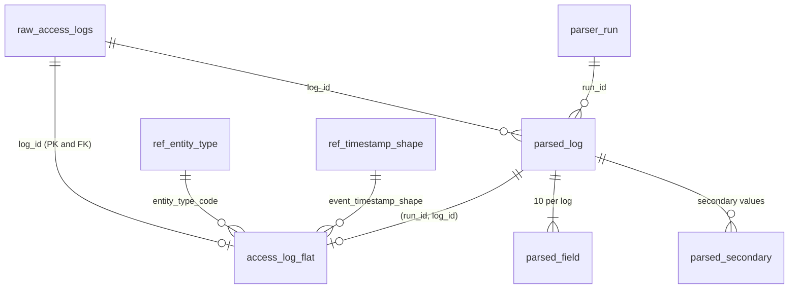

# Step 5A — Flat PostgreSQL Schema Design

**Status:** design (12/09/2026); Step 5A review corrections applied (§13). **Implemented in Step 5B** by
`sql/28_create_access_log_flat.sql`: table created, not populated ([Step 5B](Step5B_Create_Flat_Table.md)). One
correction was found during implementation. The zone-ID part of the `access_log_flat_ip_address_typed` CHECK now also
requires a non-NULL `ip_address_inet`, because the original form evaluated to NULL, and so passed, for a zone ID on a
non-VALID address. Appendix A shows the corrected line.

**Purpose:** store the primary parsed fields of the accepted parser output in one flat relational table. It keeps
every exact extracted value, its validity and its audit trail, and adds typed columns (`timestamptz`, `inet`,
`numeric`, `smallint`) wherever a validated value has a well-defined typed form.

**Inputs**
- [Step 4A validation report](Step4A_Parser_Validation_Report.md): run 14 accepted; 50,000 / 50,000 fields; T-01 … T-10
  PASS.
- The existing parser output tables `parser_run`, `parsed_log`, `parsed_field` and `parsed_secondary`.
- A read-only profile of run 14 (`READ ONLY` transaction, rolled back), which set the type choices (§9).

**Out of scope:**
- JSON/JSONB
- PostGIS
- secondary indexes
- any change to `raw_access_logs`
- implementation and data loading

---

## 1. Design principles

| # | Principle | Consequence |
|---|---|---|
| P1 | The validated exact substring is the source of truth | Each field keeps a `text` column with the value exactly as extracted (the 100%-validated value) |
| P2 | Types are derived, never guessed | Typed columns are filled **only** for VALID values and only by a documented conversion rule; INVALID and PLACEHOLDER values keep their text and leave the typed column NULL |
| P3 | NULL means "no value", and the validity column says why | MISSING ⇔ `value IS NULL` ⇔ `start_pos IS NULL`; typed columns are NULL whenever the value is not VALID |
| P4 | Every row is traceable to its raw log and parser run | `log_id` → `raw_access_logs`; `(run_id, log_id)` → `parsed_log` → `parser_run` |
| P5 | The table enforces what the parser guarantees | CHECK constraints cover MISSING/NULL consistency, position rules, typed-column rules, record validity and NONE rows |
| P6 | Column names match the answer key | `<field>` and `<field>_validity` have the same names as in `expected_fields` |

## 2. Table, schema and grain

| Item | Design |
|---|---|
| Schema | `log_regex` (the project schema) |
| Table | **`log_regex.access_log_flat`** |
| Grain | **one row per raw log** — 5,000 rows, including the 9 NONE rows (all fields MISSING) |
| Content | the primary fields of **one accepted parser run** (currently run 14), published into the table |
| History | stays in `parser_run` / `parsed_log` / `parsed_field` / `parsed_secondary` (one set per run) |
| Secondary values | not stored here; they stay in `parsed_secondary`, joinable on `(run_id, log_id)` |

The existing view `v_parsed_access_logs` pivots the latest run on every query, with text columns only. The flat table
is its stored, typed and constrained counterpart for a chosen accepted run.

## 3. Keys and relationships



| Constraint | Definition | Purpose |
|---|---|---|
| Primary key | `PRIMARY KEY (log_id)` | exactly one flat row per raw log |
| Raw log FK | `FOREIGN KEY (log_id) REFERENCES log_regex.raw_access_logs (log_id) ON UPDATE RESTRICT ON DELETE RESTRICT` | every row belongs to an existing raw log |
| Parser lineage FK | `FOREIGN KEY (run_id, log_id) REFERENCES log_regex.parsed_log (run_id, log_id) ON UPDATE RESTRICT ON DELETE RESTRICT` | the row is the output of that run for that log. `RESTRICT` also blocks deleting a published run, whose `parsed_log` rows would otherwise cascade |
| Vocabulary FKs | `entity_type_code` → `ref_entity_type (entity_type)`; `event_timestamp_shape` → `ref_timestamp_shape (shape_name)` | typed codes come only from the reference data |

**The raw table stays unchanged.** A foreign key that references `raw_access_logs` does not change its columns, rows,
fingerprints or guard trigger. PostgreSQL does add two internal referential-integrity triggers to the referenced
table, exactly as it already has for the three existing foreign keys (6 internal triggers today, plus 1 guard
trigger). The Step 3B-1 integrity check counts the guard triggers only and remains 10 / 10.

**Indexes:** the primary key necessarily creates its unique index. No other index is part of this design; indexing is
deferred to the performance step.

**Rebuild protection (Step 5A review).** `sql/07` (reference tables) and `sql/08` (parser output tables) rebuild with
`DROP … CASCADE`. That would silently remove the flat table's foreign keys and discard the parser run its rows
reference. The protection has three parts:

- **Script guards:** both scripts start with a guard that raises SQLSTATE `LR003` while `log_regex.access_log_flat`
  exists, before any `BEGIN` or `DROP`.
- **Runner guard:** `sql/run_step3b3_f1_parser.ps1`, the only runner that calls them, refuses before any database
  work.
- **Foreign-key check:** after installing the table and after every load, the implementation must run
  `sql/27_verify_access_log_flat_foreign_keys.sql`. It fails (SQLSTATE `LR004`) unless exactly the four foreign keys
  above exist, are validated and match their definitions.

## 4. Columns

### 4.1 Identity and lineage

| Column | Type | Null | Meaning |
|---|---|---|---|
| `log_id` | `integer` | NOT NULL | raw log id (PK, FK) |
| `run_id` | `bigint` | NOT NULL | parser run the row was published from (FK with `log_id` to `parsed_log`) |
| `loaded_at` | `timestamptz` | NOT NULL, default `now()` | publication time (same for all rows of one load transaction) |

### 4.2 Record classification (copied from `parsed_log`)

| Column | Type | Null | Meaning |
|---|---|---|---|
| `format_family` | `text` | NOT NULL | `F1` … `F5`, `NONE` |
| `detection_rule` | `text` | NOT NULL | `DET-F1` … `DET-F5`, `DET-00`, `DET-NONE` |
| `sub_format` | `text` | NULL | e.g. `pipe-delimited`, `template-C`, `rfc5424`, `ipv6-bracket-port`, `dmy_dash`; NULL for NONE |
| `record_validity` | `log_regex.record_validity_status` | NOT NULL | `VALID`, `INVALID`, `BROKEN` |
| `is_truncated` | `boolean` | NOT NULL | EC-134, EC-135, EC-136 |
| `event_end_pos` | `integer` | NULL | last character of the event scope; NULL only for NONE rows |
| `diagnostics` | `text[]` | NOT NULL, default `'{}'` | parser diagnostic codes (e.g. `truncated`, `no_format_detected`) |

`format_candidates` is not copied: in the accepted run it always equals `{detection_rule}`.

### 4.3 Field block (repeated for all 10 fields)

For each field `<f>` in `ref_field` order: `entity_type`, `email_address`, `resource_url`, `event_timestamp`, `tool`,
`latitude`, `longitude`, `ip_address`, `action_phrase`, `status`.

| Column | Type | Null | Meaning |
|---|---|---|---|
| `<f>` | `text` | NULL = MISSING | exact extracted substring of `raw_log` (never `''`) |
| `<f>_validity` | `log_regex.field_validity_status` | NOT NULL | `VALID`, `INVALID`, `PLACEHOLDER`, `MISSING` |
| `<f>_start_pos` | `integer` | NULL = MISSING | 1-based character position of `<f>` in `raw_log` |
| `<f>_source` | `text` | NULL | parser slot the value came from (`parsed_field.slot_id`, e.g. `F1.key.email`, `F4.user_agent`, `F5.column[6]`) |
| `<f>_missing_reason` | `log_regex.missing_reason_code` | NULL unless MISSING | `absent`, `empty`, `sentinel` |

10 × 5 = 50 columns. `text` (not `varchar(n)`) is used for all extracted values. In PostgreSQL both have the same
storage and speed, and the observed lengths vary widely (§9.1): an arbitrary limit could only reject a valid value.

### 4.4 Typed columns (filled only for VALID values)

| Field | Typed column | Type | Rule (VALID values only) | Rows in run 14 |
|---|---|---|---|---:|
| entity_type | `entity_type_code` | `text` FK `ref_entity_type` | `upper(regexp_replace(value, '[[:space:]_-]+', '_', 'g'))` — exactly the normalisation of the validator `is_valid_entity_type()`: every run of whitespace, `_` or `-` becomes one `_` (`Service Account`, `service-account`, `Service  Account` → `SERVICE_ACCOUNT`) | 4,634 |
| event_timestamp | `event_timestamp_shape` | `text` FK `ref_timestamp_shape` | the first `ref_timestamp_shape` pattern that matches, recorded for **every** non-NULL value (VALID and INVALID) | 4,990 |
| event_timestamp | `event_timestamp_local` | `timestamp(6)` | wall-clock date and time exactly as written, read with the shape's group map. The year-less syslog shape takes `parser_run.assumed_year` (2026, C-04); epoch values are read as UTC. 12-hour shapes: hour = hour mod 12, plus 12 for PM — **12 AM → 00**, 1–11 AM → 01–11, **12 PM → 12**, 1–11 PM → 13–23 | 4,928 |
| event_timestamp | `event_timestamp_utc_offset` | `interval` | `Z` → `00:00`; `±hh:mm` / `±hhmm` → that offset; epoch → `00:00`; **NULL** when the text states no zone, or only an abbreviation | 2,941 |
| event_timestamp | `event_timestamp_utc` | `timestamptz(6)` | `(event_timestamp_local - event_timestamp_utc_offset) AT TIME ZONE 'UTC'`; NULL when the offset is unknown | 2,941 |
| latitude | `latitude_degrees` | `numeric(10,7)` | signed decimal as written; hemisphere prefix/suffix gives the sign (S negative); DMS = d + m/60 + s/3600, computed exactly and rounded once to 7 decimal places; precision limits in §4.6 | 4,249 |
| longitude | `longitude_degrees` | `numeric(10,7)` | as latitude (W negative) | 4,252 |
| ip_address | `ip_address_inet` | `inet` | `split_part(value, '%', 1)::inet` — the host address without a zone ID | 4,948 |
| ip_address | `ip_address_zone_id` | `text` | the part after `%` (IPv6 zone ID, which `inet` cannot store); NULL otherwise | 1 |
| status | `status_code` | `smallint` | the 3-digit HTTP code of `403` or `403 Forbidden` | 2,035 |
| status | `status_word` | `text` | `upper(value)` for word statuses (`ok` → `OK`), and `✓` as written; NULL for codes | 2,666 |

No typed column is defined for `email_address`, `resource_url`, `tool` or `action_phrase`:

- **email_address:** the exact text is the value. 402 VALID addresses contain uppercase, so any case folding would be
  a normalisation decision. `citext` is not used, to avoid an extension.
- **resource_url, tool, action_phrase:** no general typed form exists in core PostgreSQL.

**Why these types** (evidence in §9):

- **`timestamp(6)` + `interval` + `timestamptz(6)`:** only 2,941 of 4,928 valid timestamps state their zone. Storing
  every value as `timestamptz` would invent a time zone for the other 1,987. The local wall-clock time is always
  exact; the absolute instant is filled only when the text defines it. Fractions have at most 6 digits.
- **`numeric(10,7)` rather than `double precision`** (reasoning corrected after the Step 5A review):
  - **Not chosen for storage exactness.** Every stored 7-place value also round-trips through `double precision`
    (0 failures over the 8,501 VALID coordinates).
  - **Same arithmetic as the validator.** VAL-GEO decides validity with `numeric` comparisons
    (`abs(value::numeric) <= 90`). Range CHECKs and conversions on a `numeric` column therefore agree with the
    validator exactly, including at the ±90 / ±180 boundaries.
  - **Exact DMS conversion with one explicit rounding step.** d + m/60 + s/3600 is computed exactly and rounded once
    to 7 places. The same formula in `double precision` does not give the 7-place result for 395 of the 560 VALID
    DMS values (e.g. `0°05'04.9"W`: 0.0846944 vs 0.08469444444444443).
  - **Exact comparison and aggregation.** Equality, sums and averages are decimal-exact: `0.1 + 0.2 = 0.3` holds for
    `numeric` but not for `double precision`.
  - **A declared precision contract.** 7 decimal places (about 1.1 cm) is the largest precision in the data.
    `numeric(10,7)` would silently round a longer value (`12.12345678` → `12.1234568`), so the load rejects such
    values instead (§4.6).
  - **Cost.** `numeric` is larger and slower than `double precision`, and PostGIS needs an explicit cast later. This is
    negligible for 5,000 rows; the performance step may revisit it.
- **`inet`:** all 4,948 VALID addresses cast once the zone ID is split off. The **VALID** flag, not castability,
  decides the typed value, because 4 INVALID IPv4 values with leading zeros are also castable and would be silently
  rewritten (`192.168.037.068` → `192.168.37.68`). Verification compares `inet` values, not text (§10).
- **`smallint` status code:** codes are 100–599.

### 4.5 Complete column list (71 columns)

| # | Group | Columns |
|---:|---|---|
| 1–3 | identity | `log_id`, `run_id`, `loaded_at` |
| 4–10 | record | `format_family`, `detection_rule`, `sub_format`, `record_validity`, `is_truncated`, `event_end_pos`, `diagnostics` |
| 11–16 | entity type | `entity_type`, `entity_type_validity`, `entity_type_start_pos`, `entity_type_source`, `entity_type_missing_reason`, `entity_type_code` |
| 17–21 | email | `email_address`, `email_address_validity`, `email_address_start_pos`, `email_address_source`, `email_address_missing_reason` |
| 22–26 | resource | `resource_url`, `resource_url_validity`, `resource_url_start_pos`, `resource_url_source`, `resource_url_missing_reason` |
| 27–35 | timestamp | `event_timestamp`, `event_timestamp_validity`, `event_timestamp_start_pos`, `event_timestamp_source`, `event_timestamp_missing_reason`, `event_timestamp_shape`, `event_timestamp_local`, `event_timestamp_utc_offset`, `event_timestamp_utc` |
| 36–40 | tool | `tool`, `tool_validity`, `tool_start_pos`, `tool_source`, `tool_missing_reason` |
| 41–46 | latitude | `latitude`, `latitude_validity`, `latitude_start_pos`, `latitude_source`, `latitude_missing_reason`, `latitude_degrees` |
| 47–52 | longitude | `longitude`, `longitude_validity`, `longitude_start_pos`, `longitude_source`, `longitude_missing_reason`, `longitude_degrees` |
| 53–59 | IP | `ip_address`, `ip_address_validity`, `ip_address_start_pos`, `ip_address_source`, `ip_address_missing_reason`, `ip_address_inet`, `ip_address_zone_id` |
| 60–64 | action | `action_phrase`, `action_phrase_validity`, `action_phrase_start_pos`, `action_phrase_source`, `action_phrase_missing_reason` |
| 65–71 | status | `status`, `status_validity`, `status_start_pos`, `status_source`, `status_missing_reason`, `status_code`, `status_word` |

### 4.6 Load-time coordinate precision rule

VAL-GEO accepts any number of decimal places, and `numeric(10,7)` would round a longer value silently. The load
therefore **rejects**: it raises an error and publishes nothing if any VALID coordinate would need rounding beyond its
written precision.

| Notation | Accepted | Rejected example |
|---|---|---|
| signed decimal, hemisphere prefix or suffix | at most 7 decimal places | `12.12345678`, `N51.50740001` |
| DMS | seconds with at most 3 decimal places | `19°04'33.6123"N` |

**Why 3 decimal places for DMS seconds:** 0.001″ ≈ 2.8 × 10⁻⁷°, which is still coarser than the 10⁻⁷° step of
7 decimal places. Rounding to 7 places therefore keeps the written precision.

Checks before insert (VALID values only):

- decimal and hemisphere forms: `coalesce(char_length(substring(value FROM '[0-9][.]([0-9]+)')), 0) <= 7`
- DMS: `coalesce(char_length(substring(value FROM '[0-9]{2}[.]([0-9]+)["″]')), 0) <= 3`

Rounding a DMS result to 7 decimal places is part of the documented conversion, not a rejection case.

**Run 14:** 0 rejections. Decimal and hemisphere forms have at most 7 decimal places (3,967 latitudes, 3,974
longitudes); DMS seconds have at most 1 decimal place (282 latitudes, 278 longitudes).

## 5. How NULL represents MISSING

| Field state | `<f>` | `<f>_start_pos` | `<f>_missing_reason` | typed column(s) | Example |
|---|---|---|---|---|---|
| **MISSING** | **NULL** | NULL | `absent` / `empty` / `sentinel` | NULL | F1 key absent; F5 empty column `;;`; F2 `anonymous` |
| PLACEHOLDER | token as written | position | NULL | **NULL** | `-`, `N/A`, `NULL`, `null`, `unknown` |
| INVALID | value as written | position | NULL | **NULL** (only `event_timestamp_shape` may be set) | `29-02-2026 12:00`, `1.2.3.4.5`, `NaN` |
| VALID | value as written | position | NULL | filled by the rule in §4.4 | `2026-01-08T10:45:30Z` → `event_timestamp_utc` |

Rules:

- **NULL means "no value" only in the value and position columns.** The literal text `NULL` in a raw log is a
  PLACEHOLDER value stored as the string `'NULL'`, never as SQL NULL. An empty string is never stored.
- **A NULL typed column is not an absence of data.** It means "no valid typed form"; `<f>_validity` says why (MISSING,
  PLACEHOLDER or INVALID).
- **Missing reasons** keep what the parser saw:
  - `absent`: no slot, key or clause at all
  - `empty`: slot present but empty (`status=`, an empty F5 column)
  - `sentinel`: F2 `anonymous` and `an unspecified resource`
- **NONE rows** have all 10 values NULL with `missing_reason = 'absent'` and `record_validity = 'BROKEN'`.

In run 14: 2,626 MISSING values (absent 2,160 · empty 341 · sentinel 125) and 613 placeholder values (§9.2).

## 6. How VALID / INVALID / PLACEHOLDER status is stored

Three **domains** over `text`:

```sql
CREATE DOMAIN log_regex.field_validity_status  AS text CHECK (VALUE IN ('VALID', 'INVALID', 'PLACEHOLDER', 'MISSING'));
CREATE DOMAIN log_regex.record_validity_status AS text CHECK (VALUE IN ('VALID', 'INVALID', 'BROKEN'));
CREATE DOMAIN log_regex.missing_reason_code    AS text CHECK (VALUE IN ('absent', 'empty', 'sentinel'));
```

| Option | Assessment |
|---|---|
| **Domain over `text` (chosen)** | One definition for all 10 validity columns. Values are text, so they compare directly with `parsed_field.validity` and `expected_fields.<f>_validity` (both `text` + CHECK today). Readable in queries and exports. The allowed set can be changed with `ALTER DOMAIN` |
| `ENUM` type | Compact, but values sort by declaration order, cannot be removed, and need casts when compared with the existing `text` columns |
| Lookup table + 10 foreign keys | Adds 10 constraints and joins for a fixed four-value vocabulary |
| `boolean is_valid` | Cannot separate INVALID, PLACEHOLDER and MISSING |

- **MISSING** is a stored validity value (not only a NULL value), so every field has exactly one explicit state.
- **Record validity** is stored per row and **checked** against the 10 field states (§8).

## 7. Position, source and diagnostic metadata

| Question an auditor asks | Where the answer is |
|---|---|
| Which raw log is this? | `log_id` → `raw_access_logs.raw_log` |
| Which parser run, version, reference data and assumed year produced it? | `run_id` → `parser_run` |
| Where exactly in the raw text is the value? | `<f>_start_pos` (+ `char_length(<f>)`); `event_end_pos` for the event scope |
| Which parser slot or rule produced it? | `<f>_source` (slot); `parsed_field.rule_id` and `candidate_count` via `(run_id, log_id, field_name)` |
| Why is it missing? | `<f>_validity = 'MISSING'` + `<f>_missing_reason` |
| How was the typed value derived? | `event_timestamp_shape` (timestamp shape and so the day/month order); conversion rules in §4.4 |
| How was the format decided, and is the record truncated? | `format_family`, `detection_rule`, `sub_format`, `is_truncated`, `diagnostics` |
| Which other candidates existed (ports, proxies, referers, look-alikes)? | `parsed_secondary` via `(run_id, log_id)` |
| When was the row published? | `loaded_at` |

`rule_id` and `candidate_count` stay in `parsed_field` (18 distinct rules, at most 2 candidates) rather than adding
20 more columns. They remain one join away through the lineage foreign key.

**Exact-substring invariant.** `substr(raw_log, <f>_start_pos, char_length(<f>)) = <f>` needs the raw table, so no CHECK
constraint can express it. The load step must verify it for every stored value (47,374 expected), as `run_parser()`
already does. The CHECKs enforce everything that can be decided within the row (§8).

## 8. Constraints

| Constraint | Rule |
|---|---|
| Per field (×10) `…_<f>_state` | `(<f> IS NULL) = (<f>_validity = 'MISSING')` · `(<f>_start_pos IS NULL) = (<f> IS NULL)` · `(<f>_missing_reason IS NOT NULL) = (<f>_validity = 'MISSING')` · `(<f>_source IS NULL) = (<f>_missing_reason IS NOT DISTINCT FROM 'absent')` (added after review) · `<f> <> ''` · `<f>_start_pos >= 1` and the value ends within `event_end_pos` |
| `…_entity_type_code` | `(entity_type_code IS NOT NULL) = (entity_type_validity = 'VALID')` |
| `…_event_timestamp_typed` | `(event_timestamp_local IS NOT NULL) = (event_timestamp_validity = 'VALID')` · `(event_timestamp_utc_offset IS NULL) = (event_timestamp_utc IS NULL)` · offset within ±14 hours · shape only with a value |
| `…_coordinates_typed` | `(latitude_degrees IS NOT NULL) = (latitude_validity = 'VALID')` and `BETWEEN -90 AND 90`; `(longitude_degrees IS NOT NULL) = (longitude_validity = 'VALID')` and `BETWEEN -180 AND 180` |
| `…_ip_address_typed` | `(ip_address_inet IS NOT NULL) = (ip_address_validity = 'VALID')` · host address (`masklen` 32 / 128) · zone ID only with IPv6 |
| `…_status_typed` | `(status_code IS NOT NULL OR status_word IS NOT NULL) = (status_validity = 'VALID')` · not both · code 100–599 · word upper-case |
| `…_format_family` | `format_family IN ('F1','F2','F3','F4','F5','NONE')` |
| `…_detection_rule` | `DET-<format>` for F1–F5; `DET-00` or `DET-NONE` for NONE |
| `…_event_end_pos` | NULL exactly for NONE rows; otherwise ≥ 1 |
| `…_sub_format` (added after review) | `(sub_format IS NULL) = (format_family = 'NONE')` |
| `…_none_rows` | NONE ⇒ all 10 validity columns `MISSING` |
| `…_record_validity_rule` | `record_validity = CASE WHEN format_family = 'NONE' OR is_truncated THEN 'BROKEN' WHEN any <f>_validity = 'INVALID' THEN 'INVALID' ELSE 'VALID' END` |

Run 14 satisfies every rule above: the per-field states are the Step 3A C-07 invariants already enforced on
`parsed_field`, the typed counts are in §4.4, and the record-validity rule is the one `run_parser()` applies.

## 9. Profile evidence (run 14, read-only)

### 9.1 Stored text lengths

| Field | Values | Max characters | Max bytes |
|---|---:|---:|---:|
| entity_type | 4,694 | 15 | 15 |
| email_address | 4,711 | 47 | 47 |
| resource_url | 4,849 | 2,107 | 2,107 |
| event_timestamp | 4,990 | 32 | 32 |
| tool | 4,668 | 139 | 139 |
| latitude | 4,339 | 15 | 20 |
| longitude | 4,346 | 15 | 20 |
| ip_address | 4,987 | 39 | 39 |
| action_phrase | 4,987 | 38 | 38 |
| status | 4,803 | 25 | 25 |

### 9.2 MISSING and PLACEHOLDER

- **MISSING reasons:**
  - `absent` 2,160: entity 276, email 161, resource 76, timestamp 10, tool 278, latitude 583, longitude 589, IP 13,
    action 13, status 161
  - `empty` 341: entity 30, email 48, resource 30, tool 54, latitude 78, longitude 65, status 36
  - `sentinel` 125: email 80, resource 45
- **PLACEHOLDER tokens** (613): `-` 397, `null` 119, `N/A` 71, `NULL` 17, `unknown` 9.

### 9.3 Timestamps (4,990 values: 4,928 VALID, 62 INVALID; every value matches a `ref_timestamp_shape`)

| Shape | Zone information in the text | VALID | INVALID | Typed result for VALID |
|---|---|---:|---:|---|
| `epoch_seconds`, `epoch_milliseconds` | UTC by definition | 132 + 108 | 0 | local + offset 0 + UTC |
| `iso8601` | `Z` | 1,248 | 14 | local + offset 0 + UTC |
| `iso8601` | numeric offset (`+05:30`) | 573 | 10 | local + offset + UTC |
| `apache_clf` | numeric offset (`+0530`) | 880 | 9 | local + offset + UTC |
| `iso8601` | zone abbreviation (`IST`) | 1 | 0 | local only (abbreviation is ambiguous) |
| `iso8601` (no zone), `us_mdy_12h`, `syslog_rfc3164`, `dmy_dash`, `ymd_slash`, `compact_basic` | none | 590 + 345 + 621 + 292 + 76 + 62 | 13 + 5 + 6 + 4 + 1 + 0 | local only |

Maximum fraction digits: 6. Absolute instant available for 2,941 of 4,928 VALID values.

### 9.4 Coordinates (VALID values)

| Notation | Latitude | Longitude | Max decimal places | Max integer digits |
|---|---:|---:|---:|---:|
| signed decimal | 3,696 | 3,699 | 7 | 2 / 3 |
| hemisphere prefix `N51.5074` | 181 | 181 | 7 | 2 / 3 |
| hemisphere suffix `51.5074 N` | 90 | 94 | 7 | 2 / 3 |
| DMS `19°04'33.6"N` (2 with `′ ″`) | 282 | 278 | 1 (seconds) | 2 |
| **Total** | **4,249** | **4,252** | | |

### 9.5 IP addresses, status, entity type

- **IP addresses (VALID):**
  - IPv4 3,905, IPv4-mapped IPv6 112, IPv6 930: all cast as written
  - IPv6 with zone ID 1: casts after the `%zone` is removed
  - Among INVALID values, 4 leading-zero IPv4 values (e.g. `192.168.037.068` → `192.168.37.68`) are castable to `inet`
    but not valid under VAL-IP
- **Status (VALID):**
  - code only 1,633 and code + reason 402 → 2,035 `status_code` values
  - 2,665 word statuses → 18 upper-case words (e.g. `OK` 460, `SUCCESS` 636; 13 appear in two spellings)
  - `✓` 1
- **Entity type (VALID):** 4,634 values in up to 4 spellings each, e.g. `API Client`, `API_CLIENT`, `api-client`,
  `api_client`. All map to one of the 7 `ref_entity_type` codes.
- **Email (VALID):** 4,544, of which 402 contain uppercase.

### 9.6 Audit metadata

`parsed_field` in run 14:

- 123 distinct slots (longest 30 characters)
- 18 distinct rule ids
- `candidate_count` at most 2

Diagnostics are present on 9 logs (10 codes).

## 10. Population and verification plan (for the implementation step; not done here)

1. Create the three domains and the table (Appendix A) in one transaction; no index other than the primary key.
2. Publish one accepted run (default: the latest run with formats `{F1,F2,F3,F4,F5,NONE}`, currently 14). Use a single
   `INSERT … SELECT` that pivots `parsed_log` + `parsed_field` by `field_name` and derives the typed columns with the
   rules in §4.4. Timestamps and coordinates reuse the `ref_timestamp_shape` group maps and the parsing already used by
   the validators.
3. Verify before commit:
   - **Rows:** 5,000, one per `raw_access_logs` row, all from the same `run_id`.
   - **Round trip:** unpivoting the 10 × 5 field columns reproduces `parsed_field` exactly (value, validity,
     position, slot, missing reason).
   - **Exact positions:** `substr(raw_log, start_pos, length) = value` for all 47,374 stored values.
   - **Answer key:** 50,000 / 50,000 value and validity matches; record validity 4,750 / 238 / 12.
   - **Typed counts:** equal the VALID counts in §4.4 (4,634 · 4,990 · 4,928 · 2,941 · 2,941 · 4,249 · 4,252 · 4,948 ·
     1 · 2,035 · 2,666).
   - **Typed values:**
     - `event_timestamp_utc` equals the epoch value for epoch rows
     - 12-hour values equal PostgreSQL `to_timestamp(value, 'MM/DD/YYYY HH12:MI[:SS] AM')`
     - IP addresses are compared **as `inet` values, never as text**:
       - `ip_address_inet = split_part(ip_address, '%', 1)::inet`
       - `ip_address_zone_id IS NOT DISTINCT FROM nullif(split_part(ip_address, '%', 2), '')`
       - `inet` output shortens IPv6 (`2001:0db8:…` → `2001:db8:…`), so a text comparison would wrongly fail for
         203 VALID values
     - `entity_type_code = upper(regexp_replace(entity_type, '[[:space:]_-]+', '_', 'g'))`, and
       `is_valid_entity_type(entity_type)` is true for every row with a code
     - coordinates are within range, and the precision rule of §4.6 rejected nothing
   - **Foreign keys:** `sql/27_verify_access_log_flat_foreign_keys.sql` passes after installing the table and again
     after the load: exactly the four foreign keys of §3, validated, with their columns and ON UPDATE / ON DELETE
     actions.
   - **Raw integrity:** `verify_raw_access_logs()` 10 / 10 before and after.

## 11. What this design deliberately does not include

| Excluded | Reason / where it belongs |
|---|---|
| JSON/JSONB columns (e.g. secondary values, raw JSON body of F3) | later JSON/JSONB step |
| `geometry` / `geography` point from latitude/longitude | later PostGIS step; `latitude_degrees` / `longitude_degrees` are its input |
| Secondary indexes (on `run_id`, typed columns, validity columns) | later indexing / performance step |
| Changes to `raw_access_logs` | none — only referenced by a foreign key |
| Normalised email, resource scheme/host, tool product/version | normalisation decisions not yet made |

## 12. Decisions for review

1. **Grain:** one current row per raw log (PK `log_id`, lineage via `run_id`), with run history kept in the parser
   tables. The alternative is a history table keyed `(run_id, log_id)`.
2. **Two layers per field:** exact `text` + typed columns filled only for VALID values.
3. **Timestamps:** `timestamp(6)` wall clock for all VALID values, `interval` offset and `timestamptz(6)` instant only
   when the text defines the zone. The single `IST` value gets no offset, syslog dates take the run's assumed year
   2026, and 12-hour times use 12 AM → 00 and 12 PM → 12.
4. **Coordinates:** `numeric(10,7)` for decimal arithmetic consistent with VAL-GEO, with DMS rounded once to 7
   decimals. Values that would need more precision are rejected at load (§4.6). The alternative is
   `double precision`.
5. **IP:** `inet` + separate zone-ID text for the one IPv6 zone value.
6. **Status:** `status_code smallint` or `status_word text`, never both. `✓` is kept as a word, since it is not in
   `ref_status_word`.
7. **Validity storage:** `text` domains (not `ENUM` or lookup tables). MISSING is stored explicitly.
8. **Audit columns in the table:** `start_pos`, `source`, `missing_reason` per field and the record diagnostics.
   `rule_id` and `candidate_count` stay in `parsed_field`.
9. **Foreign keys and destructive rebuilds** (resolved after review): `sql/07` and `sql/08` drop with `CASCADE`, which
   would silently remove the flat table's foreign keys. Both now refuse to run while `access_log_flat` exists
   (`LR003`), the 3B-3 runner refuses first, and `sql/27` must pass after install and after every load.
10. **Exact-substring invariant:** enforced by load verification, not a CHECK or trigger (it needs the raw table).
11. **`diagnostics` as `text[]`**, matching `parsed_log`; it is not JSON.


## 13. Step 5A review and corrections (12/09/2026)

### 13.1 Review verdicts

| # | Decision | Verdict | Resolution |
|---:|---|---|---|
| 1 | One row per raw log | APPROVED | — |
| 2 | Exact text plus typed columns for VALID values only | APPROVED | — |
| 3 | Timestamp types and time-zone handling | APPROVED | 12-hour rule made explicit (§4.4) |
| 4 | Coordinates `numeric(10,7)` | APPROVED | reasoning corrected; load-time precision rule added (§4.4, §4.6) |
| 5 | IP `inet` plus zone ID | NEEDS CHANGE | verification compares `inet` values, not text (§10) |
| 6 | Status representation | APPROVED | — |
| 7 | Entity-type code and foreign key | NEEDS CHANGE | derivation uses the validator's exact normalisation (§4.4) |
| 8 | MISSING, INVALID and PLACEHOLDER storage | APPROVED | — |
| 9 | CHECK constraints and audit metadata | APPROVED | two CHECKs added (§8, Appendix A) |
| 10 | Foreign-key CASCADE / RESTRICT risks | NEEDS CHANGE | guards in `sql/07`, `sql/08` and the 3B-3 runner; foreign-key check `sql/27` (§3, §10) |

### 13.2 Files changed by the corrections

| File | Change |
|---|---|
| `sql/07_parser_reference_data.sql` | guard block before `BEGIN` and the first `DROP`: raises `LR003` while `log_regex.access_log_flat` exists; header note. Nothing else changed |
| `sql/08_parser_output_tables.sql` | the same guard and header note. Nothing else changed |
| `sql/run_step3b3_f1_parser.ps1` | new step "Rebuild guard" before any database work; fail-safe (any answer other than "table absent" refuses); header note |
| `sql/27_verify_access_log_flat_foreign_keys.sql` | new, read-only catalog check (`LR004` on failure); reports "nothing to verify" while the table does not exist |
| `docs/Step5A_Flat_Schema_Design.md` | §3, §4.4, §4.6 (new), §8, §9.5, §10, §12, this section, Appendix A |
| `docs/Step3B3_F1_Parser.md` | guard notes for `sql/07` and `sql/08` |
| `README.md` | status and Step 5A summary |

No parser function, validator, table, view, index or data was changed. `access_log_flat` was not created, and no new
table was populated.

### 13.3 Read-only verification

Run 14 was used for all evidence. Every query ran in a session with `default_transaction_read_only = on`, inside
transactions that were rolled back. Neither `sql/07` nor `sql/08` was executed.

| Check | Result |
|---|---|
| State | `access_log_flat` absent; 14 parser runs; `verify_raw_access_logs()` 10 / 10 |
| Entity code (validator normalisation) | 4,634 / 4,634 VALID codes in `ref_entity_type`; code-in-reference agrees with `is_valid_entity_type()` for all 4,652 VALID and INVALID values |
| Entity probes | `Service  Account`, `service_-account`, `API<TAB>Client`, `API<NBSP>Client`: validator VALID, corrected code in the reference, previous rule not; `-user`: both reject |
| IP as `inet` | 4,948 / 4,948 VALID addresses equal as `inet`, while 203 differ as text; EC-100 zone ID `eth0` verified |
| 12-hour clock | 345 VALID values; 12 AM → 00 in all 12 cases, 12 PM → 12 in all 10 cases; all 345 equal PostgreSQL `to_timestamp`; probes 12:00 AM, 12:30 PM, 01:05 AM, 11:59 PM correct |
| Coordinate precision rule | 0 rejections: decimal and hemisphere forms have at most 7 places; DMS seconds at most 1 place |
| `numeric` vs `double precision` | `double precision` DMS arithmetic misses the 7-place value for 395 / 560 values; `numeric(10,7)` silently rounds `12.12345678` to `12.1234568`; `0.1 + 0.2 = 0.3` true for `numeric`, false for `double precision` |
| Extra CHECK rules | `sub_format` NULL only for NONE: 0 violations (9 NULL rows). Source NULL only for `absent`: 0 violations (2,160 rows) |
| Guard placement (static) | in `sql/07` and `sql/08` the guard ends before the first `BEGIN` and the first `DROP`; in the runner it runs before any other database call |
| Guard behaviour | the exact guard block from each script passes when `access_log_flat` is absent and refuses with `LR003` when an existing table (`parsed_log`) stands in for it |
| Runner guard query | returns `f` on the live database (table absent), so the runner would proceed; any other answer refuses |
| `sql/27`, table absent | "nothing to verify", exit 0 |
| `sql/27` on an existing table without the four keys (`parsed_field`) | fails as intended with `LR004` (0 of 4 found, 2 foreign keys defined) |
| `sql/27` matching logic | a copy expecting `parsed_field`'s two real foreign keys passes |
| Encoding | all changed SQL and PowerShell files are ASCII |

---

## Appendix A — DDL sketch (design only; not executed)

```sql
-- Step 5A design sketch. NOT EXECUTED. Implementation, loading and verification belong to the next step.
-- Enforced by the load and its verification, not by CHECKs: exact substrings; entity_type_code =
-- upper(regexp_replace(entity_type, '[[:space:]_-]+', '_', 'g')); 12 AM -> 00 and 12 PM -> 12; the coordinate
-- precision rule (section 4.6); the four foreign keys (sql/27_verify_access_log_flat_foreign_keys.sql).

CREATE DOMAIN log_regex.field_validity_status  AS text CHECK (VALUE IN ('VALID', 'INVALID', 'PLACEHOLDER', 'MISSING'));
CREATE DOMAIN log_regex.record_validity_status AS text CHECK (VALUE IN ('VALID', 'INVALID', 'BROKEN'));
CREATE DOMAIN log_regex.missing_reason_code    AS text CHECK (VALUE IN ('absent', 'empty', 'sentinel'));

CREATE TABLE log_regex.access_log_flat (
    -- identity and lineage
    log_id                          integer      NOT NULL,
    run_id                          bigint       NOT NULL,
    loaded_at                       timestamptz  NOT NULL DEFAULT now(),

    -- record classification
    format_family                   text         NOT NULL,
    detection_rule                  text         NOT NULL,
    sub_format                      text,
    record_validity                 log_regex.record_validity_status NOT NULL,
    is_truncated                    boolean      NOT NULL,
    event_end_pos                   integer,
    diagnostics                     text[]       NOT NULL DEFAULT '{}',

    -- entity_type
    entity_type                     text,
    entity_type_validity            log_regex.field_validity_status NOT NULL,
    entity_type_start_pos           integer,
    entity_type_source              text,
    entity_type_missing_reason      log_regex.missing_reason_code,
    entity_type_code                text,

    -- email_address
    email_address                   text,
    email_address_validity          log_regex.field_validity_status NOT NULL,
    email_address_start_pos         integer,
    email_address_source            text,
    email_address_missing_reason    log_regex.missing_reason_code,

    -- resource_url
    resource_url                    text,
    resource_url_validity           log_regex.field_validity_status NOT NULL,
    resource_url_start_pos          integer,
    resource_url_source             text,
    resource_url_missing_reason     log_regex.missing_reason_code,

    -- event_timestamp
    event_timestamp                 text,
    event_timestamp_validity        log_regex.field_validity_status NOT NULL,
    event_timestamp_start_pos       integer,
    event_timestamp_source          text,
    event_timestamp_missing_reason  log_regex.missing_reason_code,
    event_timestamp_shape           text,
    event_timestamp_local           timestamp(6),
    event_timestamp_utc_offset      interval,
    event_timestamp_utc             timestamptz(6),

    -- tool
    tool                            text,
    tool_validity                   log_regex.field_validity_status NOT NULL,
    tool_start_pos                  integer,
    tool_source                     text,
    tool_missing_reason             log_regex.missing_reason_code,

    -- latitude
    latitude                        text,
    latitude_validity               log_regex.field_validity_status NOT NULL,
    latitude_start_pos              integer,
    latitude_source                 text,
    latitude_missing_reason         log_regex.missing_reason_code,
    latitude_degrees                numeric(10,7),

    -- longitude
    longitude                       text,
    longitude_validity              log_regex.field_validity_status NOT NULL,
    longitude_start_pos             integer,
    longitude_source                text,
    longitude_missing_reason        log_regex.missing_reason_code,
    longitude_degrees               numeric(10,7),

    -- ip_address
    ip_address                      text,
    ip_address_validity             log_regex.field_validity_status NOT NULL,
    ip_address_start_pos            integer,
    ip_address_source               text,
    ip_address_missing_reason       log_regex.missing_reason_code,
    ip_address_inet                 inet,
    ip_address_zone_id              text,

    -- action_phrase
    action_phrase                   text,
    action_phrase_validity          log_regex.field_validity_status NOT NULL,
    action_phrase_start_pos         integer,
    action_phrase_source            text,
    action_phrase_missing_reason    log_regex.missing_reason_code,

    -- status
    status                          text,
    status_validity                 log_regex.field_validity_status NOT NULL,
    status_start_pos                integer,
    status_source                   text,
    status_missing_reason           log_regex.missing_reason_code,
    status_code                     smallint,
    status_word                     text,

    -- keys
    CONSTRAINT access_log_flat_pkey PRIMARY KEY (log_id),
    CONSTRAINT access_log_flat_raw_log_fkey FOREIGN KEY (log_id)
        REFERENCES log_regex.raw_access_logs (log_id) ON UPDATE RESTRICT ON DELETE RESTRICT,
    CONSTRAINT access_log_flat_parsed_log_fkey FOREIGN KEY (run_id, log_id)
        REFERENCES log_regex.parsed_log (run_id, log_id) ON UPDATE RESTRICT ON DELETE RESTRICT,
    CONSTRAINT access_log_flat_entity_type_code_fkey FOREIGN KEY (entity_type_code)
        REFERENCES log_regex.ref_entity_type (entity_type),
    CONSTRAINT access_log_flat_event_timestamp_shape_fkey FOREIGN KEY (event_timestamp_shape)
        REFERENCES log_regex.ref_timestamp_shape (shape_name),

    -- record classification
    CONSTRAINT access_log_flat_format_family CHECK (format_family IN ('F1', 'F2', 'F3', 'F4', 'F5', 'NONE')),
    CONSTRAINT access_log_flat_detection_rule CHECK (
        CASE WHEN format_family = 'NONE' THEN detection_rule IN ('DET-00', 'DET-NONE')
             ELSE detection_rule = 'DET-' || format_family END),
    CONSTRAINT access_log_flat_event_end_pos CHECK (
        (event_end_pos IS NULL) = (format_family = 'NONE') AND (event_end_pos IS NULL OR event_end_pos >= 1)),
    CONSTRAINT access_log_flat_sub_format CHECK ((sub_format IS NULL) = (format_family = 'NONE')),
    CONSTRAINT access_log_flat_none_rows CHECK (
        format_family <> 'NONE'
        OR (entity_type_validity = 'MISSING' AND email_address_validity = 'MISSING' AND resource_url_validity = 'MISSING'
            AND event_timestamp_validity = 'MISSING' AND tool_validity = 'MISSING' AND latitude_validity = 'MISSING'
            AND longitude_validity = 'MISSING' AND ip_address_validity = 'MISSING'
            AND action_phrase_validity = 'MISSING' AND status_validity = 'MISSING')),
    CONSTRAINT access_log_flat_record_validity_rule CHECK (
        record_validity = CASE
            WHEN format_family = 'NONE' OR is_truncated THEN 'BROKEN'
            WHEN 'INVALID' IN (entity_type_validity, email_address_validity, resource_url_validity,
                               event_timestamp_validity, tool_validity, latitude_validity, longitude_validity,
                               ip_address_validity, action_phrase_validity, status_validity) THEN 'INVALID'
            ELSE 'VALID' END),

    -- per-field state (MISSING <=> NULL value <=> NULL position <=> missing reason; source NULL <=> absent;
    -- no empty strings; in event scope)
    CONSTRAINT access_log_flat_entity_type_state CHECK (
        (entity_type IS NULL) = (entity_type_validity = 'MISSING')
        AND (entity_type_start_pos IS NULL) = (entity_type IS NULL)
        AND (entity_type_missing_reason IS NOT NULL) = (entity_type_validity = 'MISSING')
        AND (entity_type_source IS NULL) = (entity_type_missing_reason IS NOT DISTINCT FROM 'absent')
        AND (entity_type IS NULL OR (entity_type <> '' AND entity_type_start_pos >= 1
             AND entity_type_start_pos + char_length(entity_type) - 1 <= event_end_pos))),
    CONSTRAINT access_log_flat_email_address_state CHECK (
        (email_address IS NULL) = (email_address_validity = 'MISSING')
        AND (email_address_start_pos IS NULL) = (email_address IS NULL)
        AND (email_address_missing_reason IS NOT NULL) = (email_address_validity = 'MISSING')
        AND (email_address_source IS NULL) = (email_address_missing_reason IS NOT DISTINCT FROM 'absent')
        AND (email_address IS NULL OR (email_address <> '' AND email_address_start_pos >= 1
             AND email_address_start_pos + char_length(email_address) - 1 <= event_end_pos))),
    CONSTRAINT access_log_flat_resource_url_state CHECK (
        (resource_url IS NULL) = (resource_url_validity = 'MISSING')
        AND (resource_url_start_pos IS NULL) = (resource_url IS NULL)
        AND (resource_url_missing_reason IS NOT NULL) = (resource_url_validity = 'MISSING')
        AND (resource_url_source IS NULL) = (resource_url_missing_reason IS NOT DISTINCT FROM 'absent')
        AND (resource_url IS NULL OR (resource_url <> '' AND resource_url_start_pos >= 1
             AND resource_url_start_pos + char_length(resource_url) - 1 <= event_end_pos))),
    CONSTRAINT access_log_flat_event_timestamp_state CHECK (
        (event_timestamp IS NULL) = (event_timestamp_validity = 'MISSING')
        AND (event_timestamp_start_pos IS NULL) = (event_timestamp IS NULL)
        AND (event_timestamp_missing_reason IS NOT NULL) = (event_timestamp_validity = 'MISSING')
        AND (event_timestamp_source IS NULL) = (event_timestamp_missing_reason IS NOT DISTINCT FROM 'absent')
        AND (event_timestamp IS NULL OR (event_timestamp <> '' AND event_timestamp_start_pos >= 1
             AND event_timestamp_start_pos + char_length(event_timestamp) - 1 <= event_end_pos))),
    CONSTRAINT access_log_flat_tool_state CHECK (
        (tool IS NULL) = (tool_validity = 'MISSING')
        AND (tool_start_pos IS NULL) = (tool IS NULL)
        AND (tool_missing_reason IS NOT NULL) = (tool_validity = 'MISSING')
        AND (tool_source IS NULL) = (tool_missing_reason IS NOT DISTINCT FROM 'absent')
        AND (tool IS NULL OR (tool <> '' AND tool_start_pos >= 1
             AND tool_start_pos + char_length(tool) - 1 <= event_end_pos))),
    CONSTRAINT access_log_flat_latitude_state CHECK (
        (latitude IS NULL) = (latitude_validity = 'MISSING')
        AND (latitude_start_pos IS NULL) = (latitude IS NULL)
        AND (latitude_missing_reason IS NOT NULL) = (latitude_validity = 'MISSING')
        AND (latitude_source IS NULL) = (latitude_missing_reason IS NOT DISTINCT FROM 'absent')
        AND (latitude IS NULL OR (latitude <> '' AND latitude_start_pos >= 1
             AND latitude_start_pos + char_length(latitude) - 1 <= event_end_pos))),
    CONSTRAINT access_log_flat_longitude_state CHECK (
        (longitude IS NULL) = (longitude_validity = 'MISSING')
        AND (longitude_start_pos IS NULL) = (longitude IS NULL)
        AND (longitude_missing_reason IS NOT NULL) = (longitude_validity = 'MISSING')
        AND (longitude_source IS NULL) = (longitude_missing_reason IS NOT DISTINCT FROM 'absent')
        AND (longitude IS NULL OR (longitude <> '' AND longitude_start_pos >= 1
             AND longitude_start_pos + char_length(longitude) - 1 <= event_end_pos))),
    CONSTRAINT access_log_flat_ip_address_state CHECK (
        (ip_address IS NULL) = (ip_address_validity = 'MISSING')
        AND (ip_address_start_pos IS NULL) = (ip_address IS NULL)
        AND (ip_address_missing_reason IS NOT NULL) = (ip_address_validity = 'MISSING')
        AND (ip_address_source IS NULL) = (ip_address_missing_reason IS NOT DISTINCT FROM 'absent')
        AND (ip_address IS NULL OR (ip_address <> '' AND ip_address_start_pos >= 1
             AND ip_address_start_pos + char_length(ip_address) - 1 <= event_end_pos))),
    CONSTRAINT access_log_flat_action_phrase_state CHECK (
        (action_phrase IS NULL) = (action_phrase_validity = 'MISSING')
        AND (action_phrase_start_pos IS NULL) = (action_phrase IS NULL)
        AND (action_phrase_missing_reason IS NOT NULL) = (action_phrase_validity = 'MISSING')
        AND (action_phrase_source IS NULL) = (action_phrase_missing_reason IS NOT DISTINCT FROM 'absent')
        AND (action_phrase IS NULL OR (action_phrase <> '' AND action_phrase_start_pos >= 1
             AND action_phrase_start_pos + char_length(action_phrase) - 1 <= event_end_pos))),
    CONSTRAINT access_log_flat_status_state CHECK (
        (status IS NULL) = (status_validity = 'MISSING')
        AND (status_start_pos IS NULL) = (status IS NULL)
        AND (status_missing_reason IS NOT NULL) = (status_validity = 'MISSING')
        AND (status_source IS NULL) = (status_missing_reason IS NOT DISTINCT FROM 'absent')
        AND (status IS NULL OR (status <> '' AND status_start_pos >= 1
             AND status_start_pos + char_length(status) - 1 <= event_end_pos))),

    -- typed columns: filled exactly for VALID values
    CONSTRAINT access_log_flat_entity_type_code CHECK (
        (entity_type_code IS NOT NULL) = (entity_type_validity = 'VALID')),
    CONSTRAINT access_log_flat_event_timestamp_typed CHECK (
        (event_timestamp_local IS NOT NULL) = (event_timestamp_validity = 'VALID')
        AND (event_timestamp_utc_offset IS NULL) = (event_timestamp_utc IS NULL)
        AND (event_timestamp_utc_offset IS NULL
             OR (event_timestamp_local IS NOT NULL
                 AND event_timestamp_utc_offset BETWEEN interval '-14 hours' AND interval '14 hours'))
        AND (event_timestamp_shape IS NULL OR event_timestamp IS NOT NULL)),
    CONSTRAINT access_log_flat_latitude_degrees CHECK (
        (latitude_degrees IS NOT NULL) = (latitude_validity = 'VALID')
        AND (latitude_degrees IS NULL OR latitude_degrees BETWEEN -90 AND 90)),
    CONSTRAINT access_log_flat_longitude_degrees CHECK (
        (longitude_degrees IS NOT NULL) = (longitude_validity = 'VALID')
        AND (longitude_degrees IS NULL OR longitude_degrees BETWEEN -180 AND 180)),
    CONSTRAINT access_log_flat_ip_address_typed CHECK (
        (ip_address_inet IS NOT NULL) = (ip_address_validity = 'VALID')
        AND (ip_address_inet IS NULL OR masklen(ip_address_inet) = CASE family(ip_address_inet) WHEN 4 THEN 32 ELSE 128 END)
        AND (ip_address_zone_id IS NULL OR (ip_address_zone_id <> '' AND ip_address_inet IS NOT NULL AND family(ip_address_inet) = 6))),
    CONSTRAINT access_log_flat_status_typed CHECK (
        (status_code IS NOT NULL OR status_word IS NOT NULL) = (status_validity = 'VALID')
        AND (status_code IS NULL OR status_word IS NULL)
        AND (status_code IS NULL OR status_code BETWEEN 100 AND 599)
        AND (status_word IS NULL OR status_word = upper(status_word)))
);

COMMENT ON TABLE log_regex.access_log_flat IS
    'Primary parsed fields of one accepted parser run, one row per raw log: exact extracted text, validity, position, '
    'source slot and missing reason per field, plus typed columns filled only for VALID values.';
```
