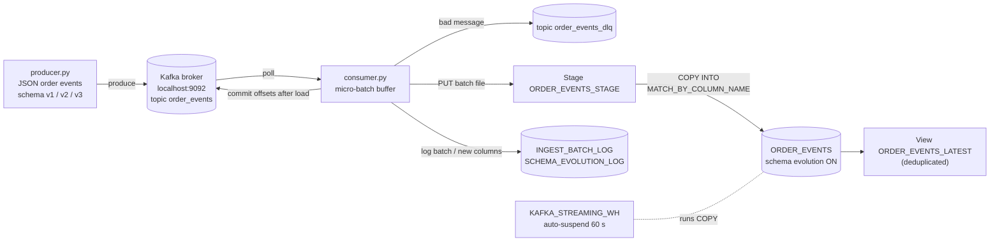

# Assignment 3 (Portfolio Assignment 9) — Kafka-to-Snowflake Streaming Pipeline
## Technical Specification

---

## 1. Document Control

| Item | Value |
|---|---|
| Project | Real-time streaming pipeline from a local Kafka broker to Snowflake, with automatic schema evolution |
| Assignment | **Assignment 3 (Portfolio Assignment 9)**. The assignment brief numbers it 3; the repository folder is numbered 9 for portfolio tracking. Both refer to this project. |
| Document version | 1.7 |
| Last updated | 2026-10-06 |
| Status | Implemented and verified; see README. |
| Environment | Local Windows 11 machine (Kafka, producer, consumer) + existing Snowflake account on AWS |
| Repository folder | `assignment-9-kafka-snowflake-streaming/` |

**Conventions.** `<connection>` stands for the local Snowflake CLI connection name. This document contains no credentials.

---

## 2. Summary

**Requirement.** Kafka produces data continuously. The data must land in a Snowflake table automatically, with no manual steps. When Kafka starts sending a field that the table does not have, the matching column must be created automatically, and existing data and columns must keep working.

**Flow.**

```
Kafka (local)  ->  Streaming consumer (local)  ->  Snowflake target table
```

**What the pipeline does.**
1. A single-node Kafka broker runs on the local machine.
2. A Python **producer** sends JSON order events to a Kafka topic at a steady rate and, on request or on a schedule, starts including new fields.
3. A Python **consumer** reads the topic continuously, groups messages into small batches (every few seconds), and loads each batch into Snowflake.
4. The Snowflake table has **schema evolution enabled**. When a batch contains a field with no matching column, Snowflake adds the column during the load. One known numeric business field, `DISCOUNT_PCT`, is declared with an explicit type up front (section 9.5).
5. Rows loaded before the change keep `NULL` in the new column. Rows that lack a field get `NULL` for it. Nothing is rewritten or reloaded.
6. Kafka offsets are committed only after Snowflake confirms the load, so a crash never loses data.

---

## 3. Requirements Traceability

| # | Requirement | How it is met | Where |
|---|---|---|---|
| R1 | Kafka continuously produces data | Local Kafka broker + a producer that runs until stopped | `scripts/`, `producer/producer.py` |
| R2 | Data is automatically ingested into Snowflake | Long-running consumer loads every micro-batch | `consumer/consumer.py`, `consumer/snowflake_loader.py` |
| R3 | Openflow or a suitable streaming/ingestion connector | Custom streaming consumer using the file-ingestion path (internal stage + `COPY INTO`). Section 5 explains why Openflow and Snowpipe Streaming were not used | `consumer/` |
| R4 | Continuous processing without manual intervention | Poll loop with automatic reconnect and retry; no per-batch human step | `consumer/consumer.py` |
| R5 | Kafka may introduce new fields at any time | Producer schema versions v1 → v2 → v3 and an ad-hoc `--extra-field` option | `producer/event_factory.py` |
| R6 | Automatic schema evolution | `ENABLE_SCHEMA_EVOLUTION = TRUE` on the table + `COPY INTO … MATCH_BY_COLUMN_NAME` | `sql/01_create_objects.sql`, `snowflake_loader.py` |
| R7 | New field → new column created automatically | Done by Snowflake during the load; recorded in `SCHEMA_EVOLUTION_LOG` | `snowflake_loader.py` |
| R8 | Existing data and columns keep working | Additive-only changes; old rows get `NULL`; a dedup view shields readers | Section 9 |

---

## 4. Scope

### In scope
- Local Kafka install, start, stop and topic scripts.
- Producer with evolving schema.
- Consumer with micro-batch loading, schema evolution, retries and dead-letter handling.
- Snowflake schema, table, stage, file format, log tables and views.
- Unit tests, an end-to-end test and a demo runbook.

### Out of scope / not implemented
- **Dropping or renaming columns.** A field that disappears from Kafka keeps its column; later rows hold `NULL`.
- **Changing a column's data type.** See section 9.4 for what happens on a type conflict.
- Schema Registry, Avro or Protobuf. Messages are plain JSON.
- Multi-broker Kafka, TLS, SASL. The broker listens on `localhost` only.
- Running the producer or consumer as a Windows service. They run in terminals.
- Any always-on AWS service (MSK, EC2, ECS, Openflow BYOC).

---

## 5. Design Decisions

| Decision | Choice | Reason |
|---|---|---|
| Kafka | Apache Kafka 4.x binary, single node, KRaft mode, run natively on Windows | Docker is not installed on this machine. Java 17 is, and Kafka 4.x needs nothing else. No ZooKeeper. |
| Producer | Local Python script | As requested. |
| Consumer | Local Python script | As requested. |
| Kafka client | `confluent-kafka` | Maintained, ships Windows wheels for Python 3.10, supports manual offset commits. |
| Ingestion method | Micro-batch file → internal stage (`PUT`) → `COPY INTO` | Uses Snowflake's native schema evolution, works with the existing password-based connection, and runs on a warehouse that suspends when idle. |
| Schema evolution | Snowflake-native (`ENABLE_SCHEMA_EVOLUTION`) | Snowflake creates the columns and infers their types. The consumer issues no `ALTER TABLE`. |
| Known numeric fields | Declared explicitly in `sql/01_create_objects.sql` (`DISCOUNT_PCT NUMBER(5,2)`) | Verified on this account: a numeric column created by schema evolution is sized to its first values and never widens (section 9.5). Unknown new fields still use schema evolution. |
| More than 100 new fields in one batch | The loader splits the batch into several `COPY` operations | Verified on this account: one `COPY` adds at most 100 columns; a `COPY` that would add 101 fails as a whole (section 9.6). |
| Snowflake database | Existing `AI_OPERATOR_DB`, new schema `KAFKA_STREAMING` | The working role owns this database and cannot create databases. |
| Warehouse | New dedicated `KAFKA_STREAMING_WH`, **X-Small**, 60 s auto-suspend, auto-resume | Keeps this pipeline's cost separate from other assignments. X-Small is enough for a low-volume learning/demo workload; the size is one variable in `sql/00_admin_setup.sql`. |
| AWS | None | No AWS resource is created by this project. |

**Alternatives considered and rejected.**

| Alternative | Why not |
|---|---|
| Snowflake Openflow | Needs an Openflow deployment (Snowflake-managed container runtime or BYOC in AWS) that runs continuously. This conflicts with "no always-on services" and is not expected to be available on a trial account. |
| Snowpipe Streaming SDK | Needs key-pair authentication. The pipeline user has password authentication only, and the working role cannot alter the user. It would also bypass the requested warehouse. |
| Snowflake Kafka Connector (Kafka Connect) | Same key-pair requirement, plus a Kafka Connect worker to run. It replaces the requested local consumer. |
| Consumer-issued `ALTER TABLE ADD COLUMN` | Works, but re-implements type inference that Snowflake already provides. |

**Latency.** A message reaches Snowflake within roughly one flush interval (default 5 s) plus the load time. This is near-real-time micro-batching, not per-row streaming.

---

## 6. Architecture



| Component | Value |
|---|---|
| Kafka | Single broker, KRaft, `localhost:9092`, installed in `C:\kafka` |
| Topics | `order_events` (3 partitions), `order_events_dlq` (1 partition) |
| Consumer group | `snowflake-loader` |
| Database / schema | `AI_OPERATOR_DB.KAFKA_STREAMING` |
| Target table | `ORDER_EVENTS` |
| Stage | `ORDER_EVENTS_STAGE` (internal) |
| File format | `NDJSON_FF` (newline-delimited JSON) |
| Warehouse | `KAFKA_STREAMING_WH` |
| Role | `CLAUDE_AI_ROLE` (owns the schema and table, which schema evolution requires) |

---

## 7. Components

### 7.1 Local Kafka

- Installed from the official Apache Kafka binary archive into `C:\kafka`. The install path must contain **no spaces** and be short; the Windows `.bat` scripts fail otherwise. The project folder itself contains a space, so Kafka is not installed inside it.
- Storage is formatted once with a generated cluster ID, then the broker is started with the KRaft `server.properties`.
- Data directory: `C:\kafka\data`.

**Windows-specific handling (built into the scripts).**

| Issue | Handling |
|---|---|
| `kafka-server-start.bat` calls `wmic`, which Windows 11 no longer ships | `KAFKA_HEAP_OPTS` is set before starting, so the script skips that call |
| "The input line is too long" | Short install path |
| Broker can crash on Windows when it deletes old log segments | Retention is set long enough that no deletion happens during a demo; `reset_kafka.ps1` wipes the data directory between demos |

### 7.2 Producer

`python -m producer.producer [options]`

| Option | Default | Meaning |
|---|---|---|
| `--rate` | `5` | Messages per second |
| `--count` | none | Stop after this many messages. Without it the producer runs until Ctrl+C |
| `--schema-version` | `1` | Start with schema v1, v2 or v3 |
| `--evolve-every` | none | Move to the next schema version after this many messages |
| `--extra-field name=value` | none | Add any new field to every message. Repeatable |

- Message key: `order_id` (keeps one order's events in one partition, in order).
- Message value: UTF-8 JSON object.
- `acks=all`, idempotence enabled, delivery callback logs failures.
- `--bad-every N` sends a deliberately malformed message every N messages, to exercise the dead-letter path.

### 7.3 Consumer

`python -m consumer.consumer`

Loop:
1. Poll Kafka. Parse each message as a JSON object.
2. Invalid message (not JSON, or not an object) → publish to `order_events_dlq` with the error text, and continue.
3. Valid message → normalise field names (section 8.3), add Kafka metadata fields, append to the buffer. A single message that alone introduces more than 100 new fields cannot be loaded by any `COPY` and is sent to `order_events_dlq` instead (section 9.6).
4. Flush when the buffer holds `BATCH_MAX_RECORDS` (default 500) **or** `BATCH_MAX_SECONDS` (default 5) have passed since the first buffered message.
5. Flush = write the buffer to a local NDJSON file → `PUT` to the stage → `COPY INTO` the table → write log rows → commit Kafka offsets → delete the local file. A batch that introduces more than 100 new fields is loaded as several `PUT` + `COPY` pairs; offsets are committed only after all of them succeed.
6. If there are no messages, no query is sent, so the warehouse suspends.

The consumer holds one Snowflake connection, reconnects if it drops, and stops cleanly on Ctrl+C (flushes the buffer, commits, closes).

---

## 8. Message Contract

### 8.1 Schema versions

| Field | Type | v1 | v2 | v3 |
|---|---|---|---|---|
| `event_id` | string (UUID) | ✓ | ✓ | ✓ |
| `event_time` | string (ISO-8601 UTC) | ✓ | ✓ | ✓ |
| `order_id` | string | ✓ | ✓ | ✓ |
| `customer_id` | integer | ✓ | ✓ | ✓ |
| `product` | string | ✓ | ✓ | ✓ |
| `quantity` | integer | ✓ | ✓ | ✓ |
| `unit_price` | number | ✓ | ✓ | ✓ |
| `status` | string | ✓ | ✓ | ✓ |
| `payment_method` | string | | ✓ | ✓ |
| `discount_pct` | number | | ✓ | ✓ |
| `loyalty_tier` | string | | | ✓ |
| `is_gift` | boolean | | | ✓ |
| `shipping_address` | object (`city`, `state`, `pincode`) | | | ✓ |

All data is synthetic.

### 8.2 Metadata added by the consumer

| Field | Meaning |
|---|---|
| `_kafka_topic` | Source topic |
| `_kafka_partition` | Source partition |
| `_kafka_offset` | Offset within the partition |
| `_kafka_timestamp` | Broker timestamp of the message |
| `_ingested_at` | Time the consumer built the batch (UTC) |

### 8.3 Field-name normalisation

Before loading, each top-level key is upper-cased, and every character other than `A–Z`, `0–9` and `_` is replaced with `_`. A key that starts with a digit gets a leading `_`. This guarantees a valid, predictable column name (`"discount %"` → `DISCOUNT__`). If two keys in one message collapse to the same name, the message goes to the dead-letter topic.

Only **top-level** fields become columns. A nested object or array is loaded as one `VARIANT`/`OBJECT`/`ARRAY` column; new keys inside it need no schema change.

---

## 9. Snowflake Design

### 9.1 Objects

| Object | Type | Purpose |
|---|---|---|
| `KAFKA_STREAMING_WH` | Warehouse | Runs `COPY INTO` and log inserts |
| `KAFKA_STREAMING` | Schema | Holds everything below |
| `NDJSON_FF` | File format | `TYPE = JSON`, `STRIP_OUTER_ARRAY = FALSE` |
| `ORDER_EVENTS_STAGE` | Internal stage | Receives batch files; files are purged after a successful load |
| `ORDER_EVENTS` | Table | Target table, schema evolution enabled |
| `INGEST_BATCH_LOG` | Table | One row per `COPY`: file, offsets, rows parsed/loaded, errors, duration. A split batch has several rows sharing one `BATCH_ID` |
| `SCHEMA_EVOLUTION_LOG` | Table | **Application-level audit table.** One row per column that Snowflake added: name, type, batch, first offset, time |
| `ORDER_EVENTS_LATEST` | View | One row per (`_KAFKA_TOPIC`, `_KAFKA_PARTITION`, `_KAFKA_OFFSET`); removes duplicates. Selects the declared columns by name, never `SELECT *` (section 9.7) |
| `PIPELINE_HEALTH` | View | Rows loaded, last load time, lag in seconds, columns added |

### 9.2 Target table (initial shape)

`AI_OPERATOR_DB.KAFKA_STREAMING.ORDER_EVENTS`, created with `ENABLE_SCHEMA_EVOLUTION = TRUE`.

| Column | Type |
|---|---|
| `EVENT_ID` | `VARCHAR` |
| `EVENT_TIME` | `TIMESTAMP_NTZ` |
| `ORDER_ID` | `VARCHAR` |
| `CUSTOMER_ID` | `NUMBER` |
| `PRODUCT` | `VARCHAR` |
| `QUANTITY` | `NUMBER` |
| `UNIT_PRICE` | `NUMBER(12,2)` |
| `STATUS` | `VARCHAR` |
| `_KAFKA_TOPIC` | `VARCHAR` |
| `_KAFKA_PARTITION` | `NUMBER` |
| `_KAFKA_OFFSET` | `NUMBER` |
| `_KAFKA_TIMESTAMP` | `TIMESTAMP_NTZ` |
| `_INGESTED_AT` | `TIMESTAMP_NTZ` |
| `DISCOUNT_PCT` | `NUMBER(5,2)` |

Every column is nullable. This is the v1 shape plus one explicitly typed v2 field, `DISCOUNT_PCT` (section 9.5). Every other later column is added by Snowflake, not by a script.

`sql/01_create_objects.sql` also contains `ALTER TABLE ORDER_EVENTS ADD COLUMN IF NOT EXISTS DISCOUNT_PCT NUMBER(5,2)`, so a table created by an earlier version of the script is brought up to date. That statement is run by hand at setup time. At run time the consumer issues no `ALTER TABLE`.

### 9.3 How schema evolution works

```sql
COPY INTO ORDER_EVENTS
FROM @ORDER_EVENTS_STAGE/<batch file>
FILE_FORMAT = (FORMAT_NAME = NDJSON_FF)
MATCH_BY_COLUMN_NAME = CASE_INSENSITIVE
ON_ERROR = CONTINUE
PURGE = TRUE;
```

- `MATCH_BY_COLUMN_NAME` maps each top-level JSON key to the column of the same name.
- Because the table has `ENABLE_SCHEMA_EVOLUTION = TRUE` and the loading role owns the table, a key with no matching column makes Snowflake **add the column**, with a type inferred from the data, in the same `COPY` statement that loads the rows.
- A column with no matching key in the file is loaded as `NULL`.

**Who does what.** Snowflake performs the schema evolution. The consumer never issues `ALTER TABLE`. `SCHEMA_EVOLUTION_LOG` is an application-level audit table: after a `COPY`, the consumer only *detects* the columns Snowflake has already created and records one audit row for each. If the audit insert fails, the column still exists and the data is still loaded.

**Recording the change.** The consumer keeps the set of known column names (read from `INFORMATION_SCHEMA.COLUMNS` at start-up). When a batch contains a name outside that set, the consumer re-reads the columns after the `COPY` and writes one `SCHEMA_EVOLUTION_LOG` row per new column. This costs a query only when a new field actually appears.

### 9.4 Behaviour by case

| Case | Result |
|---|---|
| New top-level field appears | Column added automatically; earlier rows hold `NULL` |
| Field missing from a message | `NULL` in that column |
| Field stops appearing | Column stays; later rows hold `NULL` |
| New key inside a nested object | No schema change; stored inside the `VARIANT` value |
| Same field arrives with an incompatible type (for example text in `QUANTITY`) | That row is rejected by `ON_ERROR = CONTINUE`; the batch log records the error count and first error; the other rows load. The pipeline keeps running |
| More than 100 new fields in one batch | One `COPY` cannot add them: it fails as a whole with error `000691`. The loader splits the batch into parts that each add at most 100 columns and loads them one after another (section 9.6) |
| One message that alone introduces more than 100 new fields | Cannot be loaded by any `COPY`. Sent to the dead-letter topic; the pipeline continues |
| Unknown numeric field, later value larger than the first ones | The column is not widened. That row is rejected and counted in `ERRORS_SEEN`; the other rows load (section 9.5) |
| Unknown numeric field created from whole numbers, later value has a fraction | Loaded with the fraction dropped and no error. Known limitation (section 9.5) |

### 9.5 Numeric fields

Verified on this account (README section 6, "Numeric widening check"):

- When schema evolution creates a numeric column, Snowflake sizes it to the first values it sees: `7` gave `NUMBER(1,0)`, `12.5` gave `NUMBER(3,1)`.
- **Snowflake does not widen an evolved numeric column afterwards.** A later, larger value is rejected with `Number out of representable range`; the rest of the file loads.
- A fractional value sent to a column that was created from whole numbers is loaded **with the fraction silently dropped** (`7.25` stored as `7`, no error).

Rule that follows: **fractional values must not silently lose precision, so a known numeric business field is declared with an explicit type before it is produced.** This project has one such field:

| Field | Declared as | Holds |
|---|---|---|
| `DISCOUNT_PCT` | `NUMBER(5,2)` | 0.00 to 999.99, two decimal places |

Unknown new fields are still created by schema evolution: `PAYMENT_METHOD`, `LOYALTY_TIER`, `IS_GIFT`, `SHIPPING_ADDRESS` and anything sent with `--extra-field`. Text, boolean, date, timestamp and nested values are not affected by the sizing problem.

**Remaining limitation.** A numeric field that is *not* known in advance still gets a column sized to its first values. To add such a field safely, declare its column in `sql/01_create_objects.sql` first. Not pre-declaring every possible field is deliberate: it would defeat automatic schema evolution.

### 9.6 Column limit per COPY and batch splitting

Verified on this account (README section 6, "Column limit check"): one `COPY` adds **at most 100** new columns. A `COPY` that would add 101 fails entirely with `000691 (22000): Error in Schema Evolution: adding too many columns`; no column is added and no row is loaded. A following `COPY` can add another 100 to the same table.

Handling, in `consumer/snowflake_loader.py`:

1. Before loading, the loader counts the batch's field names that are not yet columns. Up to 100 (setting `MAX_NEW_COLUMNS_PER_COPY`): one `PUT` and one `COPY`, as before.
2. More than 100: the batch file is cut, in record order, into part files. Records are added to a part until the next record would take that part past 100 new columns. Columns introduced by an earlier part count as existing for later parts.
3. Each part is loaded with its own `PUT` and `COPY` and gets its own `INGEST_BATCH_LOG` row; all parts share one `BATCH_ID`.
4. The batch is loaded only when every part is loaded. If a part fails, the loader raises, the consumer commits nothing and retries with the same file name.
5. On that retry the loader reuses the same split and skips the parts that already loaded, so they are not loaded twice.

A record is one row and cannot be cut. A single message that alone introduces more than 100 new fields is therefore sent to the dead-letter topic by the consumer before it is buffered.

If the consumer process stops while a split batch is half loaded, the parts already loaded are loaded again after restart. This is the same at-least-once behaviour as for an unsplit batch, and `ORDER_EVENTS_LATEST` removes the duplicates.

### 9.7 The de-duplicated view and schema evolution

Verified on this account: a view defined with `SELECT *` fails with error `002057` ("declared 5 column(s), but view query produces 13 column(s)") as soon as schema evolution adds a column to its table.

`ORDER_EVENTS_LATEST` therefore lists the declared columns of `ORDER_EVENTS` by name. It keeps one row per Kafka message, identified by (`_KAFKA_TOPIC`, `_KAFKA_PARTITION`, `_KAFKA_OFFSET`), choosing the earliest `_INGESTED_AT`. Columns added later by schema evolution are not part of the view; queries that need them read `ORDER_EVENTS` directly.

---

## 10. Delivery Guarantees and Error Handling

| Topic | Behaviour |
|---|---|
| Delivery | **At-least-once.** `enable.auto.commit = false`; offsets are committed only after `COPY` succeeds |
| Duplicates | Possible only if the consumer dies between a successful `COPY` and the offset commit. `ORDER_EVENTS_LATEST` removes them using (`_KAFKA_PARTITION`, `_KAFKA_OFFSET`) |
| Batch file names | `order_events_p<partition range>_<first offset>_<last offset>_<uuid>.json`, so every file is unique and traceable |
| Malformed message | Sent to `order_events_dlq` with headers `error` and `source_offset`; the pipeline continues |
| Message with more than 100 new fields | Sent to `order_events_dlq` the same way; the pipeline continues |
| `COPY` reads 0 rows of a non-empty file (file-level `LOAD_FAILED`) | Treated as a failure, not as a finished batch: nothing is committed and the batch is retried |
| Split batch, one part fails | Nothing is committed; the retry loads only the parts that are not loaded yet |
| Snowflake error (network, warehouse resuming) | Retry with exponential backoff (1 s → 60 s cap). The buffer and offsets are kept, so nothing is lost |
| Snowflake down for a long time | Consumer keeps retrying and pauses polling so the buffer does not grow without limit |
| Kafka down | Client reconnects by itself; consumer logs and waits |
| Consumer restart | Resumes from the last committed offset |
| Rebalance | Buffer is flushed and committed before partitions are released |

---

## 11. Configuration

All settings live in `config/settings.py` with defaults, and each can be overridden by an environment variable or a local `.env` file (git-ignored). `.env.example` documents every key.

| Key | Default |
|---|---|
| `KAFKA_BOOTSTRAP_SERVERS` | `localhost:9092` |
| `KAFKA_TOPIC` | `order_events` |
| `KAFKA_DLQ_TOPIC` | `order_events_dlq` |
| `KAFKA_GROUP_ID` | `snowflake-loader` |
| `BATCH_MAX_RECORDS` | `500` |
| `BATCH_MAX_SECONDS` | `5` |
| `MAX_NEW_COLUMNS_PER_COPY` | `100` (the measured Snowflake limit) |
| `SNOWFLAKE_CONNECTION_NAME` | `<connection>` |
| `SNOWFLAKE_ROLE` | `CLAUDE_AI_ROLE` |
| `SNOWFLAKE_WAREHOUSE` | `KAFKA_STREAMING_WH` |
| `SNOWFLAKE_DATABASE` | `AI_OPERATOR_DB` |
| `SNOWFLAKE_SCHEMA` | `KAFKA_STREAMING` |
| `SNOWFLAKE_TABLE` | `ORDER_EVENTS` |
| `BATCH_DIR` | `%LOCALAPPDATA%\kafka_snowflake_batches` (no spaces, outside the repo) |

**Credentials.** The consumer connects with `snowflake.connector.connect(connection_name=…)`, which reads the same `config.toml` the Snowflake CLI uses. No account, user or password is stored in this project.

---

## 12. Code Layout

| Path | Responsibility |
|---|---|
| `spec.md` | This document |
| `README.md` | Setup, run and demo instructions, with the evidence (command and query output) |
| `requirements.txt` | `confluent-kafka`, `snowflake-connector-python`, `python-dotenv` |
| `requirements-dev.txt` | `pytest` |
| `.env.example`, `.gitignore` | Configuration template; ignores `.env`, batch files, caches |
| `config/settings.py` | All settings and object names |
| `producer/producer.py` | Command line, send loop, delivery reports |
| `producer/event_factory.py` | Builds one event for a given schema version (pure, no Kafka import) |
| `consumer/consumer.py` | Poll loop, batching, offset commits, shutdown |
| `consumer/transform.py` | JSON parsing, field-name normalisation, metadata (pure) |
| `consumer/batching.py` | In-memory micro-batch buffer: flush rules, offsets to commit, batch file (pure) |
| `consumer/snowflake_loader.py` | Connection, `PUT`, `COPY`, batch splitting, log tables, new-column detection |
| `consumer/dead_letter.py` | Publishes rejected messages to the DLQ topic |
| `sql/00_admin_setup.sql` | Warehouse and grant. **Run once by an account administrator** |
| `sql/01_create_objects.sql` | Schema, file format, stage, tables, views |
| `sql/02_validate.sql` | Read-only checks: row counts, columns, lag, duplicates |
| `sql/99_teardown.sql` | Drops the schema (kept separate; never run automatically) |
| `scripts/install_kafka.ps1` | Downloads, verifies the checksum and extracts Kafka to `C:\kafka` |
| `scripts/start_kafka.ps1` | Formats storage on first run, starts the broker |
| `scripts/create_topics.ps1` | Creates both topics if missing |
| `scripts/stop_kafka.ps1` | Stops the broker |
| `scripts/reset_kafka.ps1` | Deletes the Kafka data directory (asks for confirmation) |
| `scripts/verify_gate.py` | Verification gate (section 18): checks the Snowflake behaviours on the real account |
| `tests/` | Unit and end-to-end tests |

---

## 13. Coding Standards

**Every piece of code in this project must be commented.** This is a requirement of the assignment owner and applies to Python, SQL, PowerShell and configuration files.

| Level | Rule |
|---|---|
| File | Starts with a header comment or docstring: what the file is for and how it fits in the pipeline |
| Function / class | Docstring stating purpose, parameters, return value and errors raised |
| Logic | Inline comment on every non-obvious step, explaining **why** as well as what (for example why offsets are committed after the load) |
| SQL | Comment block above every statement; comment on every option that affects behaviour (`ENABLE_SCHEMA_EVOLUTION`, `MATCH_BY_COLUMN_NAME`, `ON_ERROR`, `AUTO_SUSPEND`) |
| PowerShell | Comment above every step, including each Windows workaround and the reason for it |
| Config | Comment on every setting: meaning, unit and default |
| Tests | Docstring stating the behaviour being checked |

Other rules: type hints on all Python functions; `logging` instead of `print`; SQL values passed as bind variables; identifiers taken only from `config/settings.py`; no credentials in code.

---

## 14. Setup and Run

Prerequisites: Windows 11, Java 17, Python 3.10, Snowflake CLI with a working `<connection>`.

```powershell
# --- One-time setup ---
# 1. Account administrator runs sql/00_admin_setup.sql in Snowsight (creates the warehouse, grants USAGE)
# 2. Create the Snowflake objects
snow sql -c <connection> --role CLAUDE_AI_ROLE -f sql/01_create_objects.sql
# 3. Install Python packages and Kafka
pip install -r requirements.txt
.\scripts\install_kafka.ps1

# --- Every run (three terminals) ---
.\scripts\start_kafka.ps1          # terminal 1: broker
.\scripts\create_topics.ps1        # once per fresh Kafka data directory
python -m consumer.consumer        # terminal 2: loader
python -m producer.producer --rate 5 --evolve-every 300   # terminal 3: data

# --- Check ---
snow sql -c <connection> --role CLAUDE_AI_ROLE --warehouse KAFKA_STREAMING_WH -f sql/02_validate.sql
```

**Demo script (schema evolution).**
1. Start the producer on v1. Show `ORDER_EVENTS` with its 14 declared columns and a rising row count.
2. Restart the producer with `--schema-version 2`. Within one flush, `PAYMENT_METHOD` exists (added by Snowflake) and the pre-declared `DISCOUNT_PCT` starts to fill; older rows show `NULL` in both.
3. Run with `--extra-field campaign=diwali`. `CAMPAIGN` appears without touching the consumer or Snowflake.
4. Show `SCHEMA_EVOLUTION_LOG` and `INGEST_BATCH_LOG`.
5. Stop the producer. Show the warehouse suspending after 60 s.

---

## 15. Testing

| Level | What | How |
|---|---|---|
| Unit | Event factory: each schema version has exactly the expected fields | `pytest tests/test_event_factory.py` |
| Unit | Parsing, field-name normalisation, name collisions, metadata | `pytest tests/test_transform.py` |
| Unit | Batching: flush on size, flush on time, no flush when empty | `pytest tests/test_batching.py` (Kafka and Snowflake replaced by fakes) |
| Unit | Offsets are committed only after a successful load; not after a failed one | `pytest tests/test_consumer_commit.py` |
| Unit | `COPY` result handling: a file-level `LOAD_FAILED` raises; rejected rows do not | `pytest tests/test_snowflake_loader.py` |
| Unit | Batch splitting at the 100-column limit: every record loaded once and in order; offsets committed only after all parts; a retry skips loaded parts; an over-wide message goes to the dead-letter topic | `pytest tests/test_batch_splitting.py` (the stand-in for Snowflake rejects any `COPY` adding more than 100 columns) |
| Unit | `DISCOUNT_PCT` is declared `NUMBER(5,2)` and every produced value fits it exactly; no other later field is pre-declared; the view has no `SELECT *` and selects only declared columns | `pytest tests/test_sql_objects.py` |
| Live (gate) | View before and after schema evolution, `DISCOUNT_PCT` values, the real loader with a split batch | `python -m scripts.verify_gate --check shape` and `--check split` |
| Live | Objects exist; counts, lag and duplicates | `sql/02_validate.sql` |
| Live (scripted) | **Type conflict:** produce a valid row → a row with text in `QUANTITY` → a valid row. Both valid rows are in `ORDER_EVENTS`, the invalid row is not, `INGEST_BATCH_LOG` shows one rejected row with its error, and the consumer is still running and loads a further message afterwards | `pytest tests/test_e2e.py` with `KAFKA_SF_LIVE=1`; the producer option `--type-conflict-demo` sends the same three messages for a manual demo |
| Live (scripted) | End to end: produce N v1 messages → N rows; produce v2 → new columns exist, old rows `NULL`; malformed message → in DLQ, pipeline still running; consumer restart → no rows lost | `pytest tests/test_e2e.py` with `KAFKA_SF_LIVE=1` (skipped otherwise). Uses a separate test topic and test table |

---

## 16. Cost Controls

| Control | Detail |
|---|---|
| Warehouse size | X-Small by default; one variable in `sql/00_admin_setup.sql` |
| Auto-suspend | 60 s. `AUTO_RESUME = TRUE`, `INITIALLY_SUSPENDED = TRUE` |
| Idle behaviour | With no Kafka messages the consumer sends no queries, so the warehouse suspends |
| While data flows | A load every 5 s keeps the warehouse running. Cost is the warehouse's hourly rate for as long as the producer runs |
| Producer | `--count` gives a bounded run for demos |
| Staged files | `PURGE = TRUE` removes them after loading |
| `PUT` | Uploading to the stage uses no warehouse |
| AWS | No resources created |

---

## 17. Acceptance Criteria

**Evidence is required for every criterion.** A criterion counts as met only when the README shows evidence captured from the actual environment: Snowflake query output, Kafka command output, consumer or producer logs, the command that was run, or a screenshot. The README contains a table mapping each criterion number below to its evidence. A criterion without evidence is reported as "not verified", not as passed.

1. With Kafka, producer and consumer running, the `ORDER_EVENTS` row count rises without any manual action.
2. A message is queryable in Snowflake within about 15 seconds of being produced.
3. When the producer starts sending a new top-level field, a column of that name exists in `ORDER_EVENTS` after the next load, with no change to the consumer, no manual SQL and no restart.
4. Rows loaded before the change are still present and hold `NULL` in the new column.
5. Queries written against the original columns return the same results before and after the change.
6. Each added column has a row in `SCHEMA_EVOLUTION_LOG`.
7. A malformed message lands in `order_events_dlq` and the pipeline continues.
8. Stopping and restarting the consumer loses no messages; `ORDER_EVENTS_LATEST` has no duplicate (`_KAFKA_PARTITION`, `_KAFKA_OFFSET`).
9. With the producer stopped, the warehouse is suspended within about two minutes.
10. Every source file has a header comment, and every function has a docstring.
11. A row whose field has an incompatible type is rejected, the valid rows before and after it are loaded, and the pipeline keeps running.

---

## 18. Mandatory Verification Gate

These are behaviours of Snowflake or Kafka that the design depends on. **Each one must be verified on the actual account and machine before any code relies on it.** No behaviour is described as working in the README until its check has been run here; the result of every check is recorded in the README.

| # | Item | Fallback if it does not hold |
|---|---|---|
| 0 | A new top-level field makes Snowflake create the column automatically | None within the approved design; stop and report |
| 1 | Schema evolution adds the column **and** loads that batch's values for it in the same `COPY` | Re-run the `COPY` for the same file with `FORCE = TRUE` when new columns were detected |
| 2 | Types Snowflake infers for new columns (ISO timestamps, booleans, decimals, nested objects) | Document the inferred types; keep source values as strings where inference is unsuitable |
| 3 | Maximum columns one `COPY` may add | Measured: 100. Implemented: the loader splits a batch that introduces more (section 9.6) |
| 4 | Exact result columns of `COPY` (`rows_parsed`, `rows_loaded`, `errors_seen`, `first_error`) | Use `VALIDATE()` or the load history function for the batch log |
| 5 | Current Apache Kafka 4.x release and its Windows scripts behave as described in section 7.1 | Run Kafka under WSL2 with the same configuration |
| 6 | `PUT` from a Windows path through the Python connector | Batch directory is already outside the repo and free of spaces |

---

## 19. Build Order

1. `sql/00_admin_setup.sql` (administrator) and `sql/01_create_objects.sql`.
2. Kafka scripts; broker running; topics created.
3. `event_factory` and producer; verify messages with the Kafka console consumer.
4. `transform` and its unit tests.
5. `snowflake_loader`; resolve the open items in section 18 with a hand-made batch file.
6. Consumer loop, offset commits, dead-letter path; unit tests.
7. End-to-end test and the schema evolution demo.
8. `README.md` with the evidence (command and query output).

---

## 20. Enhancement: PostgreSQL Source Database

This section extends the specification. Sections 1 to 19 are unchanged and still describe the Kafka → Snowflake pipeline.

**Goal.** Give the order events a relational source. The target flow is:

```
PostgreSQL source DB -> CDC (section 21) -> Kafka -> existing Python consumer -> Snowflake
```

**Scope of this step.** PostgreSQL connection, a new database, the source table, a one-time load of the existing events, and verification. CDC was specified and implemented afterwards as its own step (section 21).

| Item | Decision |
|---|---|
| Server | Local PostgreSQL, `localhost:5432` |
| Database | `kafka_source_db`, created for this project. No existing database is used or changed |
| Table | `order_events`, defined in `sql/postgres/01_create_source_table.sql` |
| Primary key | `event_id` (UUID), the business key shared with Kafka and Snowflake |
| Columns | The business fields of all three schema versions, typed to match Snowflake (`unit_price NUMERIC(12,2)`, `discount_pct NUMERIC(5,2)`, `shipping_address JSONB`); the original Kafka position of copied rows; `record_source`; `created_at`, `updated_at` |
| Credentials | Read from the environment or the git-ignored `.env`. No password in the source code; `.env.example` lists the keys with the password empty |
| Initial data | The existing events are copied once from Snowflake `ORDER_EVENTS` by `source_db/backfill_from_snowflake.py`. Read-only on Snowflake; nothing is sent to Kafka |
| Idempotency | The load stops if the rows are already present, uses `ON CONFLICT (event_id) DO NOTHING`, and runs in one transaction |
| Marker for CDC | Copied rows carry `record_source = 'project3_backfill'`, because they are already in Snowflake |
| Impact on the existing pipeline | None. Producer, consumer, loader, Kafka topics and Snowflake objects are not modified |

**Acceptance for this step.**

1. PostgreSQL is reachable with the configured login.
2. The database `kafka_source_db` exists.
3. The table `order_events` exists.
4. It holds exactly the 300 existing events.
5. There are no duplicate event ids.
6. Snowflake `ORDER_EVENTS` still holds 300 rows.

Evidence for each is in README section 11.

---

## 21. Enhancement: Change Data Capture from PostgreSQL

This section extends the specification. Sections 1 to 19 still describe the Kafka → Snowflake pipeline, which this enhancement does not modify.

**Goal.** A row inserted into PostgreSQL `kafka_source_db.order_events` reaches Snowflake `ORDER_EVENTS` without any manual step, through the existing Kafka topic and the existing consumer.

```
PostgreSQL -> Debezium (Kafka Connect, standalone) -> Kafka pgcdc.public.order_events
           -> CDC bridge -> Kafka order_events -> existing consumer -> Snowflake
```

### 21.1 Decisions

| Item | Decision | Reason |
|---|---|---|
| CDC tool | Debezium PostgreSQL connector, `pgoutput` | Log-based; `pgoutput` is built into PostgreSQL |
| Runtime | Kafka Connect in standalone mode | Ships with the installed Kafka; no Docker. Standalone keeps its position in a local file and needs no extra compacted topics, which are a risk on the Windows broker |
| Transformation | A separate Python bridge, `cdc/` | Keeps `consumer/`, `producer/` and the Snowflake loader unchanged, and makes the conversion unit-testable |
| Operations | INSERT only in version 1. UPDATE and DELETE are intentionally excluded | `ORDER_EVENTS` is append-only; updates and deletes have no defined meaning there yet |
| Existing rows | Never published | They are already in Snowflake |
| Technical columns | Removed by the bridge | They must not become Snowflake columns |
| New business columns | Forwarded | Snowflake schema evolution keeps working across the new source |
| Unusable messages | Existing dead-letter topic `order_events_dlq` | No new topic needed |
| Duplicates | New view `ORDER_EVENTS_UNIQUE`, one row per `EVENT_ID` | A re-sent event has a new Kafka offset, which `ORDER_EVENTS_LATEST` cannot recognise |
| Snowflake table | Unchanged | No change is required |

### 21.2 Protection of the existing 300 rows

1. Debezium `snapshot.mode=no_data`.
2. Publication `order_events_cdc_pub`: `WHERE (record_source <> 'project3_backfill') WITH (publish = 'insert')`; `publication.autocreate.mode=disabled`.
3. The bridge forwards only operation `c` and drops rows marked `project3_backfill`.
4. Gate: the CDC topic holds no message after Debezium's first start, checked before the bridge is started.

### 21.3 Message contract

The bridge writes to `order_events` exactly what `producer/event_factory.py` produces: the same field names, order, JSON types and timestamp format, with the order id as the message key. Technical columns (`record_source`, `source_kafka_*`, `created_at`, `updated_at`) are removed, null columns are omitted, and any other column is forwarded unchanged.

### 21.4 Delivery

At-least-once at every stage. The bridge commits its position in the CDC topic only after Kafka has confirmed the forwarded messages and any dead letters.

The bridge's consumer allows 10 minutes between polls (`max.poll.interval.ms = 600000`; the Kafka default is 5) and caps the records per poll at 100. If the bridge is nevertheless removed from its consumer group, it does not attempt a commit, which Kafka would refuse; it rejoins and reads again from its last checkpoint, so no change event is lost and one may be forwarded twice.

The bridge writes its log output through a queue, so that a console which accepts no output cannot hold the main loop between forwarding an event and committing the position (README section 12, "An incident in the first live run").

### 21.5 Infrastructure changes this enhancement requires

| Change | Scope | Reversible |
|---|---|---|
| `wal_level = logical` | Whole PostgreSQL server; needs a service restart by an administrator | Yes (`ALTER SYSTEM RESET` and restart) |
| `max_slot_wal_keep_size` (recommended) | Whole server; reload only | Yes |
| Login `cdc_user`, publication, replication slot | `kafka_source_db` (the login is stored per server) | Yes (`sql/postgres/99_cdc_teardown.sql`) |
| Kafka topics `pgcdc.public.order_events`, `__debezium-heartbeat.pgcdc` | Local broker; created, never deleted | Left in place |
| One Java process for Kafka Connect, one Python process for the bridge | Local machine | Yes (stop them) |
| Snowflake view `ORDER_EVENTS_UNIQUE` | Additive | Yes (drop the view) |

### 21.6 Acceptance for the enabling phase

1. After Debezium's first start the CDC topic contains no message, and PostgreSQL and Snowflake both still hold 300 rows.
2. One row inserted into PostgreSQL produces exactly one message in the CDC topic, one in `order_events`, and one new row in Snowflake (301 in each).
3. The new row's values in Snowflake equal the inserted values.
4. `ORDER_EVENTS` gains no column.
5. An update or a delete in PostgreSQL produces no Kafka message.
6. Restarting Kafka Connect publishes none of the existing rows.

Status of each is recorded in README section 12.

### 21.7 Result (2026-10-06)

The enhancement is implemented and live.

| # | Acceptance point | Result |
|---|---|---|
| 1 | No message in the CDC topic after Debezium's first start; 300 rows on both sides | Met |
| 2 | One inserted row gives one CDC message, one `order_events` message and one Snowflake row | Met, twice: 300 → 301 → 302 on both sides |
| 3 | The new row's values in Snowflake equal the inserted values | Met |
| 4 | `ORDER_EVENTS` gains no column | Met: still 18 columns |
| 5 | An update or a delete in PostgreSQL produces no Kafka message | Met for an update of a publishable row and for the delete of a temporary row; that temporary row was also excluded by the row filter |
| 6 | Restarting Kafka Connect publishes none of the existing rows | Not exercised: Kafka Connect was not restarted. The bridge was restarted twice and forwarded nothing again |

### 21.8 Limitations of version 1

- INSERT only. UPDATE and DELETE are intentionally excluded; a row changed or removed in PostgreSQL is not changed in Snowflake.
- Kafka Connect with Debezium, the bridge and the consumer must all be running for a row to reach Snowflake. Rows inserted while Kafka Connect is stopped are delivered when it starts again.
- A replication slot that is not read makes PostgreSQL keep its log; `max_slot_wal_keep_size` bounds this, at the price of an invalidated slot if the limit is exceeded.
- Delivery is at-least-once; `ORDER_EVENTS_UNIQUE` removes a repeated event.
- Kafka topics must not be deleted on this Windows broker.

---

## 22. Local Process Orchestration

This section adds two scripts that start and stop the pipeline. It changes no pipeline logic: sections 1 to 21 are unaffected.

| Item | Decision |
|---|---|
| Entry points | `scripts/start_pipeline.ps1`, `scripts/stop_pipeline.ps1` (shared code in `scripts/pipeline_common.ps1`) |
| Managed services | Kafka broker, Kafka Connect with Debezium, Snowflake consumer, CDC bridge |
| Not managed | The producer (demo data; run by hand only) and PostgreSQL (a Windows service; only checked for reachability) |
| How services are started | With the existing commands: `start_kafka.ps1 -Background`, `start_connect.ps1 -Background`, `python -m consumer.consumer`, `python -m cdc.bridge`. Hidden background processes, output to log files |
| Start order | Broker, Kafka Connect, consumer, bridge |
| Stop order | Bridge, consumer, Kafka Connect, broker |
| Duplicate protection | A service is not started if one of this project's processes runs it, or if its Kafka consumer group has a connected member |
| Process identification | By command line (Kafka main class, Kafka Connect main class, `-m <module>`) or by the PID file written at start. Never by image name |
| Stopping | Orderly first: a Ctrl+Break (Python services) or Ctrl+C (Java services) event is delivered to the service's own console by `scripts/request_graceful_stop.py`. A service that does not exit in time is ended by its process id |
| Runtime files | Logs and PID files in `<KAFKA_HOME>\run-logs`, outside the repository |
| Never done | Stopping PostgreSQL; stopping a process by image name; deleting or altering topics, Kafka data, consumer groups, Debezium offsets or the replication slot; running a teardown |

**Acceptance.**

1. `start_pipeline.ps1` brings all four services up from a stopped state and reports `Pipeline Status: READY`.
2. A second run starts nothing.
3. With the pipeline started only by the script, one row inserted into PostgreSQL appears exactly once in Snowflake.
4. `stop_pipeline.ps1` stops the four services and reports `Pipeline Status: STOPPED`; PostgreSQL keeps running.
5. No topic, Kafka data, Debezium offset or replication slot is removed by either script.

Status of each is recorded in README section 13.
